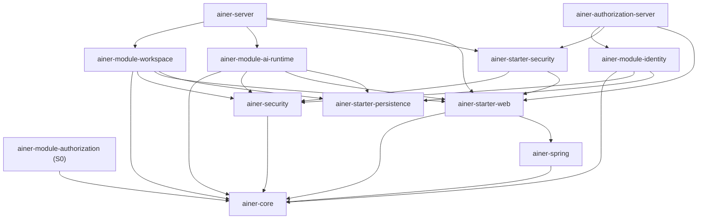

# 1. Executive Summary

> 文档类型：架构审计快照
> 审计日期：2026-08-03
> 代码基线：`6553a57`（`codex/scaffold-modern-baseline`）
> 审计范围：根 POM、framework/starter、Identity、Workspace、Authorization、AI Runtime、两个可执行运行时、Flyway migration、测试与现行/Proposed 文档
> 判定原则：代码、migration 和测试用于判断“已实现”；Proposed ADR/设计文档只用于判断“方向”，不计为已交付能力。

## 定位结论

**在 `Framework / Product Backend / Platform Foundation` 三项中，ainer-boot 当前应归类为 `Platform Foundation`。**

更准确地说，它是一个正在形成中的、以模块化单体为主要交付方式的 **AI Application Foundation
kernel + reference runtimes**，而不是已经完备的多产品平台。

对题设 A/B/C/D 的严谨选择是：

**C. AI Application Foundation（早期、不完整，存在向 D 演化的边界症状）。**

理由如下：

- 不是 A：仓库中没有 xq-platform 的 CRM、ERP、商品、供应链、财务协同或小程序业务模块；现行文档也将 `xq-platform-next` 定义为外部消费者，而不是 Ainer 源码副本。
- 不是 B：Identity、tenant、Workspace、OAuth 虽有企业协作色彩，但 Plan、Entitlement、Usage Meter、通用 Storage/Asset、通用 Notification、Organization/Workforce 均未成为可用的平台能力，因此不能称为完整的企业 SaaS Framework。
- 选择 C：仓库已有独立的 framework/starter 制品结构、身份与安全边界、Workspace、AI Model Gateway、调用审计，以及独立运行时雏形；这些是平台底座而非产品后台。
- 暂不选择 D：当前并未混入 xq 产品业务，framework 与 reference runtime 共存本身也不是边界错误。不过，`Tenant -> Workspace` 双层成员模型、framework 主体强制 tenant，以及 “Identity weekly report” 语义进入通用 AI Runtime，已经是 D 型边界漂移的预警。

`Framework` 只是其中一种制品形态，不能概括整个仓库。Ainer 同时拥有数据库状态、领域生命周期、
OAuth/Identity 运行时和参考 Resource Server，已超出“被动类库”。`Product Backend` 也不准确，
因为产品内容域和产品组合根均不在这里。

## 优势

- **物理依赖方向正确。** framework/starter 没有反向依赖 Identity、Workspace、AI 或任何产品模块，当前不存在 `framework -> crm` 一类依赖。
- **模块化单体基础较好。** 模块拥有自己的 migration、端口、事务和测试，Identity 与业务 Resource Server 通过运行时契约/事件协作，而非直接查询彼此私表。
- **安全与治理意识强。** OAuth 2.1/OIDC、Passkey、可信 actor、tenant 上下文、审计、outbox、AI 调用成本记录等不是演示级拼接。
- **AI Gateway 已有真实内核。** 已存在 provider SPI、OpenAI-compatible adapter、SSE、模型 allowlist、敏感策略、调用审计、Token/成本/延迟与每日预算。
- **演进方向正确。** 现行架构明确优先模块化单体、稳定契约和独立制品，不依赖微服务来制造边界。

## 缺陷

- **Identity 仍是 tenant-first。** 当前认证/令牌上下文依赖有效 tenant membership，默认账户投影围绕 default tenant 构建，可信主体也强制携带 `tenantId`；这不自然支持尚未加入 Workspace 的 C 端用户、公开访问、注册引导或个人创作者账户。
- **Tenant 与 Workspace 语义重叠。** 当前同时存在 Identity tenant membership 与 tenant 内 Workspace membership，两层均有 `OWNER/ADMIN/MEMBER`，对 Creator Platform 会形成重复的归属、授权和计费边界。
- **商业化控制面缺失。** 没有 Subscription、Plan、Entitlement、Quota/Meter、预占与结算；AI 每日预算不能替代 Free/Pro/Creator Pro/Team。
- **资产底座缺失。** 没有对象存储 SPI、Asset 元数据、签名上传、CDN、媒体生命周期或图片/视频处理能力。
- **AI Runtime 只完成部分闭环。** 单 provider 配置不等于模型路由；缺少 prompt 版本管理、持久化异步任务、租约、重试、取消、幂等和配额结算。
- **若干能力仍是设计或 S0。** Authorization 尚未被两个运行时实际消费；Organization/Workforce、通用 Artifact/Knowledge 等主要处于 Proposed 状态。
- **真实产品消费闭环尚未证明。** BOM/starter 已有 external golden consumer 验证，但尚缺 mdpress/xq 对 Identity、Workspace、AI、migration、版本升级的完整产品级验证。

## 最大风险

**最大风险不是技术栈，也不是单体架构，而是把当前必填 tenant 上下文及
`Tenant -> Workspace` 双层治理模型固化为所有产品的通用根边界。** 一旦 mdpress 也被迫采用
“Tenant membership + Workspace membership”，Identity、授权、
订阅、AI 配额、资产归属和审计都会绑定到错误的聚合边界。后续即使拆成微服务，也只会把同一个
语义错误分散到更多服务中。

因此，ainer-boot 能否成为“AI 时代应用基础设施”，首先取决于 Account/Workspace/Organization
边界，而不是再增加多少 AI SDK 或业务模块。

# 2. Architecture Boundary Analysis

## 2.1 对 `server/framework/system/biz` 的事实校正

当前仓库并不存在传统脚手架常见的 `server/system/biz` 三段式目录。实际结构以根
[`pom.xml`](../../pom.xml) 为准：

- `ainer-framework/*`：无 Spring 核心契约、Spring 共性、安全契约与 starter；
- `ainer-module-identity`、`ainer-module-workspace`、`ainer-module-ai-runtime`、`ainer-module-authorization`：候选平台模块；
- `ainer-server`、`ainer-authorization-server`：两个可执行 composition root/reference runtime；
- xq-platform 与 mdpress 的产品模块：当前仓库中不存在。

因此，本节不按旧目录名推断职责，而按实际制品、代码依赖、数据所有权和运行时行为分类。

分类口径：

- **A. Foundation Layer**：语义对多个独立产品稳定，允许被产品组合和扩展；
- **B. Enterprise Extension**：为组织、员工、企业流程或 xq 行业产品服务，不应成为所有产品的前置条件；
- **C. Product Specific**：只属于某个产品、参考部署的 composition root 或具体用例，不能作为通用基础层被下游依赖。

## 2.2 模块分类

| Module | Category | Reason | Recommendation |
|---|---|---|---|
| `ainer-dependencies` | A — Foundation | 统一依赖版本，不包含领域语义 | 保持独立 BOM；延续已有 Maven 3.9+/4 golden consumer 发布门禁，并扩展到平台模块 |
| `ainer-framework/ainer-core` | A — Foundation | 无 Spring 的错误码、异常、错误注册和 API 响应契约 | 严格保持最小；禁止加入 tenant、CRM 或 AI 产品模型 |
| `ainer-framework/ainer-spring` | A — Foundation | Spring 通用适配，无业务依赖 | 仅承载框架集成，不承载领域服务 |
| `ainer-framework/ainer-security` | A — Foundation（需修正） | 可信主体与 authority 是通用能力，但 `AuthenticatedActor` 当前强制 `tenantId` | 将 workspace/isolation context 设计为按资源解析、可选；支持匿名、未入空间用户、ServiceAccount/Agent |
| `ainer-starter-web` | A — Foundation | HTTP 错误、请求追踪等跨产品能力 | 保持产品无关，建立依赖守卫 |
| `ainer-starter-persistence` | A — Foundation | MyBatis/Flyway/PostgreSQL/UUID 基线 | 保持数据访问基础设施；不提供跨模块共享 Repository |
| `ainer-starter-security` | A — Foundation（需修正） | JWT Resource Server 共性可复用，但继承 tenant-first actor 约束 | 解耦“已认证”与“已选择 Workspace”；由 endpoint/resource policy 决定是否必须有 Workspace |
| `ainer-module-identity` | A — Foundation candidate | 全局用户、本地凭证、tenant directory/membership 支撑多个产品；但 User/Account/Profile 尚未清晰分离，认证仍依赖 active/default tenant 上下文 | 保留一个全局 Account 根与 SubjectRef；引入 LoginIdentity/Profile，支持 tenantless onboarding 和微信/OIDC 等外部身份绑定 |
| `ainer-module-authorization` | A — Foundation candidate（S0） | 通用授权核心只依赖 `ainer-core`，语义方向正确 | 在至少一个真实运行时接入持久化和 Spring adapter 前，不宣称为已交付平台授权能力 |
| `ainer-module-workspace` | A — Foundation candidate（边界待决） | 协作空间与 membership 可跨产品复用，但当前被建模为 tenant 下第二层空间 | 将顶层协作/计费/资源边界统一为 Workspace；若现有内层 Workspace 有独立价值，应明确重命名为 Project/ResourceGroup |
| `ainer-module-ai-runtime`：Model Gateway、policy、invocation ledger | A — Foundation | provider SPI、策略、Token/成本/延迟审计是跨产品 AI 基础能力 | 拆清 provider registry/router、usage facts 与产品调用者；保持对 content/CRM 等产品模型无感 |
| `ainer-module-ai-runtime`：governed task / “Identity weekly report” | C — Product Specific / experiment | migration 与 Proposed ADR 带有 `target_identity_id`、weekly report、evidence/memory 等首个业务用例语义；当前还是同步 application service | 从通用 gateway 中隔离为实验模块或产品模块；只把经两个产品验证的通用 Run/Artifact/Job 语义回提 foundation |
| `ainer-server` | C — Deployment/Reference Specific | 它是 Workspace + AI 的可执行组合根；composition root 天然属于一个部署，不是供产品依赖的基础类库 | 保留为 reference/golden app；xq 和 mdpress 各自建立 composition root，禁止复制改名后长期分叉 |
| `ainer-authorization-server` | A — Optional Foundation Runtime | OAuth/OIDC/Passkey 可作为共享身份运行时，但部署策略、客户端注册和管理面具有环境特性 | 将协议核心、Ainer Identity adapter 与部署配置分层；允许产品共享部署或独立部署 |
| Organization / Workforce（仅 Proposed） | B — Enterprise Extension | 部门、员工、岗位、任职、SubjectSet 对 xq 很重要，对个人 Creator 不是通用前置条件 | 作为可选 enterprise extension 实现，依赖 Identity/Workspace，不得反向进入 core |
| CRM / ERP / BPM / Mall / Product / Supply Chain / Finance | B — Enterprise/Product Extension（当前不存在） | 主要服务 xq 的业务模型，不能定义平台根语义 | 留在 `xq-platform`；只有经多产品验证的技术能力才能上提 Ainer |
| Content / Theme / Publishing / AI Writing workflow | C — mdpress Product Specific（当前不存在） | 是 Creator Platform 的产品差异化能力 | 留在 `mdpress-platform`，通过端口消费 AI、Asset、Entitlement 等 foundation 能力 |

两个可执行运行时的分类不同并非例外：`ainer-authorization-server` 可以作为产品无关、可选共享的
OAuth/OIDC 协议运行时交付；`ainer-server` 当前只组合 Workspace 与 AI 示例能力，没有独立的通用
协议职责，因此应保持 reference composition root，不能成为产品依赖入口。

## 2.3 边界判断

当前代码不是“xq 业务塞进 framework”，其主要问题更隐蔽：**物理边界干净，但部分基础概念带有
企业 tenant 预设，且一个产品验证用例进入了通用 AI 模块。**

下一步不应进行大规模目录重命名，而应先完成两件事：

1. 固化跨产品真正稳定的语义：Account/SubjectRef、Workspace、Membership、Entitlement、Asset、AI Invocation；
2. 把 Organization/Workforce 和具体 AI workflow 保持为可选扩展或产品模块。

## 2.4 通用基础能力不能按名称“推定已存在”

| Foundation capability | 当前事实 | 判定 |
|---|---|---|
| Audit | Identity、Workspace、OAuth、AI 各自有较强审计表和保留策略 | **部分。** 已形成可复用模式，但没有一个所有产品必须写入的万能 Audit 表；后者也不应被仓促创建 |
| Notification | Identity provisioning 有加密 outbox、HTTPS relay 和 delivery receipt | **领域内已实现、通用能力未实现。** 邮件/短信/站内信 channel、模板、偏好和产品触达策略尚不存在 |
| Configuration | 有强类型启动配置与安全默认值 | **基础设施已实现、运行时产品配置未实现。** 没有 Workspace 级动态配置、Feature Flag 或配置版本治理 |
| Task | 有 relay/retention runner、SSE 虚拟线程和 AI governed task 原型 | **不等于通用异步任务平台。** 缺少 durable queue、lease、retry、cancel、idempotency 与恢复协议 |
| Storage | PostgreSQL 持久化 starter 已实现 | **对象存储/Asset 缺失。** 数据库 persistence 不能被算作 Image/File/Video storage |
| Billing | AI invocation 有 Token/成本事实 | **商业控制面缺失。** 成本审计不能替代 Subscription、Entitlement、Metering 和支付适配 |

这一区分也给出一个抽取原则：先让领域模块拥有可靠的审计/outbox，再从两个真实消费者中提炼
共性；不要为了模块清单完整而提前建立一个语义过宽的“system”模块。

# 3. Multi-Product Capability Review

将 mdpress 作为独立的 `Creator Platform / Consumer Application` 接入，而不是把它假设为企业
SaaS，当前自然支持度如下：

| Capability | 当前自然支持度 | 结论 |
|---|---:|---|
| Identity | 部分 | 全局用户与认证内核可用，但 tenant-first 登录、Profile/外部身份缺口必须修正 |
| Personal/Team/Enterprise Workspace | 条件性 | 将 Identity Tenant 演化/映射为顶层 Workspace 并不装配内层 Workspace 是可行路径；两层原样同时采用则不自然 |
| Subscription / Plan / Quota | 不支持 | 只有 AI 调用事实与部署级预算，没有商业 Entitlement/Metering |
| AI Gateway | 部分支持 | 单 provider 调用、流式输出和审计可用；路由、Prompt、可靠异步任务缺失 |
| Asset / Media | 不支持 | 没有通用对象存储和 Asset 生命周期 |

## Identity

mdpress 至少需要区分全局主体、登录账户及多个登录方式、可公开展示的 Profile，以及 Account 与
多个 Workspace 的成员关系。

当前 [`IdentityUser`](../../ainer-module-identity/src/main/java/dev/ainer/module/identity/account/domain/IdentityUser.java)
同时承担本地用户名、密码摘要、展示名和状态；
[`IdentityAccount`](../../ainer-module-identity/src/main/java/dev/ainer/module/identity/account/application/IdentityAccount.java)
则是把 user、credential、默认 tenant 和角色拼在一起的认证投影。它不是边界清晰的 Account
聚合。当前模型并未直接退化为 Employee/Customer，但明显偏向“已属于企业 tenant 的后台成员”。

对 mdpress 的具体问题：

- 未加入任何团队的个人创作者也必须先有 active tenant membership；默认账户投影还围绕 default tenant 构建；
- 未见面向 C 端的公开自注册、常规账户恢复和社交账号绑定完整生命周期；现有 Passkey recovery 不能替代产品注册流程；
- `displayName` 不足以承担头像、简介、locale、时区、创作者品牌资料和公开主页等 Profile；
- 缺少邮箱/手机号/微信 OpenID/UnionID/OIDC 等 1:N 外部身份绑定模型；
- `OWNER/ADMIN/MEMBER` 是协作空间角色，不应存成全局用户身份；
- “会员等级”与角色完全不同，Pro 用户不等于 Workspace Admin。

建议不要仅为名称完整而创建两个含义模糊的 `User` 与 `Account` 聚合。推荐以 `Account` 作为全局
人类账户根，现有 `IdentityUser` 可兼容演化而不必立即改表名：

| Concept | 建议职责 |
|---|---|
| `SubjectRef` | 授权使用的稳定引用；类型可为 Account、ServiceAccount、Agent，不必先建立统一大表 |
| `Account` | 全局人类账户与安全生命周期根；不隶属于某个 Workspace |
| `User` | 产品/API 对人类用户的称谓，不再建立第二个与 Account 1:1 的 foundation 聚合 |
| `LoginIdentity` | 1:N 登录标识和验证方式，如 username、email、phone、WeChat、OIDC、Passkey |
| `Profile` | 1:1 或按产品扩展的展示资料；基础层只保留通用字段 |
| `AuthenticatedAccountView` | 为认证/控制台组装的读模型，不再被误认为领域聚合 |
| `WorkspaceMembership` | SubjectRef/Account 与 Workspace 的关系，承载空间治理角色 |

关键约束是只有一个全局人类账户根；membership 与 role 不进入该根，Profile 与登录凭证有清楚的
生命周期边界。`ServiceAccount` 和 `Agent` 可在真实需求出现时通过同一 SubjectRef 协议加入。

## Workspace Model

mdpress 的 Personal、Team、Enterprise 是同一种资源容器的不同治理模式：

- `PERSONAL`：默认单 owner，可升级但不要求组织结构；
- `TEAM`：多人协作，成员、邀请、席位与团队订阅；
- `ENTERPRISE`：在 Team 上增加企业身份、合规、组织扩展或合同能力。

若同时装配 Identity Tenant 与 `ainer-module-workspace`，当前完整模型是：

```text
IdentityTenant
├── TenantMembership (OWNER / ADMIN / MEMBER)
└── Workspace
    └── WorkspaceMembership (OWNER / ADMIN / MEMBER)
```

Identity 已支持多 tenant membership、tenant selection 与签发前 membership 校验，因此存在一条
现实的渐进路径：把现有 Identity Tenant 演化/映射为 mdpress 顶层 Workspace，并且不装配当前内层
Workspace 模块。这条路径能够复用认证能力。

**不自然的是把两层原样同时采用。** 若把每个 Creator Workspace 映射为 tenant，内层 Workspace
变成多余；若让所有 Creator 共用一个 tenant 再把产品空间放在内层，隔离、订阅、配额与身份选择
又被分到两个边界。

建议模型是：

```text
Account
    │
    └── WorkspaceMembership ──> Workspace (PERSONAL / TEAM / ENTERPRISE)
                                    │
                                    ├── Subscription / Entitlement
                                    ├── Asset / Content / AI Usage
                                    └── Organization (optional extension)
```

现有 `tenant_id` 可先保留为数据库隔离键，并在迁移期与顶层 `workspace_id` 1:1 映射；不要同时对
产品暴露 Tenant 与 Workspace 两套相同的 owner/member 语义。现有内层 Workspace 只有在能证明是
独立 Project/ResourceGroup 时才保留，并应据其真实含义重命名。

## Subscription

当前仓库没有可执行的 Subscription、Plan、Entitlement、Meter、Quota Period、Credit、Invoice 或
Payment adapter。AI invocation 中的 Token/成本记录是很好的 usage fact，但不能回答当前订阅、
功能权益、周期额度、并发预占、升降级或取消。

Foundation 应提供最小商业控制面：

```text
Subscription -> PlanVersion -> Entitlement
Workspace    -> Meter        -> UsageEvent
                           -> Reservation -> Settlement / Release
```

`Free / Pro / Creator Pro / Team` 的名称、价格、权益组合和支付流程属于 mdpress；Ainer 只提供稳定的
Entitlement/Metering 机制和支付 provider 端口。Role 管谁可执行动作，Entitlement 管买到了什么，
Quota 管一个周期可消耗多少，三者不能合并。

## AI Capability

| 需要的能力 | 当前状态 | 判断与建议 |
|---|---|---|
| AI Provider abstraction | 已实现基础版 | [`ModelProvider`](../../ainer-module-ai-runtime/src/main/java/dev/ainer/module/ai/gateway/application/ModelProvider.java) 与 OpenAI-compatible adapter 可复用 |
| Model routing | 未实现 | 当前只配置一个 provider，`requestedModel` 基本直通；增加 provider registry、模型目录、策略路由、fallback/circuit breaker |
| Prompt management | 未实现 | 调用者直接传 system/user prompt；增加有版本、变量 schema、状态和审计的 PromptDefinition，产品仍拥有具体 prompt 内容 |
| Token usage / cost | 已实现 | invocation ledger 记录 token、成本、延迟与状态；应作为 Metering 输入事实，而非最终计费账本 |
| Quota | 部分 | 已有 tenant 日预算/RPM，但主要由部署配置定义，未连接 Plan/Entitlement，也没有并发预占/结算 |
| Streaming | 已实现基础版 | SSE 与连接取消可用，但属于请求生命周期，不是可靠后台任务 |
| Async generation task | 原型，不可视为已交付 | [`AiTaskRunService`](../../ainer-module-ai-runtime/src/main/java/dev/ainer/module/ai/gateway/application/AiTaskRunService.java) 同步执行；缺少 worker、lease、retry、cancel、idempotency、timeout recovery |
| Run / Artifact / Result | 部分原型 | governed task migration 有 task/run/result/context 表，但 ADR 仍为 Proposed，且 invocation 的 `task_run_id` 未形成可靠闭环 |
| Multi-modal generation | 未实现 | 当前主要是文本 Chat Completion；图片/视频/音频应通过 provider capability 与 Asset 引用扩展 |

[`V202607290500__create_ai_governed_task.sql`](../../ainer-module-ai-runtime/src/main/resources/db/migration/V202607290500__create_ai_governed_task.sql)
中的 `target_identity_id` 和首个 “Identity weekly report” 用例说明 task 模型仍在用产品场景验证。
应保留实验价值，但不能把社交账号周报、内容策略或创作 workflow 定义成平台通用语义。

mdpress 的 AI Writing 应留在产品模块：它负责文章大纲、改写、选题、发布流程和 UI 状态；Ainer
负责模型调用、路由、可靠 Job/Run、Prompt 版本、Usage Fact、策略和 Artifact 引用。

## Asset Capability

当前没有生产级的 Image/File/Video/Media、CDN 或 Object Storage 模块。AI result 中存一段文本，
也不能替代资产系统。

| Layer | Foundation responsibility | mdpress responsibility |
|---|---|---|
| Blob Storage | provider SPI、bucket/key、签名上传/下载、校验和、加密、生命周期 | 选择业务用途与上传入口 |
| Asset Metadata | asset id、workspace owner、media type、size、status、object ref、审计 | 文章封面、素材库、主题资源等关系 |
| Delivery | CDN URL/签名策略、访问控制、删除与保留策略 | 页面和微信公众号发布策略 |
| Media Processing | 可选转码/缩略图 job 端口、派生资产关系 | 产品规格、裁剪模板、内容审核流程 |

不要把 Markdown 文档、文章版本、微信公众号草稿等内容领域放入 Storage/Asset foundation；基础层只
管理二进制对象、元数据、归属和生命周期。

# 4. Tenant Model Deep Review

## 4.1 当前 `tenantId` 的真实含义

当前代码中 `tenantId` 同时承担至少四种含义：

1. Identity 中的账户归属与默认登录上下文；
2. JWT/`AuthenticatedActor` 中的必填安全上下文；
3. Workspace 和 AI 数据表中的隔离过滤键；
4. owner/admin/member 的治理边界。

[`AuthenticatedActor`](../../ainer-framework/ainer-security/src/main/java/dev/ainer/security/actor/AuthenticatedActor.java)
要求已认证 actor 必须携带 tenant；Identity 基础 migration
[`V202607220300__create_identity.sql`](../../ainer-module-identity/src/main/resources/db/migration/V202607220300__create_identity.sql)
又通过 membership 和 default tenant 形成登录投影。与此同时，
[`Workspace`](../../ainer-module-workspace/src/main/java/dev/ainer/module/workspace/workspace/domain/Workspace.java)
自身仍归属于 tenant，并有另一套 member/role。

物理类型也暴露了同一问题：Identity 的 tenant 主键采用 UUID，而 Workspace/AI 的早期 migration
仍以 `VARCHAR(128)` 保存 `tenant_id`。这不是单纯命名差异，而是平台尚未拥有一个跨运行时、可
版本化的 Isolation/Workspace identifier contract。统一语义时应先统一契约与转换边界，再逐步迁移
列类型，不能让产品自行拼接字符串 ID。

这是一种有效的企业后台起步模型，但不是跨产品稳定模型。

## 4.2 企业产品：`tenant = organization`？

对 xq-platform，早期可以把一个 tenant 与一个企业客户/组织 1:1 映射，但不能把两者定义为永恒
同义词：

- 一个企业客户未来可能管理多个法人、品牌、门店、核算单元或阿米巴组织；
- Organization 有层级、任职、部门和业务身份，Isolation Scope 只回答数据边界；
- 企业并购、集团化和外部协作可能要求一个协作空间关联多个 Organization；
- 套餐与合同通常属于客户 Workspace，业务单据则可能属于具体 Organization/Business Unit。

因此，xq 可以采用 `Enterprise Workspace + Organization/Workforce extension`，而不是把所有
Organization 规则塞进 Tenant。

## 4.3 Creator 产品：`tenant = workspace`？

对 mdpress，顶层 Workspace 正是最自然的资源、协作、资产、订阅和 AI 配额边界。个人用户也应
自动拥有 Personal Workspace。此时技术隔离键可与 Workspace 1:1，但产品 API 和领域模型不应再
暴露一个功能重复的 Tenant。

特别需要允许以下状态存在：

- 用户已注册但 Personal Workspace 尚在幂等创建中；
- 用户访问公开内容，不需要选定 Workspace；
- 一个用户属于多个 Workspace，并在请求中显式或由资源反查当前 Workspace；
- ServiceAccount/Agent 在授权后代表某个 Workspace 执行任务。

因此，“已认证”不能等价于“已选择 tenant”。

## 4.4 建议模型

不建议采用 `Tenant -> Space -> Organization`。三层名词都容易被理解为顶层容器，却没有三个稳定、
独立的生命周期，只会延续当前重复成员关系。

建议采用产品可见的 `Account -> Workspace` 模型，并把技术隔离与企业扩展分开：

```text
Global Identity
Account (human subject)
        │
        └── WorkspaceMembership <── SubjectRef(ServiceAccount / Agent)
                    │
                    v
Workspace ── owns ── Resources / Subscription / Usage / Assets
   │
   └── optional Organization / Workforce / BusinessUnit

Persistence enforcement: IsolationScope(workspaceId)
```

术语约束：

| Concept | 是否产品可见 | 唯一职责 |
|---|---:|---|
| Account | 是 | 全局人类账户，不因加入/退出 Workspace 而改变 |
| Workspace | 是 | 协作、资源所有权、订阅与配额边界 |
| Organization | 仅企业扩展 | 企业结构、部门、员工任职、业务主体 |
| IsolationScope | 否，基础设施概念 | 数据访问和策略执行键；当前可复用 `tenant_id` 物理列 |

结合现有代码，**优先迁移路径**是让 `ainer_identity_tenant` 在语义上演化为顶层 Workspace/Isolation
root，复用已有的多 tenant 选择与 membership 校验，并让 mdpress 不装配当前内层 Workspace。
这不是继续宣称 tenant 等于 company，而是对已有表和 token claim 做兼容演化。只有内层 Workspace
被证明具有独立的 Project/ResourceGroup 生命周期时，才保留第二层并按真实语义重命名。

## 4.5 非重写式迁移路径

1. 先以 ADR 冻结语义：确定现有 `ainer_identity_tenant` 是演化为 Workspace 根，还是只保留为内部 IsolationScope；决定前不再扩展第二套 membership。
2. 为顶层容器增加 `workspace_type`、生命周期和稳定外部 ID；让 PERSONAL/TEAM/ENTERPRISE 使用同一聚合。
3. 将 actor 中的 `tenantId` 兼容读取为可选 `workspaceId/isolationScopeId`；资源型 endpoint 再强制解析 Workspace。
4. 支持注册后幂等创建 Personal Workspace，并允许无 Workspace 的认证阶段。
5. 对现有内层 Workspace 做使用审计：若语义其实是 Project，则重命名并迁移 API；若没有独立生命周期，则合并 membership，而不是永久保留双层。
6. 迁移期间保留旧 claim/列的适配器和双读验证，逐模块切换；不要求一次性改表或停机重写。

# 5. User Model Deep Review

## 5.1 当前概念

当前模型中：

- `IdentityUser` 是全局用户记录，但同时包含 username/password/display name；
- `IdentityAccount` 是带默认 tenant 与角色的登录读模型；
- `TenantMembership` 和 `WorkspaceMember` 都表达成员关系；
- `TenantRole` 与 `WorkspaceRole` 都固定为 `OWNER/ADMIN/MEMBER`；
- `ainer-module-authorization` 另有一套通用 Role/Policy 语义，但尚未被运行时使用；
- `Admin` 更多是角色/管理面称谓，并没有被清楚限定为平台运营者、Workspace 管理员还是产品后台管理员。

## 5.2 对 xq-platform 的适配度

当前 Identity 对 xq 的账户登录和企业租户隔离是可用起点，但不等于企业身份模型已经完成。
xq 还需要：

- Employee、Employment、Department、Position、Organization/BusinessUnit；
- 员工离职、调岗、兼岗、跨组织任职和数据权限；
- 客户/供应商联系人等业务 Party，它们不一定都是登录 User；
- 阿米巴核算单元，它也不应被误建模为 tenant 或登录 role。

这些应进入 Enterprise Extension/xq 领域，而不是膨胀 IdentityUser。

## 5.3 对 mdpress 的适配度

mdpress 的个人创作者首先是全局 Account，其次才是一个或多个 Workspace 的成员。它还需要
公开 Profile、微信身份绑定、个人订阅/Workspace 订阅、创作者品牌与内容所有权。当前用户表可以
作为迁移起点，但默认 tenant membership 和后台式角色不足以直接支撑完整生命周期。

## 5.4 混淆点与纠正原则

| 混淆 | 后果 | 纠正原则 |
|---|---|---|
| User 与 Account | 同一密码、状态和读投影在多个对象重复 | 只保留一个全局账户聚合；credential/login identity 独立 |
| User 与 Employee/Customer | 登录身份被企业人事或 CRM 生命周期绑架 | Employee、Customer、CreatorProfile 通过 `subjectId/userId` 关联，不继承 User |
| Member 与 Person | “成员”被当成人，无法表达一人多空间 | Member 永远是 Subject 与 Workspace/Organization 的关系 |
| TenantRole 与 WorkspaceRole | 双层 OWNER/ADMIN/MEMBER 冲突 | 顶层治理角色只保留在 WorkspaceMembership |
| Admin | 平台运维权、空间治理权、产品内容管理权混在一起 | 分为 PlatformOperator、Workspace governance role、Product permission |
| Role 与 Subscription | Pro 被误当成角色，权限与商业状态耦合 | Role 管动作，Entitlement 管购买能力，Quota 管消耗 |
| Role 与数据范围 | 一个 `ADMIN` 被迫解释组织、门店、文章等范围 | 使用授权策略/资源关系；企业数据范围留给 Organization/SubjectSet 扩展 |

目标安全上下文至少应区分：

```text
subjectId        required after authentication
actorType        HUMAN / SERVICE_ACCOUNT / AGENT
workspaceId      optional until a protected resource resolves it
organizationId   optional, enterprise extension only
authorities      coarse technical authorities
```

Workspace role、产品权限、数据范围与 entitlement 由授权服务按资源加载，不应全部塞进 JWT。这样既
适合 xq 的复杂企业授权，也适合 mdpress 的个人用户和团队协作。

# 6. Dependency Analysis

## 6.1 当前 Maven 依赖图

下图箭头表示“消费方依赖被消费方”，只画仓库内主要编译依赖：



`ainer-dependencies` 仅通过 `dependencyManagement` 统一版本，不形成 Java 编译依赖，因此未画成
运行时节点；它仍是制品消费关系的一部分。

`ainer-starter-persistence` 主要聚合第三方持久化依赖，不依赖任何业务模块。Identity 与 Workspace
之间存在 HTTPS directory/outbox 等运行时协作，但没有 Maven 级相互依赖；这是正确的边界方式。

## 6.2 重点问题的直接回答

**framework 是否依赖业务？没有。**

在当前 POM 与 Java import 中，没有发现 `ainer-framework/* -> ainer-module-*`，也不存在
`framework -> crm/erp`。`ainer-core` 仍保持无 Spring，starter 也没有依赖产品模块。这是本次审计
最明确的正面结论。

## 6.3 仍需处理的依赖风险

| 风险 | 类型 | 说明 | 处理 |
|---|---|---|---|
| AI task 出现 `workspace_id`、`target_identity_id` 和 weekly report | 语义耦合，不是 Maven 耦合 | AI 模块虽然未 import Identity/Workspace，却已经理解具体产品对象 | 用 opaque owner/resource ref 或由产品 workflow 持有关系；实验 slice 移出 gateway |
| `AuthenticatedActor` 强制 tenant | 反向抽象耦合 | 所有 framework consumer 被迫接受企业 tenant 生命周期 | 改成可选 Workspace/Isolation context，由资源 policy 强制 |
| Authorization module 未被运行时引用 | 漂浮能力 | 源码存在不等于平台已集成，容易造成能力清单虚高 | 用一个最小真实授权场景贯通 adapter、持久化和测试 |
| `ainer-server` 同时组合 Workspace 与 AI | 组合根风险 | 当前没有违规，但若产品开始依赖 server 而非发行物，就会形成隐性产品基座 | 明确它是 reference app；external product 只消费 BOM/module/starter |
| Identity/Workspace 各自持有 membership/role | 领域重复 | 编译图看不出来，却会造成授权、审计和所有权冲突 | 统一顶层 WorkspaceMembership，企业组织成员另建明确关系 |

建议增加自动化边界门禁：

- framework 包禁止 import `dev.ainer.module..`；
- Foundation module 禁止依赖 `xq..`、`mdpress..` 或 reference app；
- 产品模块只通过公开 application port/API 使用 foundation，不查询其私有表；
- composition root 可以依赖模块，模块不能反向依赖 composition root；
- 数据库 migration 按 owner module 校验，禁止跨模块外键直接绑定私表；
- 语义审查与 Maven/ArchUnit 守卫并行，避免“没有 import 就等于没有耦合”的误判。

# 7. Ideal Future Architecture

## 7.1 推荐的逻辑结构

下面是逻辑产品生态，不要求所有目录位于同一个 Git 仓库。现行
[`ainer-scaffold-design.md`](../design/ainer-scaffold-design.md) 已把 xq 定义为外部消费者；mdpress 也应
遵守同一原则。

```text
ainer-platform                         # 发布基础制品与可选共享运行时
├── foundation
│   ├── core / web / persistence / security / observability / test
│   ├── identity-account               # Account, SubjectRef, LoginIdentity, Profile
│   ├── workspace-access               # Workspace, Membership, ownership
│   ├── authorization                  # policy/relationship/data-scope ports
│   ├── audit-outbox
│   ├── notification                   # channel/template/delivery ports
│   ├── storage-asset                  # object storage + asset lifecycle
│   ├── entitlement-metering           # subscription primitives, quota, usage
│   ├── ai-gateway                     # provider, model routing, policy, invocation
│   └── ai-job                         # durable run, retry, cancel, artifact refs
├── enterprise-extension               # 可选，不是所有产品前置
│   ├── organization
│   └── workforce
└── reference-apps
    ├── authorization-server
    └── sample-resource-server

xq-platform                            # 独立 consumer，模块化单体
├── composition
├── crm / erp / product / supply-chain / finance
├── organization-workforce-adapter
└── miniprogram-adapters

mdpress-platform                       # 独立 consumer，模块化单体
├── composition
├── creator-profile
├── content / theme / publishing
├── ai-writing-workflow
├── product-subscription-catalog
└── wechat-adapter
```

该结构不是要求一次性创建十几个空模块。只有出现明确的独立生命周期、数据所有权或第二个消费者
时才物理拆分；在此之前可以在同一 Maven module 内用 package/port 保持边界。

## 7.2 平台与产品的责任线

| Foundation owns | Product owns |
|---|---|
| 身份、登录方式、Workspace membership、可信 actor | Creator/Employee/Customer 等产品身份 |
| 授权机制和策略执行端口 | 文章、订单、CRM 客户等资源规则 |
| Blob/Asset 生命周期 | 内容资产与产品对象的业务关系 |
| Entitlement/Metering 原语 | Plan 名称、定价、营销权益、支付编排 |
| AI provider/router/policy/invocation/job | 写作、周报、选题、商品描述等 workflow |
| Audit/outbox/notification delivery 机制 | 产品事件、模板内容和触达策略 |

共享平台能力的上提门槛建议为：至少两个独立产品出现相同语义、生命周期和非功能需求，并且产品
差异可由端口/配置表达。否则先留在产品内。这能避免“为了抽象而抽象”。

## 7.3 与目标的距离

**综合判断：中。**

- 从依赖方向、模块化单体、数据库所有权、安全基线和 AI Gateway 内核看，距离较近；不需要推倒重来。
- 从 Account/Workspace 语义、Subscription/Entitlement、Asset、Prompt/Router、可靠 AI Job 和真实产品级 consumer 升级闭环看，距离仍远。
- 两者综合不是“近”：mdpress 的核心商业闭环恰好依赖当前缺失的商业、资产和异步 AI 能力。
- 也不是“远”：现有模块不需要拆成微服务，framework 与大部分 Identity/AI 代码可以演进复用。

真正目标不是“通用 Spring Boot 后台 + 一个 LLM client”，而是让任意产品可以安全获得全局身份、
Workspace、授权、Entitlement、资产、AI 执行与 Usage 治理，同时不继承 xq 或 mdpress 的业务模型。

# 8. Refactoring Strategy

本策略不建议重写，也不建议先拆微服务。以兼容迁移、external consumer 验证和模块化单体为主。

## Immediate

现在应完成：

1. **接受一个 Account/Workspace/Tenant ADR。** 明确产品可见模型、`tenant_id` 的技术含义、当前内层 Workspace 的去留，以及兼容迁移方式；在此之前冻结第二套 membership 扩展。
2. **隔离产品化 AI task。** 将 weekly report/governed task 标为 experiment 或移入独立验证模块，避免它继续塑造通用 gateway schema/API。
3. **建立 mdpress 独立 composition root。** 只消费 Ainer BOM、starter 和模块制品；先做注册/登录、Personal Workspace、一次 AI 调用的 golden path，不复制 `ainer-server` 源码。
4. **建立依赖与语义门禁。** 加入 framework 禁业务依赖、模块禁跨表、产品包名禁入 foundation 的构建检查，并在 ADR checklist 中检查 owner/tenant/workspace 语义。
5. **制作 capability truth table。** 对 Identity、Authorization、AI Task、Organization、Asset、Billing 标记 Implemented/Partial/Proposed/Absent，避免把 migration 或 Proposed ADR 当成交付完成。
6. **扩展制品消费门禁。** 在已有 BOM/starter golden consumer 基础上，加入 Identity、Workspace、AI、migration 和版本升级验证，并最终由独立 mdpress consumer 承接。

Immediate 的退出标准不是功能齐全，而是 mdpress 不再依赖错误的 tenant 双层模型，产品边界已经可
独立演进。

## Short Term（1–3 个月）

按 mdpress 首个端到端产品闭环驱动以下能力：

1. **Identity 演进**：拆分 LoginIdentity/Profile；支持无 Workspace 的认证阶段、Personal Workspace 幂等创建、微信/OIDC adapter；保留旧 username/default tenant 兼容读取。
2. **Workspace 收敛**：统一顶层 membership/ownership，加入 PERSONAL/TEAM/ENTERPRISE；Organization 仅作为可选扩展。
3. **Entitlement/Metering MVP**：PlanVersion、Entitlement、Meter、UsageEvent、周期配额与 reservation/settlement；先接 AI Token 和团队席位，不先做完整财务系统。
4. **Storage/Asset MVP**：对象存储 SPI、Asset 元数据、签名上传、Workspace ACL、CDN/object ref、删除/保留；先支撑封面和文章素材。
5. **AI Runtime 闭环**：provider registry、模型目录/路由、PromptDefinition/version、durable Job/Run、lease/retry/cancel/idempotency，以及 invocation/usage/artifact 的一致关联。
6. **Authorization 最小落地**：让 Workspace owner/member 与一类产品资源真正通过 authorization adapter 验证；不要让一个“大一统权限项目”阻塞 mdpress。
7. **端到端门禁**：覆盖个人用户、团队邀请、订阅额度、并发 AI 预占/结算、资产归属、失败重试和取消，确保 external consumer 可升级。

缺失能力可以先在 mdpress 内通过 Ainer 定义的端口实现；只有在语义稳定且 xq 也需要时再回提平台。
这比预先构建庞大的“万能 core”风险更低。

## Long Term

- 形成稳定版本、兼容策略、Initializer 和多产品升级矩阵，产品通过制品升级而不是复制源码。
- 让 xq 与 mdpress 共同验证 Workspace、Entitlement、Asset、AI Usage、Audit/Outbox 等真正共享能力。
- 增加多 provider 路由、KMS/密钥治理、模型能力目录、评测/可观测性、RAG/Artifact 等 AI 平台能力，但仍由实际产品需求拉动。
- 将通用 Notification 从 Identity 专用 provisioning outbox 中提炼为 channel/template/delivery 机制，同时让模板与触达策略留在产品。
- 在 Organization/Workforce 语义成熟后作为 Enterprise Extension 发布，不让 Creator 产品承担其复杂度。
- 只有当独立扩缩容、故障隔离、合规或团队所有权成为真实约束时，才把某个模块拆为服务；拆分不是路线图 KPI。

# 9. Final Decision

## “ainer-boot 是否适合作为 mdpress 后台？”

## **CONDITIONAL YES**

更精确的解释：

- **作为不修改边界、开箱即用的完整 mdpress 后台：NO。** 它缺少 Creator Workspace、订阅/配额、Asset、Prompt/路由和可靠异步生成闭环。
- **作为 mdpress 的平台内核和工程起点：YES。** framework、安全、Identity 的一部分、AI Gateway、审计/outbox 与模块化单体基线值得复用。
- 因而总判定是 **CONDITIONAL YES**，不是对现状能力的无条件背书。

启动 mdpress 并采用 Ainer 的架构前置条件：

1. mdpress 拥有自己的模块化单体 composition root 与产品模块，不 fork/rename `ainer-server` 后长期分叉；
2. 先接受 Account/Workspace/Tenant 语义与迁移 ADR，允许 tenantless onboarding，并消除两套顶层 membership/role；
3. Product-specific AI workflow 与通用 AI Gateway 分离。

生产收费和规模化运行条件：

4. Identity 增加外部登录身份和 Profile 边界，企业 Employee/Customer 语义不进入全局 Account；
5. 补齐 Entitlement/Metering/Quota reservation-settlement，并把 AI invocation 接为 usage fact；
6. 补齐 Object Storage/Asset/CDN 的归属、ACL 与生命周期；
7. 对长时 AI 写作补齐 provider routing、Prompt version 与 durable async Job/Run/retry/cancel/idempotency；
8. 用独立 mdpress consumer 证明制品发布、migration、升级与端到端安全门禁，而非只验证仓库内 reference app。

满足前三项并确定后续能力的交付顺序后即可启动 mdpress 开发；无需等待一个理论上“完美的平台”，
也不能用产品代码绕过这些平台边界。

最终结论：**ainer-boot 已经具备成为“AI 时代应用基础设施”的正确骨架，但尚未具备完整肌肉。**
它最值得保留的是依赖方向、安全治理和 AI 调用内核；最需要改变的是 tenant-first 的世界观。只要以
Account/Workspace 为跨产品根边界，让 Organization 成为企业扩展、让 mdpress workflow 留在产品，
并补齐 Entitlement、Asset 与可靠 AI execution，ainer-boot 可以演进为 xq-platform 与 mdpress
共同使用的平台基础，而不需要重写或微服务化。
