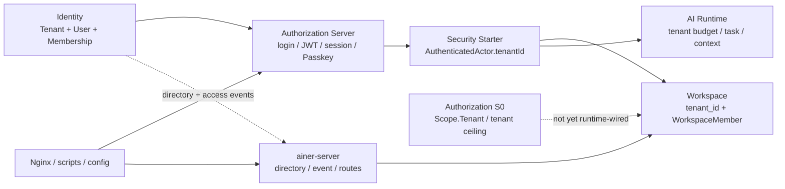

# Ainer Foundation Greenfield Reset Impact

## Document Status

- 状态：Accepted impact plan（Stage 0 决策门已于 2026-08-04 通过；执行仍按 Stage 1–8 gated，不授权立即改代码）
- 执行计划：S1.2 加法脊柱已落地（`reset@900d7cb`），破坏性 cutover 的有序施工清单见 [0033-greenfield-cutover-plan.md](0033-greenfield-cutover-plan.md)
- 日期：2026-08-03（初稿）· 2026-08-04（Stage 0 通过）
- 决策来源：[ADR-0033 Greenfield：Account、Workspace、Subject 与 Isolation 基线](../decisions/0033-account-workspace-subject-isolation-greenfield-baseline.md)
- 性质：开发阶段 baseline reset 影响分析；不是 production migration runbook
- 实现授权：无；本文不修改或授权立即修改 Java、Kotlin、POM、migration、API、测试或环境

本文回答：如果接受 Greenfield ADR，当前仓库哪些实现应删除、哪些应重建、哪些安全不变量必须保留。

结论是：

> **Tenant 已经成为 Identity、Workspace、JWT、Security、Authorization、Passkey、AI Runtime 和运维
> 路由的隐式根。开发期可以直接移除，但必须进行一次协调的 Foundation baseline reset；不能只删
> `IdentityTenant`，也不能把所有 `tenant_id` 批量替换为 `workspace_id`。**

---

## 0. Stage 0 Decision Gate Record

- **决策**：2026-08-04 维护者接受 [ADR-0033 Greenfield（Option B）](../decisions/0033-account-workspace-subject-isolation-greenfield-baseline.md)
  作为 Foundation 目标基线；v1/v2 标记 Historical。Stage 0 决策门通过。
- **前提确认**（全部成立）：无外部 consumer（`xq-zhiwu` 已走 `xiaoqu-platform`；`xq-platform-next` / mdpress
  未创建）；无正式发行 artifact（`0.1.0-SNAPSHOT`，Central 未发布）；无生产数据；无公开 API/JWT/client 合同；
  dev DB/fixture 可重建；Flyway history 无发行契约。
- **可销毁环境清单**（reset 执行时处理，本记录不授权立即销毁）：
  - `ainer-dev.xiaoqu99.com` dev 公网环境（独立 PostgreSQL 18.3、systemd Authorization Server、版本化
    JAR/Studio/Admin、Let's Encrypt、Nginx）；
  - dev PostgreSQL 数据（Identity 12 + Workspace 8 + Authorization Server 8 + AI Runtime 2 份 migration 的运行数据）；
  - dev OAuth authorization / consent / session / client state；
  - client fixture：`ainer-admin-dev` public client、双用户 fixture、dev 身份与 Token 自助撤销记录；
  - 测试 fixture：Testcontainers seeds、JWT fixtures、dev signing key；
  - 本机 / Colima dev databases 与临时 smoke schemas。
- **Git recovery point**：建议在本次收敛提交落地后，于该 commit 上打 `pre-greenfield-reset` tag。当前工作树
  有未提交改动，现在打 tag 会落在不含这些改动的 HEAD 上，作为 recovery point 会误导，故暂不打。
- **consumer 串行化**：reset Stage 8（baseline lock + Internal GoldenConsumer）通过前，禁止任何外部 consumer
  接入；这与「知物已不等 Ainer」一致。
- **运行权威**：Stage 1–8 各切片落地并验收前，既有 Accepted tenant、JWT、内层 Workspace 与 OWNER 规则继续
  是运行权威；本记录不授权立即修改 Java、migration、API 或环境。

---

## 1. Assumptions and Reset Boundary

本影响计划只在以下条件同时成立时有效：

- 没有外部 consumer；
- 没有正式发布 artifact；
- 没有生产或共享环境数据需要原地升级；
- 没有公开 API/JWT/client contract 需要兼容；
- 开发数据库、authorization、consent、session、client fixture 可全部重建；
- 当前 Flyway history 未形成必须保留的发行契约。

任一条件为假，停止 Greenfield reset，重新采用 migration ADR。不得一边删除 Tenant，一边临时保留旧
claim/API/表参与授权；那会产生比当前模型更危险的双 authority。

“删除”“修改”“重建”均描述后续实施影响。本任务只创建文档，未执行任何删除或代码变更。

---

## 2. Current Blast Radius

截至本文审查，限定在主要 Foundation 模块且排除 `target/` 后，词法 inventory 找到 **316 个包含
Tenant 词汇的文件**。这不是 316 个独立领域依赖，但说明影响远超一个 Entity：

| Area | Files matched | Primary coupling |
|---|---:|---|
| `ainer-module-identity` | 119 | Tenant aggregate、Membership、OWNER、provisioning、notification、audit、event |
| `ainer-authorization-server` | 85 | tenant-bound login principal、JWT、introspection、selection、Passkey、client control、API |
| `ainer-module-workspace` | 50 | mandatory Tenant parent、member复合边界、SQL、audit、Identity event |
| `ainer-module-ai-runtime` | 29 | invocation owner、budget/rate key、Task、ContextSnapshot、query partition |
| `ainer-framework/ainer-starter-security` | 10 | tenant claim parser、actor resolver、service policy |
| `ainer-module-authorization` | 9 | Scope.Tenant、credential ceiling、ResourceRef tenant owner |
| `ainer-server` | 9 | Identity directory/event HTTP adapters、audit/export/recovery route |
| `ainer-framework/ainer-security` | 5 | AuthenticatedActor/Service tenant projection和scope常量 |

另有 persistence starter test fixture、Nginx 和部署检查脚本使用 `tenant_id` 或 tenant API。词法数字只用于
规划，不应成为架构指标；reset completion 必须使用语义 inventory 和 fresh-database tests，而不仅是
`rg tenant` 归零。

### 2.1 Current coupling graph



关键事实：

- [`IdentityAccount`](../../ainer-module-identity/src/main/java/dev/ainer/module/identity/account/application/IdentityAccount.java)
  强制携带 tenant；对应
  [`IdentityMapper.xml`](../../ainer-module-identity/src/main/resources/mapper/identity/IdentityMapper.xml)
  强制 join default Membership 和 Tenant；
- [`AuthenticatedActor`](../../ainer-framework/ainer-security/src/main/java/dev/ainer/security/actor/AuthenticatedActor.java)
  要求非空 tenant，starter resolver 缺 claim 即拒绝；
- [`Workspace`](../../ainer-module-workspace/src/main/java/dev/ainer/module/workspace/workspace/domain/Workspace.java)
  和
  [`WorkspaceMember`](../../ainer-module-workspace/src/main/java/dev/ainer/module/workspace/workspace/domain/WorkspaceMember.java)
  都携带 TenantId；
- [`Scope`](../../ainer-module-authorization/src/main/java/dev/ainer/authorization/domain/Scope.java)和
  [`ResourceRef`](../../ainer-module-authorization/src/main/java/dev/ainer/authorization/domain/ResourceRef.java)
  把 Tenant 当授权 scope/resource owner；
- [`GovernedAiExecutionContext`](../../ainer-module-ai-runtime/src/main/java/dev/ainer/module/ai/gateway/application/GovernedAiExecutionContext.java)、
  [`AiTask`](../../ainer-module-ai-runtime/src/main/java/dev/ainer/module/ai/gateway/domain/AiTask.java)和
  [`ContextSnapshot`](../../ainer-module-ai-runtime/src/main/java/dev/ainer/module/ai/gateway/domain/ContextSnapshot.java)
  也强制 Tenant。

---

## 3. Delete Scope

不删除任何顶层 Maven module：Identity、Workspace、Authorization、AI Runtime、Security Starter 和两个
Server 应继续存在。删除的是 Tenant feature slices 和错误 contract。

### 3.1 Identity Tenant aggregate and governance

后续实施中直接删除而不是 rename：

| Delete | Representative current files | Reason |
|---|---|---|
| Tenant aggregate | [`IdentityTenant.java`](../../ainer-module-identity/src/main/java/dev/ainer/module/identity/account/domain/IdentityTenant.java) | Foundation 不再有客户/协作/隔离万能 root |
| Tenant Membership/Role | [`TenantMembership.java`](../../ainer-module-identity/src/main/java/dev/ainer/module/identity/account/domain/TenantMembership.java)、[`TenantRole.java`](../../ainer-module-identity/src/main/java/dev/ainer/module/identity/account/domain/TenantRole.java) | Human collaboration只由 WorkspaceMembership表达；业务授权在 Authorization |
| Tenant context/default | `TenantContextEntry`、default-membership查询 | Account可在零Workspace认证，不再选择default tenant |
| Tenant member management | `AddTenantMemberCommand`、[`TenantMemberManagementService`](../../ainer-module-identity/src/main/java/dev/ainer/module/identity/account/application/TenantMemberManagementService.java) | 删除第二套 OWNER/ADMIN/MEMBER authority |
| Identity Tenant ownership | Identity `OwnershipTransfer*`、`OwnershipRecovery*` | Workspace governance另行重建；legal/commercial owner不归Identity |
| Platform Tenant projection | `PlatformIdentityTenantPage/Projection/Row` | 平台查询围绕Account/LoginIdentity安全投影重建 |

Identity 的 User disable、security status、outbox/replay 思想不删除，但事件 payload 和 storage 必须重建为
qualified Account/Service facts。

### 3.2 Tenant provisioning domain

删除 `ainer-module-identity` 内全部 `TenantProvisioning*`、`TenantActivationGrant*`、
`ProvisionTenantOwnerCommand`、`TenantOwnerBootstrapResult` 及相应 repository、mapper、row、notification、
protector、relay 和 receipt 类型。

当前
[`TenantProvisioningService`](../../ainer-module-identity/src/main/java/dev/ainer/module/identity/account/application/TenantProvisioningService.java)
的工作流权威是“创建 Tenant + User + OWNER Membership”，不能通过改名成为 Account 注册。可以保留并
重新实现的只是：幂等 request、一次性 activation、加密通知、lease/retry、receipt 和安全审计模式。

### 3.3 Tenant-facing APIs and browser flow

删除当前契约：

| Current API / component | Current file | Disposition |
|---|---|---|
| `GET /api/me/tenants` | [`MyTenantContextController`](../../ainer-authorization-server/src/main/java/dev/ainer/authorizationserver/identity/MyTenantContextController.java) | 删除；新 `GET /workspaces` 读取 WorkspaceMembership |
| `/api/tenants/{tenantId}/members/**` | [`TenantMemberController`](../../ainer-authorization-server/src/main/java/dev/ainer/authorizationserver/identity/TenantMemberController.java) | 删除；Workspace Membership API重建 |
| `/api/tenants/{tenantId}/ownership-transfers/**` | [`OwnershipTransferController`](../../ainer-authorization-server/src/main/java/dev/ainer/authorizationserver/identity/OwnershipTransferController.java) | 删除；新Workspace governance contract不复用Identity role |
| platform tenant provisioning/activation | [`PlatformTenantProvisioningController`](../../ainer-authorization-server/src/main/java/dev/ainer/authorizationserver/identity/PlatformTenantProvisioningController.java)、[`TenantProvisioningActivationController`](../../ainer-authorization-server/src/main/java/dev/ainer/authorizationserver/identity/TenantProvisioningActivationController.java) | 删除；Account registration与Workspace provisioning分成两个用例 |
| tenant directory | [`IdentityDirectoryController`](../../ainer-authorization-server/src/main/java/dev/ainer/authorizationserver/identity/IdentityDirectoryController.java) tenant routes | 删除；只提供qualified Account status/directory port |
| `GET/POST /select-tenant` | [`AinerTenantSelectionFilter`](../../ainer-authorization-server/src/main/java/dev/ainer/authorizationserver/tenantcontext/AinerTenantSelectionFilter.java)、[`AinerTenantSelectionController`](../../ainer-authorization-server/src/main/java/dev/ainer/authorizationserver/tenantcontext/AinerTenantSelectionController.java) | 删除；Account session与Workspace authorization context分离 |
| tenant provisioning receipt/recovery | corresponding Identity Controllers | 删除当前 contract；仅在新Account lifecycle需要时重建 |

`PlatformIdentityQueryController` 不能整体沿用：`/tenants` 删除，`/users` 按 HumanAccount/Profile 安全
projection重建。同步重建
[`ainer-admin-v1.yaml`](../../ainer-authorization-server/src/main/openapi/ainer-admin-v1.yaml)、登录 visual
contract、前端生成 contract 和 route tests。

### 3.4 Tenant scopes, client settings and configuration

删除以下 vocabulary：

- `platform.tenants.read/write`；
- `tenant.members.read/write`；
- `tenant.ownership.transfer`；
- OAuth client setting `ainer.tenant-id`；
- platform tenant bootstrap properties；
- machine-client `tenant-id`；
- Resource Server `tenantClaim` property；
- tenant-based rate/budget configuration；
- metrics/tag 中作为万能 customer/workspace/isolation的 `tenant`。

`TenantlessServiceScopeAuthorizationManager` 也不能原样保留：新世界中所有 Token 都没有 tenant，
“缺少 tenant claim”不再能区分平台服务。重建为显式 PlatformService policy，基于受管 client/
ServicePrincipal、audience和精确 scope。

### 3.5 Operations routes

删除或重建：

- [`ops/dev/nginx/ainer-dev.xiaoqu99.com.conf`](../../ops/dev/nginx/ainer-dev.xiaoqu99.com.conf) 中
  `/api/me/tenants`、`/api/tenants/**`、`/select-tenant` route；
- [`scripts/check-dev-deployment.sh`](../../scripts/check-dev-deployment.sh) 的 tenant endpoint check；
- Authorization Server 与 Server `application.yaml` 中 tenant bootstrap/client/directory/event settings；
- Admin UI fixture与OAuth browser test中 default/select tenant假设。

---

## 4. Rebuild / Modify Scope

### 4.1 Identity

当前
[`IdentityUser`](../../ainer-module-identity/src/main/java/dev/ainer/module/identity/account/domain/IdentityUser.java)
融合 username、password hash、displayName 和 security status；Greenfield baseline 将其替换为：

```text
IdentityAuthorityRef
HumanAccount
LoginIdentity 1..n
Minimal Profile 0..1
Credential / Passkey binding
ServicePrincipal + credential binding
```

主要重建项：

- `IdentityAccount/Row/Repository/Mapper`：Account 查询不 join Workspace；LoginIdentity负责标识解析；
- `IdentityApplicationService`：支持创建零 Workspace Account；不在同事务创建 Personal Workspace；
- `IdentityDirectoryService`：按 qualified HumanSubjectRef 查询最小 status，不接受 tenant参数；
- `IdentityTokenStatusService`：从 `(tenantId, subjectId)` 改为 authority-qualified Account status/security
  epoch；
- `IdentityAccessLifecycleService`：Account disable只产生一个 account-scoped event，不按 Tenant fan-out；
- Account registration/recovery notification：只有真实登录生命周期需要时才重建，不复用 Tenant payload；
- email/phone/OIDC/WeChat link/unlink：identifier verification、step-up、无自动 Account merge。

Identity 不依赖 Workspace。Workspace 只通过窄 Account status/qualified ref port消费 Identity facts，不能
查询 Identity 私表。

### 4.2 Workspace

删除 [`TenantId.java`](../../ainer-module-workspace/src/main/java/dev/ainer/module/workspace/workspace/domain/TenantId.java)
并重建：

- Workspace：移除 tenantId；增加最小 profile/policy/status/version；
- WorkspaceMember：收敛为 Human-only WorkspaceMembership，不能让通用字符串 SubjectId静默接收
  Service/Agent；
- `WorkspaceApplicationService.create`：USER-neutral Human可幂等创建Personal Workspace，不从actor继承
  tenant；
- Repository/Row/Mapper：全部查询以 WorkspaceRef、Membership、authoritative Resource predicate为边界，
  不保留 tenant参数或复合外键；
- API response：删除 tenant字段；
- Identity directory：只验证 HumanAccount存在/状态，不要求目标先属于上层容器；
- audit/archive/export/recovery：改为 Workspace scope；
- owner语义：保留治理专用事务/恢复，但命名和审计明确为 Governance Owner/Custodian。

当前 [`/api/workspaces`](../../ainer-module-workspace/src/main/java/dev/ainer/module/workspace/workspace/api/WorkspaceController.java)
路径可以在 reset 后复用，但请求、响应、JWT和授权语义是全新 contract，不保留旧版本兼容。

最危险的中间状态是“已删除 tenant predicate，但尚未加入 Membership/resource predicate”。实施必须在
同一安全切片中完成 query rewrite、negative tests和API切换，不能发布仅按 Workspace UUID 查询的版本。

### 4.3 Security framework

当前
[`AuthenticatedActor`](../../ainer-framework/ainer-security/src/main/java/dev/ainer/security/actor/AuthenticatedActor.java)
与
[`SecurityContextAuthenticatedActorResolver`](../../ainer-framework/ainer-starter-security/src/main/java/dev/ainer/security/autoconfigure/SecurityContextAuthenticatedActorResolver.java)
应由 typed principal/context contract取代：

```text
PrincipalSubjectRef = HumanSubjectRef | ServiceSubjectRef
AuthenticatedPrincipal = principalRef + issuer + audience + assurance + scopes
AuthorizationContext = optional Workspace ceiling + purpose + request facts
AgentActorRef = optional attribution, not credential principal
```

重建项：

- 不因 USER token缺 Workspace而失败；
- `AuthenticatedService` 和 `JwtAuthenticatedServiceFactory` 删除 tenant；
- starter集中验证 token profile/contract version，不让Controller直接解析 raw JWT；
- `TenantlessServiceScopeAuthorizationManager` 改为显式 ServicePrincipal/client policy；
- scope常量从 tenant/member治理移除，Workspace和产品Permission分别定义；
- step-up、online validation、issuer/audience和stateless Resource Server保留。

### 4.4 Authorization Server and JWT

| Component | Current coupling | Greenfield rebuild |
|---|---|---|
| [`AinerUserDetails`](../../ainer-authorization-server/src/main/java/dev/ainer/authorizationserver/identity/AinerUserDetails.java) | tenantId和Tenant role非空 | Account-only session principal + assurance |
| `AinerUserDetailsService` | username查询tenant-bound IdentityAccount | LoginIdentity → HumanAccount |
| [`AinerAuthorizationServerConfiguration`](../../ainer-authorization-server/src/main/java/dev/ainer/authorizationserver/config/AinerAuthorizationServerConfiguration.java) | USER实时查TenantMembership；USER/SERVICE签发tenant_id | USER-neutral、USER-workspace、SERVICE typed profiles；无tenant claim |
| `AinerOAuth2AuthorizationJsonMapperFactory` | 序列化tenant-bound principal | 新principal/version；旧dev authorization直接失效 |
| [`RevocationAwareOAuth2AuthorizationService`](../../ainer-authorization-server/src/main/java/dev/ainer/authorizationserver/config/RevocationAwareOAuth2AuthorizationService.java) | `(tenantId, subjectId)` token status | Account/Service epoch；Workspace profile再实时查Membership |
| service client control | client setting包含tenant | client credential绑定stable ServicePrincipal；能力由scope/binding决定 |

Web security chain删除 tenant route matcher。Greenfield 不签发/接受 legacy token profile，不实现
`tenant_id` + `workspace_id`双 claim，不继承旧 refresh、consent或session。

### 4.5 Passkey

Passkey 的 WebAuthn credential和安全硬化保留，但从 Tenant Membership解绑：

- 删除
  [`AinerPasskeyTenantSubjectGuard`](../../ainer-authorization-server/src/main/java/dev/ainer/authorizationserver/passkey/AinerPasskeyTenantSubjectGuard.java)；
- recovery、lockout、enrollment grant、security audit指向HumanAccount/credential，不带tenant；
- enrollment/recovery API和service按qualified account执行；
- administrator recovery使用独立Platform Security capability、双人审批和target Account status，不使用
  Workspace role；
- `ainer_passkey_credential.subject_id` 的思想保留，但新的FK指向HumanAccount；
- 现有把安全记录绑定到IdentityMembership的migration整体退出。

### 4.6 Authorization module

重建但保留纯 evaluator方向：

| Current | Change |
|---|---|
| [`SubjectRef`](../../ainer-module-authorization/src/main/java/dev/ainer/authorization/domain/SubjectRef.java) USER/SERVICE | 保留issuer namespace，收敛为typed Human/Service principal ref；Agent ref只用于attribution/grant |
| [`Requester`](../../ainer-module-authorization/src/main/java/dev/ainer/authorization/domain/Requester.java) `credentialTenantId` | 删除；使用typed token ceiling/context |
| `Scope.Tenant` | 删除；增加qualified Workspace scope |
| `Scope.Resource(tenantId, ...)` | Resource scope只绑定authoritative ResourceRef |
| `ResourceRef.authoritativeTenantId` | 改为产品提供的home/namespace/optional WorkspaceRef，不把IsolationDomain当owner |
| `TENANT_CEILING` reason | 改为明确的scope/context/resource-home mismatch |
| GoldenConsumer merchant tenant fixture | 改为Workspace + Resource，并增加AccountPrivate负向shape |

Authorization 不直接查询 Identity/Workspace表，只消费status/relation ports与产品 ResourceResolver。
IsolationDomain不进入Permission owner模型；同一请求同时执行authorization decision和independent isolation
resolution。

### 4.7 AI Runtime — high-risk hidden coupling

AI Runtime 是 reset 的高风险阻断面，不能只把 tenant改名为Workspace：

| Current use | Evidence | Correct split |
|---|---|---|
| Invocation identity/owner | [`InvocationContext`](../../ainer-module-ai-runtime/src/main/java/dev/ainer/module/ai/gateway/application/InvocationContext.java)、[`AiInvocation`](../../ainer-module-ai-runtime/src/main/java/dev/ainer/module/ai/gateway/domain/AiInvocation.java) | qualified credential/effective principal + optional AgentActorRef |
| Runtime execution context | [`DefaultGovernedAiExecutionContextResolver`](../../ainer-module-ai-runtime/src/main/java/dev/ainer/module/ai/gateway/application/DefaultGovernedAiExecutionContextResolver.java) 从actor.tenantId构造UUID | typed principal、optional invocation Workspace、authorized resources、purpose |
| Task/ContextSnapshot | `AiTask.tenantId`、`ContextSnapshot.tenantId` | immutable refs to principal/grant/Workspace/resource/Knowledge/policy decision |
| Rate limit | [`TenantRateLimiter`](../../ainer-module-ai-runtime/src/main/java/dev/ainer/module/ai/gateway/policy/TenantRateLimiter.java) | policy-selected key：principal/product installation/entitlement/allocation/provider |
| Daily budget | invocation repository的tenant lock/sum | Entitlement/Usage allocation，不固定Workspace |
| Invocation lookup | tenant + invocation ID | authorization-aware ResourceRef + subject/Workspace facts |
| SQL partition | `tenant_id` indexes | resolved isolation/authorized partition字段，名字表达真实技术职责 |

至少拆分：

```text
Principal / Agent attribution
optional Invocation Workspace
authorized Content / Asset / Knowledge / Product facts
Entitlement and Usage allocation
resolved IsolationContext
request / trace / ContextSnapshot
```

`AiInvocationResponse` 不暴露tenant；audit记录typed refs和decision/policy version。预算不能机械改为
`workspaceDailyBudget`：个人Pro可能跨Workspace，Enterprise contract也可能覆盖多个Workspace。

### 4.8 Server adapters and operational controls

- [`HttpWorkspaceIdentityDirectory`](../../ainer-server/src/main/java/dev/ainer/server/identity/HttpWorkspaceIdentityDirectory.java)
  改为qualified HumanAccount status client；
- `WorkspaceIdentityAccessEventController/Request` 改为account disable或明确Workspace event，不接受tenant
  envelope；
- Workspace audit export/owner recovery删除tenant path和service `requireTenantId`；
- `ainer-server/application.yaml` 删除identity directory/event tenant配置，新增端口仍默认关闭并显式可信
  client；
- metrics、audit和log中记录qualified principal/Workspace/resource，不能只记录裸UUID或新的万能scope。

### 4.9 Persistence test fixture

`ainer-framework/ainer-starter-persistence` 的 probe row/migration/mapper使用 `tenant_id`。它不是业务
Tenant，但为避免脚手架继续暗示“所有表都应有 tenant”，应将测试字段改成明确的 `scope_id`、
`partition_key` 或测试自身需要的中性字段。该改动不意味着Foundation创建通用scope aggregate。

---

## 5. Migration Baseline Reset

没有生产 migration。建议删除未发布历史并按模块生成可从空库重放的 squashed baseline，不追加兼容
DROP/rename migration。

| Module | Current history | Reset disposition |
|---|---:|---|
| Identity | 12 migrations | 全部重建：HumanAccount/LoginIdentity/Profile/credential/status event；移除Tenant/Membership/ownership/provisioning |
| Workspace | 8 migrations | 全部重建：standalone Workspace、Human Membership、governance/audit/recovery；无tenant columns/FKs |
| Authorization Server | 8 migrations | OAuth JDBC概念保留但可重新baseline；service client删除tenant；Passkey recovery/enrollment改Account；删除Membership binding migration |
| AI Runtime | 2 migrations | 全部重建scope/context/usage字段；不保留伪兼容tenant_id |
| Persistence probe | test migration | 改为中性test scope/partition字段 |

### 5.1 Identity migration impact

当前
[`V202607220300__create_identity.sql`](../../ainer-module-identity/src/main/resources/db/migration/V202607220300__create_identity.sql)
和后续 directory/member/ownership/provisioning migrations全部受影响。Access event、outbox、replay、audit
可复用设计，但不能保留tenant+subject envelope或Tenant role语义。

### 5.2 Workspace migration impact

当前
[`V202607220100__create_workspace.sql`](../../ainer-module-workspace/src/main/resources/db/migration/V202607220100__create_workspace.sql)
之后通过
[`V202607220320__tenant_scope_workspace.sql`](../../ainer-module-workspace/src/main/resources/db/migration/V202607220320__tenant_scope_workspace.sql)
增加mandatory tenant。新baseline直接创建standalone Workspace/Membership，不先建无tenant再打补丁；保留
成员状态、治理并发、audit/archive/recovery的安全目标，重新设计字段和约束。

### 5.3 Authorization Server migration impact

OAuth registered client/authorization/consent仍使用标准协议模型；但是所有dev authorization/consent/client
state在reset时失效。

- [`manage_oauth_service_clients`](../../ainer-authorization-server/src/main/resources/db/migration/V202607231000__manage_oauth_service_clients.sql)
  删除tenant字段并引入stable ServicePrincipal binding；
- Passkey credential schema保留WebAuthn核心思想；
- recovery/enrollment schema删除tenant；
- [`bind_passkey_security_records_to_identity_membership`](../../ainer-authorization-server/src/main/resources/db/migration/V202607251600__bind_passkey_security_records_to_identity_membership.sql)
  整体删除。

### 5.4 Reset mechanics

后继实施任务必须：

1. 明确列出可销毁的数据库/schema名称，禁止使用宽泛递归删除目标；
2. 保留Git recovery commit/tag，不保留runtime legacy schema；
3. 删除旧Flyway files并创建新的baseline版本；
4. 清空/重建dev DB、OAuth authorization/consent/client、session和seed；
5. 轮换开发签名key或至少使old claim contract/audience严格失效；
6. CI每次从empty PostgreSQL运行全部migration和integration tests；
7. 不支持旧数据库原地启动，检测到旧schema时明确失败而不是自动猜测升级。

本任务不执行以上破坏性动作。

---

## 6. JWT and Protocol Reset

### 6.1 New token profiles

| Profile | Required claims/context | Allowed use |
|---|---|---|
| `USER_NEUTRAL_V1` | `iss`、`aud`、`sub=HumanAccountId`、`actor_type=USER`、`token_profile`、`claim_contract_version`、scope、assurance | Account/Profile/LoginIdentity/security和Personal Workspace provisioning；不能访问Workspace Resource |
| `USER_WORKSPACE_V1` | Human claims + server-resolved `workspace_id` access ceiling + membership/status version reference | Workspace/resource access；ResourceResolver仍决定真实home |
| `SERVICE_V1` | `sub=ServicePrincipalId`、SERVICE profile/version、credential/client binding、scope | service-to-service；Workspace能力来自Binding/installation grant |

无 `LEGACY_TENANT` profile、`tenant_id`、Tenant `roles`、default tenant或claim fallback。AgentActorRef若以后进入
delegated execution，以独立受控 claim/context表达，不成为普通 `sub`。

Authorization Server 只能在实时确认 HumanAccount 可用且目标 WorkspaceMembership ACTIVE 后签发
`USER_WORKSPACE_V1`；客户端提交的 Workspace 只用于请求上下文，不能直接成为 claim。refresh、introspection
和高风险访问必须重新检查 Account 状态、Membership 状态/版本与 revoke facts。即使 claim 合法，
`workspace_id` 仍只是 access ceiling，不是资源归属或最终 ALLOW。`USER_NEUTRAL_V1` 不能仅凭客户端参数
升级为 Workspace profile；Workspace、Membership 或 ResourceResolver 无法解析时全部 fail closed。

### 6.2 Protocol state handling

| State | Reset action |
|---|---|
| Access Token | old Token全部失效；Resource Server只接受new profile/version/audience |
| Refresh Token | 不升级旧authorization；清空dev rows，新refresh每次重查Account/Workspace/Service状态 |
| Browser Session | 清空；新session只保存Account principal/assurance，Workspace选择属于authorization request |
| Consent | 清空；新consent按qualified Account + client + audience/profile + scopes/purpose |
| Introspection | 按profile检查Account/Workspace Membership/ServicePrincipal；未知profile `active=false` |
| Client | 重新注册；credential绑定stable ServicePrincipal，不包含tenant setting |
| Logout / revoke | 继续区分session、token family、credential和principal生命周期 |

---

## 7. API and Event Reset

### 7.1 New API families

具体路径由后继API review冻结，但baseline围绕：

```text
/api/accounts/me
/api/accounts/me/profile
/api/accounts/me/login-identities
/api/workspaces
/api/workspaces/{workspaceId}/memberships
/api/workspaces/{workspaceId}/governance-operations
```

服务端从typed principal取得Account，不接受caller-supplied owner。Personal Workspace创建必须带幂等key。
Membership target使用qualified HumanSubjectRef；Service/Agent不能进入普通接口。Account registration与
Workspace provisioning是两个事务/可重试用例。

### 7.2 Event families

| New event fact | Owner | Consumers / invariant |
|---|---|---|
| `HUMAN_ACCOUNT_DISABLED` | Identity | 全局收紧Human access；单个qualified account event，不按Workspace fan-out |
| `LOGIN_IDENTITY_REVOKED` | Identity | 影响credential/session policy，不自动删除Workspace Membership |
| `SERVICE_PRINCIPAL_DISABLED` | Identity/security | 使其credentials/bindings不可执行 |
| `WORKSPACE_MEMBERSHIP_REVOKED` | Workspace | 只收紧一个Workspace relation |
| `WORKSPACE_GOVERNANCE_CHANGED` | Workspace | 精确invalidates相关governance decisions |
| `WORKSPACE_SUSPENDED` | Workspace | 收紧Workspace-scoped access，不关闭Account |

每个event使用typed/authority-qualified refs、payload version、occurredAt、source version和幂等receipt。旧事件
不能撤销事件发生后新建的relation。Identity不发布Workspace role change，Workspace不依赖Tenant event。
`HUMAN_ACCOUNT_DISABLED` 只改变主体当前是否可用及其授权投影，不删除、撤销或改写 WorkspaceMembership
这一协作事实；Membership 生命周期只能由 Workspace 自己改变。重新启用 Account 也不会凭空恢复已经被
Workspace 撤销的 Membership。

---

## 8. Security Invariants to Preserve

删除 Tenant 只删除错误载体，不删除其中已有的安全质量：

| Invariant | Current evidence | Greenfield preservation |
|---|---|---|
| 可信服务端principal | Authorization Server签发前实时查membership；业务不信任identity header | typed token resolver；Account/Workspace/resource facts由服务端解析 |
| issuer/audience/签名 | Resource Server和Authorization Server配置 | 保留，增加profile/version allowlist |
| OAuth scope ceiling | Spring `SCOPE_*` | 保留为能力上限，不冒充resource permission |
| default deny / fail closed | [`AuthorizationService`](../../ainer-module-authorization/src/main/java/dev/ainer/authorization/AuthorizationService.java) | resolver/status/policy异常一律DENY |
| resource anti-enumeration | Workspace cross-tenant/nonmember返回NOT_FOUND | cross-Workspace/nonmember维持不可探测行为 |
| live revoke | RevocationAware OAuth service + online validation | Account epoch、Workspace Membership、Service status分别实时校验 |
| high-risk online validation | starter online token filter | 依赖失败返回503/拒绝，不降级放行 |
| step-up | `amr/auth_time`与recent strong authentication filter | Account link/recovery/governance/high-risk operation继续使用 |
| transactional state + outbox | Identity disable与event同事务 | Account disable/Workspace revoke各自同事务写事实和outbox |
| idempotent event consumption | Workspace identity event receipt | typed event receipt、重复/乱序/时序保护 |
| governance concurrency | Workspace lock、unique active owner、专用transfer | 改为profile-specific governance continuity，不允许普通Role API授owner |
| audit and recovery | Workspace/Identity/Passkey security audit与双人审批 | 分别落入Account、Workspace、Platform Security；不共享万能owner |
| secret/credential hygiene | delegated password hash、external signing key/client secret | 原样保留；LoginIdentity不保存provider token或secret |
| modular ownership | Identity/Workspace私表不互查 | 通过qualified refs和窄ports连接 |

最重要的不变量：

> 删除 tenant predicate 的同时，必须加入 authoritative resource/Membership/isolation predicate；任何中间
> 版本都不能因为“还没接完 Authorization”而临时扩大查询。

---

## 9. Test Impact

### Delete

- `AinerTenantContextIntegrationTest`；
- Tenant bootstrap/member/ownership/provisioning/notification contract专属测试；
- tenant route/Nginx/deployment checks；
- legacy tenant claim、role和client setting tests；
- IdentityMembership → Workspace revoke compatibility tests。

### Rewrite

| Test area | Greenfield assertion |
|---|---|
| Identity integration | Account可无Workspace；LoginIdentity唯一/验证/link；disable/recovery |
| Authorization Code/PKCE | USER-neutral可签发，JWT无tenant claim，profile/version严格 |
| Resource Server | neutral token不会因缺Workspace被解析失败，但不能访问Workspace resource |
| Workspace | Personal幂等、Human-only Membership、cross-Workspace DENY、revoke、governance concurrency |
| Passkey | Account-bound enrollment/recovery；错误target/未授权operator拒绝 |
| Authorization GoldenConsumer | typed Human/Service、Workspace/Resource scope、AccountPrivate和default deny |
| AI Runtime | principal、Workspace、Entitlement、Knowledge/Resource、Isolation分轴；预算不固定Workspace |
| Server control plane | ServicePrincipal + precise scope/binding，无tenantless特殊语义 |
| Persistence starter | 中性scope/partition fixture，不暗示全局tenant列 |

### Greenfield GoldenConsumer

```text
Create HumanAccount
→ authenticate with zero Workspace
→ create Personal Workspace idempotently
→ Human WorkspaceMembership GOVERNANCE_OWNER
→ access own Workspace resource through Authorization
→ wrong Workspace denied
→ Membership revoke immediately denies
→ Account disable invalidates every Human path
→ ServicePrincipal cannot become WorkspaceMember
→ AgentActorRef cannot become Member or OWNER
```

额外负向用例：重复Personal创建、identifier link takeover、unknown token profile、forged Workspace claim、
resource home mismatch、unresolved isolation、Entitlement被误当Permission、Agent credential伪装、AccountPrivate
因Membership意外泄漏。

---

## 10. Implementation Order and Atomicity

```mermaid
flowchart LR
    gate["0. Accept ADR<br/>confirm destructive assumptions"] --> branch["1. Reset branch<br/>recovery tag + empty DB CI"]
    branch --> identity["2. Identity + typed security"]
    identity --> workspace["3. standalone Workspace"]
    workspace --> auth["4. Authorization integration"]
    auth --> asset["5. Asset boundary"]
    asset --> ai["6. AI Runtime scope split"]
    ai --> entitlement["7. Entitlement"]
    entitlement --> knowledge["8. Knowledge MVP"]
    knowledge --> baseline["9. squash migrations<br/>GoldenConsumer gate"]
    baseline --> consumers["10. external consumers"]
```



### Stage 0 — Decision gate

- 接受ADR并记录所有reset前提；
- 列出现有dev DB/client/session并确认可销毁；
- 建立Git recovery point；
- 禁止外部consumer在reset完成前接入。

### Stage 1 — Identity and security spine

- 在同一施工分支删除Tenant identity/provisioning/selection；
- 建立HumanAccount/LoginIdentity/Profile/ServicePrincipal；
- 重建JWT profiles、session、introspection、Passkey；
- Account-with-zero-Workspace通过后再继续。

### Stage 2 — Workspace

- 从schema/domain/repository/API删除tenant；
- 同时建立Human Membership和所有query predicate；
- 先只开放Personal provisioning/self read；
- 邀请/治理写操作等待Authorization spine。

### Stage 3 — Authorization

- 删除Scope.Tenant/credential ceiling；
- 接入ResourceResolver、Identity status、Workspace relation和decision audit；
- 所有受保护读写在返回正文前authorize；
- 通过cross-Workspace、wrong-home和revoke负向门禁。

### Stage 4 — Asset

- 冻结 Asset metadata、storage object 与 rights/authorization 的边界；
- 所有 Asset 读取通过 ResourceResolver/Authorization，storage location 不构成访问授权；
- 不因 reset 创建通用版权、CMS 或媒体处理平台。

### Stage 5 — AI Runtime

- 分拆principal、Workspace、Entitlement/Usage、Resource/Knowledge和Isolation；
- 重建invocation/task/context schema；
- durable job、ContextSnapshot 和预算检查只依赖Foundation ports，不引入God Workspace。

### Stage 6 — Entitlement

- 建立最小 capability、allocation、quota/usage reservation/commit/release合同；
- allocation target显式区分Human、Workspace、ProductInstallation或CommercialRef；
- 不实现产品Plan catalog、支付、invoice或完整Billing System。

### Stage 7 — Knowledge MVP

- 按ADR-0034建立KnowledgeObject/Revision/Reference与Context assembly最小合同；
- home显式区分AccountPrivate、Workspace和PlatformCatalog；
- 不在v1引入Vector DB、Knowledge Graph或MCP Server。

### Stage 8 — Baseline lock

- 删除所有临时adapter；
- 重新squash未发布migration；
- fresh PostgreSQL全量测试；
- Resource Server只接受新claim contract；
- 全仓语义inventory确认运行代码/API/schema/JWT无Foundation Tenant；
- Internal GoldenConsumer通过后才开放外部consumer。

Reset不要求每个commit都保留旧tenant runtime可用，但共享分支不得出现可部署的“无tenant predicate且无
替代Authorization”的状态。建议在独立reset branch完成安全脊柱后原子合入主线，而不是长期维护两个
可运行模型。

---

## 11. Risk Register

| Priority | Risk | Failure mode | Required control |
|---|---|---|---|
| P0 | Query boundary gap | 删除tenant WHERE后，仅按UUID读取跨Workspace数据 | query/resource architecture tests；同切片加入Membership/resource/isolation predicate |
| P0 | JWT/runtime split brain | Authorization Server已无tenant，Server仍要求旧AuthenticatedActor | typed security spine原子切换；旧profile全部失效 |
| P0 | Dual Membership | Identity TenantMembership与WorkspaceMembership同时授权 | 直接删除TenantMembership；没有compatibility reader/writer |
| P0 | God Workspace | tenant_id机械改workspace_id，预算/合同/隔离/版权再次混入 | 每字段reclassification；Workspace负面职责architecture gate |
| P1 | AI budget regression | Tenant预算改成Workspace预算，个人/企业allocation错误 | Entitlement/Usage先定义allocation target；AI只消费port |
| P1 | Passkey recovery takeover | 去掉tenant guard后缺少新的operator/target约束 | Account status、step-up、双人审批、credential-specific audit |
| P1 | Service privilege expansion | 所有Token都“tenantless”，旧manager变成平台通道 | stable ServicePrincipal + precise client policy/scope/binding |
| P1 | Account linking takeover | email/phone/OIDC/WeChat自动merge | verified provider key、step-up、冲突fail closed、无自动merge |
| P1 | Isolation leak | Workspace selector被当physical partition truth | Resource-first IsolationContextResolver；header/claim不决定placement |
| P2 | Reset asset loss | 未确认共享dev DB或fixture即删除migration | assumption gate、explicit targets、Git recovery、fresh seed |

---

## 12. Completion Checklist

### Documentation and decision

- [ ] Greenfield ADR Accepted，旧0033和tenant-first长期条款有清晰decision lineage；
- [ ] reset assumptions、可销毁环境和恢复点得到明确批准；
- [ ] 没有LegacyTenantRef/mapping/dual profile计划。

### Runtime model

- [ ] Account可在零Workspace认证、恢复、禁用；
- [ ] LoginIdentity/Profile/Credential与Account分离；
- [ ] Human/Service/Agent typed refs可区分；
- [ ] Workspace无Tenant parent，Membership只接受Human；
- [ ] Organization/commercial/isolation不进入Workspace core；
- [ ] Authorization不含Scope.Tenant或credentialTenantId；
- [ ] AI Runtime不含tenant owner/budget/context字段。

### Security and protocol

- [ ] JWT/API/event/schema均无Foundation `tenant_id`；
- [ ] old token/session/consent/client全部失效；
- [ ] server-side resolver、default deny、scope ceiling、step-up、revoke和audit保留；
- [ ] cross-Workspace、wrong-home、Service/Agent membership和unresolved isolation fail closed。

### Database and delivery

- [ ] Identity、Workspace、Authorization Server、AI Runtime新baseline从空库重复执行；
- [ ] CI不依赖旧Flyway history或seed；
- [ ] 临时adapter和旧route/config/test全部删除；
- [ ] Internal GoldenConsumer通过；
- [ ] 在此之前未创建mdpress/xq外部consumer实现。

完成这些门禁后，Ainer 才能宣称已经从“tenant-first enterprise scaffold”重置为真正的
Account/Workspace/Subject/Isolation Greenfield Foundation。
