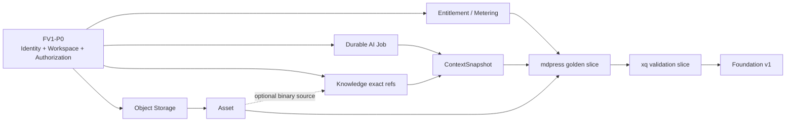
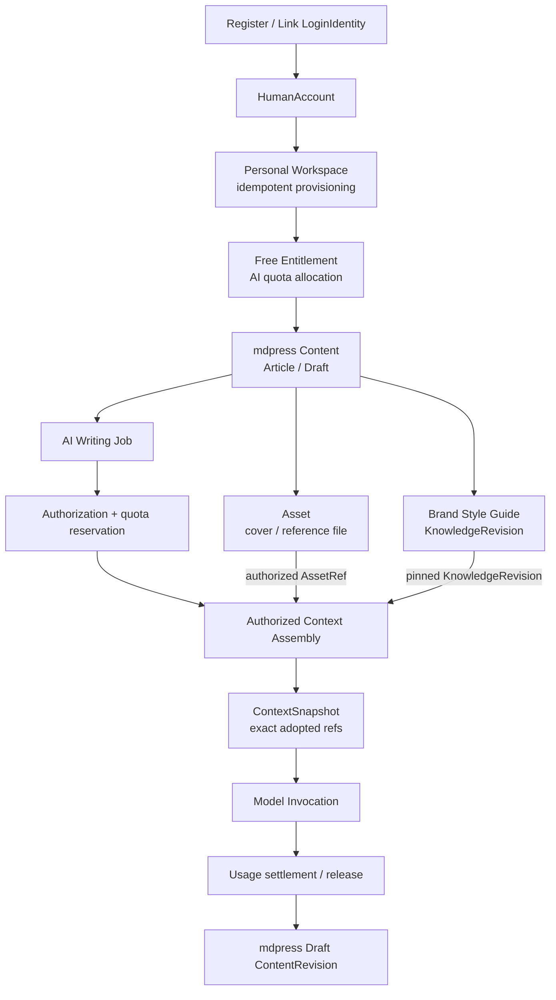

# Ainer Foundation v1 Implementation Roadmap

> 文档类型：架构实施路线 · 状态：Proposed · 基线日期：2026-08-03
> 本文不授权修改代码或数据库；实时完成状态始终以 [`project-status.md`](../project-status.md) 为准。

本文回答一个问题：**在不重写、不拆微服务、不一次实现所有抽象的前提下，Ainer 下一阶段应该先建
什么，为什么建，以及用什么真实消费者证明它属于 Foundation。**

本文使用 `FV1-P0` 至 `FV1-P3` 表示 Foundation v1 的优先级波次，避免与
[`ainer-scaffold-design.md`](../design/ainer-scaffold-design.md) 已定义的脚手架产品化 P0–P5 混淆。
两条路线不是可以并行跳过的发布计划：FV1 工作必须服从 Scaffold P0–P5 的制品、初始化器、
外部消费者和升级门禁。本文定义优先顺序，不改写当前完成状态，也不授权提前创建产品骨架。

## 1. Foundation v1 目标

### 1.1 定义

Ainer Foundation v1 不是“九个模块都有目录”，也不是完整企业中台。它是：

> **一组可由两个不同产品通过稳定制品和契约消费的模块化单体基础能力，使 Human Account、Workspace、
> Authorization、Asset、Entitlement、受治理 AI Job 和 Knowledge Context 形成可失败恢复、可授权、
> 可计量且边界清楚的真实闭环。**

Foundation v1 必须同时支持：

- `mdpress`：个人创作者、团队和企业内容空间；
- `xq-platform`：企业 Workspace、行业知识、业务事实和 Enterprise Extension；
- 两者共用安全与 AI 原语，但不共享产品 Content、ERP、CRM、规则或 UI。

### 1.2 v1 成功结果

v1 达成时应具备以下结果，而不是只具备类或表：

1. Human Account 可在零 Workspace 时完成允许的身份流程，并可幂等创建或加入 Workspace；
2. USER 与 SERVICE 的 typed credential actor 语义清楚，资源范围由服务端 resolver 决定；
   Subject/Actor 合同为 Agent 保留不扩权的扩展点，但 v1 不实现 Agent Token、ActingGrant 或 Agent Runtime；
3. mdpress 与 xq 各有一个真实资源使用同一 Authorization decision spine，撤销后立即收紧；
4. Asset/Storage、Entitlement/Usage 和 AI Job 可以处理幂等、失败、取消、重试与审计；
5. Knowledge 使用 exact Revision、Source/Evidence 和授权后的 ContextSnapshot，不依赖 Vector DB；
6. mdpress 与 xq 不复制 Ainer 源码、不查询 Foundation 私表，只消费 versioned artifact/port/API；
7. 两个独立消费者均完成回滚演练，并完成连续两个 Ainer minor 的升级验证；
   旧引用、Usage、ContextSnapshot 和审计仍可解释；
8. 产品事实与 Foundation 事实各有唯一 writer，不产生 Tenant/Workspace、Content/Knowledge 或
   Entitlement/Role 双重权威。

### 1.3 完成口径

本文使用以下状态：

| Status | 判定口径 |
|---|---|
| `Implemented` | 目标语义已冻结，有运行代码或真实 adapter、失败/安全验证，并通过公开契约被真实用例消费 |
| `Partial` | 已有可运行子切片，但目标语义、接线、可靠性或真实产品消费至少缺一项 |
| `Missing` | 只有 Proposed 文档、placeholder，或没有对应运行能力 |

`Implemented` 不等于生产就绪。生产 HA、容量、告警、备份、合规和商业发行仍需各自门禁；反过来，
存在 class、migration 或 nullable 字段也不自动构成 Foundation 能力。

## 2. 当前能力盘点

本节是用于制定顺序的 2026-08-03 快照，不取代
[`project-status.md`](../project-status.md)。现有代码最强的部分是可信 Identity/tenant 安全切片、
legacy inner Workspace 和 Model Gateway；与 v1 目标之间仍存在明显语义距离。

### 2.1 Implemented

按第 1.3 节的严格 Foundation 口径，本节要盖的九项目标能力中，**当前没有一项达到
`Implemented`**。仓库已有以下内部验证切片，但它们不改变后续完整 capability 的状态：

| Internally verified slice | 已实现范围 | 为什么不是 Foundation `Implemented` |
|---|---|---|
| Core engineering baseline | JDK 25、Spring Boot 4、BOM、Core、Web/Persistence/Security Starter、PostgreSQL、真实 HTTP 错误与模块化单体规则 | 它证明工程底座可运行，不替代下表的产品 Foundation 能力 |
| AI Model Gateway slice | OpenAI-compatible 非流式/SSE、模型白名单、预算、Token/费用、调用审计与错误脱敏 | 只算 AI Runtime 的已实现子切片，不能提升为完整 AI Runtime |
| Identity provisioning notification slice | 加密 outbox、lease/retry、HTTPS relay、幂等回执和最小终态 | 只属于 Identity provisioning，不是通用 Notification Center |

### 2.2 Partial

| Capability | 当前证据 | v1 缺口 | 结论 |
|---|---|---|---|
| Identity | user/tenant/membership、OIDC/PKCE、Passkey、预配激活、禁用/撤销和 outbox 已有真实 PostgreSQL 验证 | 仍是 tenant-first；缺 HumanAccount/qualified SubjectRef 收敛、workspace-neutral USER、LoginIdentity 1:N 和首个产品 onboarding | `Partial` |
| Workspace | inner Workspace CRUD、成员、单一 OWNER、转移/恢复、审计/归档和撤销 consumer 已实现 | 当前 Workspace 必带 legacy Tenant，且与 Identity Membership 是两套角色；canonical default collaboration boundary 和兼容 mapping 未实现 | `Partial` |
| Authorization | `ainer-module-authorization` 已有 Permission、Role、Binding、Scope、Decision 和纯决策器 S0 | 缺 PostgreSQL binding/decision audit、Spring/application adapter、真实 resource resolver、集合查询和两个产品接线 | `Partial` |
| AI Runtime | Model Gateway 已实现；已有 Proposed `AiTask/AiTaskRun/ContextSnapshot/Feedback` 代码切片 | Task 仍非可靠 durable Job；缺 lease、幂等、可靠 retry/cancel、Context 实际装配、Entitlement 结算与产品无关语义 | `Partial` |
| Notification | Identity provisioning 的加密 outbox、relay 和 receipt 可运行 | 缺通用 request/attempt/delivery contract、产品模板/偏好/同意和第二个消费者；不能直接把 Identity 表改名复用 | `Partial` |

关系数据持久化是已通过内部验证的工程底座，不是本路线中的 Asset/Object Storage capability，
因而不再用一个“Storage”行同时标注 `Partial` 和 `Missing`。

关键证据入口：

- [当前项目状态与已知缺口](../project-status.md)
- [IdentityUser 当前模型](../../ainer-module-identity/src/main/java/dev/ainer/module/identity/account/domain/IdentityUser.java)
- [Workspace 当前模型](../../ainer-module-workspace/src/main/java/dev/ainer/module/workspace/workspace/domain/Workspace.java)
- [AuthorizationService S0](../../ainer-module-authorization/src/main/java/dev/ainer/authorization/AuthorizationService.java)
- [AiTaskRunService 当前切片](../../ainer-module-ai-runtime/src/main/java/dev/ainer/module/ai/gateway/application/AiTaskRunService.java)
- [ADR-0033 v2](../decisions/0033-account-workspace-isolation-model-baseline-v2.md)
- [ADR-0034](../decisions/0034-knowledge-foundation-and-ai-context-model.md)

### 2.3 Missing

| Capability | 当前事实 | v1 最小需要 |
|---|---|---|
| Knowledge | 只有 ADR-0034 和 Proposed 数据模型；没有 canonical Knowledge runtime | exact Object/Revision、Source/Evidence、home、reference、授权解析和 Context materialization |
| Asset | 没有 Asset identity、metadata、生命周期、custody、provenance 或 storage adapter | 最小 Asset metadata + Blob reference + hash/type/size + access + retention/delete |
| Entitlement | AI 有 tenant daily budget，Context 有 policy version placeholder | feature entitlement allocation、quota reservation、Usage settle/release；不实现 Billing |
| Object Storage | 无 S3/MinIO/blob port 或 adapter | 一个由真实部署选择的对象存储 adapter、private-by-default access 和失败恢复 |

以下现象不能作为完成证据：

- AI daily budget 不能冒充 Free/Pro/Team 的 Entitlement 或 Quota；
- `ContextSnapshot` 类型存在但内容为空，不能冒充 Context Assembly；
- `AiTaskRun` 有表和 service，不能冒充 lease/retry/cancel 完整的 durable Job；
- Identity notification outbox 不能冒充跨产品通知平台；
- PostgreSQL persistence starter 不能冒充 Asset/Object Storage；
- Proposed ADR、Mermaid 和字段名不能冒充已交付 Knowledge。

## 3. 开发优先级

### 3.1 总览

| Priority | 目标 | 主要交付 | 退出依据 |
|---|---|---|---|
| `FV1-P0` | Identity / Workspace / Authorization spine 收敛 | Subject/Token profile、legacy resolver、Personal Workspace provisioning contract、真实授权闭环 | 仓库自有 GoldenConsumer 负向门禁；不依赖 xq 产品代码 |
| `FV1-P1` | mdpress 所需运行原语 | Asset/Object Storage、durable AI Job、Entitlement/Usage、产品通知 adapter | AI 写作 Golden Slice 可恢复且不重复扣额；真实 mdpress 受 consumer gate 约束 |
| `FV1-P2` | Knowledge Foundation MVP | exact Revision、Source/Evidence、Content reference、ContextPolicyBinding、ContextSnapshot | mdpress 品牌知识切片；不提前依赖 xq |
| `FV1-P3` | 第二消费者验证与 v1 promotion | xq 行业智能切片、公共契约收敛、条件式高级能力 | 两产品升级/回滚和权限撤销门禁 |

依赖顺序不是九条平行项目：



#### 与 Scaffold P0–P5 的硬依赖

[`ainer-scaffold-design.md`](../design/ainer-scaffold-design.md) 与 ADR-0024 是已有产品化权威。当前是否退出
Scaffold P0 只由 [`project-status.md`](../project-status.md) 确认；本路线不将 Proposed 文档写成已过门禁。
在本文基线日期，`project-status.md` 明确记录项目**尚未退出 Scaffold P0 Baseline Integrity**。因此
当下可执行的交付顺序是先关闭 Scaffold P0；FV1-P0 可同时完成语义、inventory 与仓库内部
GoldenConsumer 设计，但不得跳到新模块或外部产品实现。

| Scaffold gate | Foundation v1 的依赖关系 | 禁止跳过的行为 |
|---|---|---|
| P0 Baseline Integrity + P1 Scaffold Ready | 任何可发布 FV1 实现的前置；设计可继续，稳定制品不可提前宣称 | 用 SNAPSHOT、复制源码或空模块冒充 Foundation |
| P2 Create & Generate | 创建任何正式外部 consumer skeleton 的前置；P0 只使用仓库自有 GoldenConsumer/test fixture | 在 Initializer 门禁前手工创建 mdpress/xq 产品基线 |
| P3 First Consumer | 才能进入第一个真实外部产品切片；消费者顺序必须由有效 ADR 决定 | 用本 Proposed Roadmap 静默改写当前 `xq-platform-next` first-consumer 决策 |
| P4 AI-Native Scaffold | 承载经真实 product slice 验证的 AI/Knowledge 高级能力；不是 P3 首个消费者的前置 | 为了宣称 AI-native 而预建 Agent/RAG/Tool 平台 |
| P5 Ecosystem | 稳定 Foundation v1 promotion 硬门禁：至少两个独立消费者，并完成连续两个 minor 升级验证 | 一个消费者就冻结 stable public API |

因此，FV1-P0–P2 中的“mdpress 切片”在 Scaffold P2/P3 和消费者顺序 ADR 满足前，只是产品契约、
仓库 test fixture 和候选实施顺序，不是已创建的外部产品。

### 3.2 FV1-P0：Identity / Workspace 收敛

#### 为什么先做

Asset、Knowledge、AI Job 和 Entitlement 都需要可信 Subject、资源范围与撤销。如果先建设这些模块，
`tenant_id == workspace_id` 和两套 OWNER 会被写进更多外键、对象 key、索引和审计，迁移成本只会放大。

#### 最小交付

1. 完成 [ADR-0033 v2](../decisions/0033-account-workspace-isolation-model-baseline-v2.md) 的 walkthrough、
   legacy inventory 和接受评审；
2. 定义 authority-qualified Human/Service/Agent reference 家族与 USER-neutral、USER-workspace、
   SERVICE、legacy token profile；Agent 只冻结非 credential 引用、delegated profile 合同与扩展不变量，
   不实现 Agent token/runtime；
3. 允许 HumanAccount 在零 Workspace 时完成受限认证/恢复；现有 username/password 作为兼容
   LoginIdentity，不立即重写 Identity；
4. 先以仓库自有 GoldenConsumer 冻结 product-scoped、幂等 Personal Workspace provisioning
   contract；进入正式 consumer gate 后再由 mdpress 接入，失败不删除 Account；
5. 现有 Identity membership 继续是 legacy authority，禁止向 inner WorkspaceMember 双写并同时授权；
6. 实现服务端 ResourceHome/IsolationContext resolver 的最小合同；Workspace selector 只作为 ceiling；
7. 保留现有 tenant API/claim/SQL，通过 typed legacy adapter 兼容，不 rename、不删除；
8. 对 Personal/Team/Enterprise 只实现真实需要的 governance profile，不引入 Organization。

#### 退出门禁

- Account 在零 Workspace 时可取得仅允许 onboarding/profile 的 Token；
- Personal Workspace 创建幂等，部分失败可重试，重复请求不创建两个空间或 owner；
- 加入/退出 Team 不改变 Account，Service/Agent 不能成为人员 OWNER；这是合同负向门禁，
  不要求 v1 创建 Agent credential 或 ActingGrant；
- legacy tenant 与 canonical reference mapping miss/ambiguous 时 fail-closed；
- inner Workspace 与 canonical Workspace ID/API 不被混用；
- Account disable、Membership revoke 和 Workspace suspend 是三种独立事件/测试；
- 没有第二套 active top-level Membership authority。

### 3.3 FV1-P0：Authorization 最小闭环

#### 最小交付

1. 保留现有 S0 纯决策器，补齐首个持久 Binding/decision audit 和 Spring/application adapter；
2. 先支持直接 Human/Service SubjectBinding、Workspace/resource scope 和 product-owned relation；
3. 用仓库自有 GoldenConsumer 的两种资源形状验证：workspace-private draft-like resource 与
   tenantless public/owned resource；它们是 contract fixture，不是 mdpress/xq 业务模型；
4. 正式产品只实现自己的 `ResourceResolver`、`AuthorizationFactsProvider` 和 query constraint；
5. 执行 PUBLIC、RELATION_DERIVED、BINDING_REQUIRED 的完整路径，未知 facts 默认拒绝；
6. Membership governance role 只作为有限 contributor，不迁移、不双写到通用 Role；
7. Entitlement 还未接入时，不在 Authorization 中预建 Plan 角色；
8. 先用显式 application check 完成正确性，不以完整管理 UI、策略 DSL 或远程 PDP 为前置。

#### 退出门禁

- 两个 GoldenConsumer 资源形状都在读取正文前完成授权；真实 mdpress/xq 资源由
  Gate 2/3 再次验证；
- cross-workspace ID guessing 不泄漏资源存在性；
- Binding/Membership revoke 后，新 decision 立即 DENY；
- decision audit 能关联 typed Subject、resource、policy version 和 reason，但不保存正文；
- GoldenConsumer 不查询 Authorization、Identity 或 Workspace 私表；后续 xq/mdpress 继承同一门禁；
- 一个 consumer 缺失时不需要修改 Ainer Permission 常量或核心代码。

### 3.4 FV1-P1：Asset 与 Object Storage

Asset 是 AI、Content 和 Knowledge 的共同输入，必须早于 Knowledge ingestion 建立，但不能成为 DAM。

最小能力：

- `AssetRef`、MIME type、byte length、content hash、classification 和 lifecycle；
- blob/object port 与一个真实部署选择的 adapter；默认私有，不保存永久公开 URL；
- upload intent、完整性确认、`PENDING -> AVAILABLE | QUARANTINED | DELETED` 等最小状态；
- authorization-before-materialize、短时受控访问、object-store failure 和 orphan cleanup；
- custody/home、creator/provenance、rights/license 分离；Asset 不宣称 copyright owner；
- Workspace 只是默认 custody scope，Account-private 和 product-owned 资源可以使用其他 policy。

退出门禁：跨 Workspace/Account-private 负向测试、重复上传幂等、hash/type/size 校验、对象成功后才发布
Asset、数据库成功而对象失败及反向失败均可恢复、删除/保留和审计语义明确。

### 3.5 FV1-P1：Durable AI Job

不新建通用工作流引擎，优先收敛现有 `AiTask/AiTaskRun/ContextSnapshot` 实验切片：

- product-defined purpose 与版本化 input reference，不保存万能 payload；
- Job/Run 幂等键和 request fingerprint；
- lease/heartbeat、有限 retry/backoff、cancel、timeout 和 terminal state；
- Invocation 可选关联 Run，费用仍以 Invocation 为事实账本；
- Job/Invocation/ContextSnapshot 保留 opaque `PromptVersionRef`、确切 model/provider 以及配置/
  policy version，使结果可解释；Prompt 内容与版本生命周期仍由产品拥有，v1 不建 Prompt CMS；
- ContextSnapshot 记录实际采用 refs/decision/policy/digest 与上述版本引用，不默认保存
  prompt/正文；
- provider timeout、stream interruption、worker crash 和重复领取可恢复；
- result 进入 mdpress Draft 或 xq product result，AI Runtime 不直接写产品私表；
- 不把现有 `target_identity_id`、caller-supplied system prompt 或 Identity 周报用途固化为通用 Job API。

退出门禁：重复提交只产生一个逻辑任务；相同 key 不同 fingerprint 冲突；取消阻止后续副作用；重试不
重复结算；membership/grant revoke 后下一个检查点停止；Run、Invocation、ContextSnapshot 和产品结果
可关联但各有唯一 owner。

### 3.6 FV1-P1：Entitlement、Quota 与 Usage

v1 实现商业能力的**执行内核**，不实现 Billing System：

- namespaced feature/entitlement definition；
- 有效期和来源明确的 Grant/Allocation，target 不预先写死为 Workspace-only；
- Meter、Quota policy、幂等 reservation、settlement 和 release；
- Usage 记录 subject/agent、consumption scope、billed-to ref、amount/unit、period 和 source event；
- Permission、Entitlement、Quota 三层按顺序检查；
- provider 调用前预占，成功结算，拒绝/取消/失败按确定规则释放或计费；
- mdpress 拥有 Free/Pro/Creator Pro/Team 名称、价格、促销、支付和订阅 UI；
- xq 拥有企业合同与分配策略，Foundation 只消费 allocation 结果。

退出门禁：并发不能穿透 quota；重复 callback 不重复结算；取消和失败不会泄漏 reservation；Plan 不是
Role；Workspace ADMIN 不能自行扩大 entitlement；跨 Account/Workspace allocation 有明确 target 和
billed-to，不从 workspace_id 猜付款方。

### 3.7 FV1-P1：Notification 的有限处理

Identity provisioning notification 保持原 bounded context，不做大改名。mdpress 的 AI Job 完成通知
先通过稳定 product port 和产品 adapter 发送。只有 mdpress 与 xq 真实证明以下语义一致后，才把最小
`NotificationRequest -> DeliveryAttempt -> Receipt` 契约上提 Foundation：

- idempotency；
- recipient reference 与敏感目标保护；
- template/content owner；
- channel/provider adapter；
- retry、terminal receipt、preference/consent 和 audit。

v1 不要求通用 Notification Center。若第二消费者没有证明公共语义，Notification 保持 `Partial` 不阻塞
其他 Foundation v1 能力。

### 3.8 FV1-P2：Knowledge Foundation MVP

若 [ADR-0034](../decisions/0034-knowledge-foundation-and-ai-context-model.md) 被接受，以其作为架构基线孵化以下最小语义内核；
在此之前它只是候选基线，只做契约/纵向切片验证，不宣称已冻结 Foundation API：

1. `KnowledgeObject` 稳定 identity 与 immutable `KnowledgeRevision`；
2. Metadata、typed Relations、SourceRef、EvidenceLink、publication lifecycle；
3. 默认 Workspace home，并按真实用例选择性支持 AccountPrivate 或 PlatformCatalog；
4. Content-owned `KnowledgeReference@Revision`，Content 与 Knowledge 不合并；
5. exact ID/reference resolve 先于搜索、embedding 或 graph；
6. Authorization pre-filter、materialize recheck、revoke/freshness 和 classification；
7. Knowledge text 进入 Grounding channel；只有独立、可撤销、purpose-bound 且 pin exact Revision 的
   `ContextPolicyBinding` 可以进入 Instruction；
8. AI/import 只能创建 Proposal，不能自行发布；
9. ContextSnapshot 是 AI Runtime 的实际使用 manifest，Knowledge retrieval trace 不重复写 adopted truth。

本波次只使用 mdpress 候选切片：一个 Brand Style Guide + 一篇 Article，验证 revision pin、
Content reference 和 AI 写作。xq 翡翠知识保留到 FV1-P3 作为第二消费者证据，避免在 P2
就反向依赖尚未进场的 xq。

退出门禁：旧文章不随新 Revision 漂移；Knowledge/source/member revoke 后新 Context fail-closed；
Markdown prompt injection 不能进入 Instruction；当前价格只能来自产品权威生成的
immutable `DomainSnapshot/ObservationRef`；没有 Vector DB 仍能
完成精确引用、上下文和引用追踪。

### 3.9 FV1-P3：第二消费者验证与 Advanced Capability

P3 的任务不是继续扩充清单，而是让 xq 证明 mdpress 拉动的能力确实通用：

- 由 xq 执行并拥有价格/规则的权威计算，只向 Context Assembly 提供不可变、版本化的
  `DomainSnapshot/ObservationRef`，再与行业 Knowledge 和 AI advisory report 组合验证；
- 验证 Enterprise Workspace 与 Organization/LegalEntity/Brand/BusinessUnit 显式关联，而不是塞入
  Workspace core；
- 验证 Asset、Usage reservation、AI Job、KnowledgeRef 和 delivery request 的公共语义；
- 只有两产品都需要且语义一致的部分才上提稳定 Foundation API；
- Agent 不是 P3 或稳定 v1 的必修项；真实 Agent 用例出现时另立范围，并满足 ADR-0031 的
  ActingGrant、Capability 与 checkpoint 门禁，v1 只宣称 AI Gateway/Job，不宣称 Agent Runtime；
- Provider router、authorized lexical/vector read model、跨 Workspace publication 等能力只在数据和
  SLO 证明后追加，不作为 v1 宣传前的默认占位。

Foundation v1 promotion gate：两个消费者均使用非 SNAPSHOT/受控 RC artifact，无源码复制和私表访问；
均通过 PostgreSQL、安全、migration、off-state、失败恢复与升级/回滚验证；公共契约有 owner、版本和
兼容窗口；撤销 Membership、Entitlement、Knowledge 或 Asset 后，新 Context 和后续副作用 fail-closed；
稳定 v1 仍需满足 Scaffold P5 的连续两个 minor 升级门禁。

## 4. 明确不做

Foundation v1 当前不实现以下能力：

| 不做项 | 原因 | 重新评估触发器 |
|---|---|---|
| Vector DB | exact reference 和真实授权闭环尚未证明；向量不是 Knowledge authority | 真实语料/gold set、ACL pre-filter、召回与 p95/p99 证据 |
| Knowledge Graph / ontology / triple store | typed relation 不等于需要图数据库 | 至少两个无法由关系投影/查询满足的产品用例 |
| MCP Server | MCP 是 transport，不是 Knowledge/Tool authority | 有真实外部 MCP consumer、版本和安全边界 |
| Microservice | 当前无独立扩缩容、团队或故障隔离证据 | 满足 ADR-0024 的触发条件和全部工程门禁 |
| Billing System | v1 只需要 Entitlement/Quota/Usage 执行内核 | 真实支付、发票、税务、退款和对账 owner 明确 |
| Organization Full Model | 会让 Creator 产品承担企业复杂度 | xq 真实切片证明最小目录，第二消费者证明公共语义 |
| ERP / CRM / Supply Chain | 它们是 xq 产品领域，不是 Foundation | 不上提；仅稳定跨产品原语可另行评审 |
| CMS / Theme / Publishing | 它们属于 mdpress Content 产品 | 不上提；Knowledge/Asset 只提供引用与基础生命周期 |
| 通用 Workflow/BPM | AI Job 不需要设计器、任意节点或通用编排 DSL | 两个产品出现独立等待/审批/恢复的共同执行语义 |
| 万能 Notification Center | 当前只有 Identity 与单产品通知语义 | 两产品使用相同 request/attempt/receipt contract |
| DAM/DMS、转码和 CDN orchestration | Asset v1 只解决 identity、blob、ACL 和生命周期 | 多媒体规模、转码与交付 SLO 成为真实瓶颈 |
| 完整 Agent / multi-agent / agent-to-agent delegation | 当前 ActingGrant 与 Tool runtime 未验证 | 一个真实 Agent 用例通过撤销、Capability 和 checkpoint 门禁 |
| 通用 Space/Subject/Relationship 服务 | 会提前制造万能抽象和远程故障域 | 多个产品证明稳定语义且本地模块无法满足 |
| Multi-region/shard/private-deployment 平台 | v2 只需保留 Isolation Domain 扩展关系 | 客户合同、合规和真实部署拓扑出现 |

同样不做：直接删除或 rename `tenant`、一次迁移全部 Membership、把当前 inner Workspace 当 canonical
Workspace、为路线图创建空 Maven 模块、复制 xq/mdpress 产品模型进入 Ainer。

## 5. 第一个真实 Consumer：mdpress

### 5.1 为什么先选 mdpress

mdpress 同时验证 C 端人类身份、个人/团队协作、内容与知识分离、Asset、AI Job、Entitlement 和
Usage。它能最快暴露 Ainer 是否仍然隐含“每个用户都是企业员工”。

本路线将 mdpress 设为 Foundation v1 的第一个能力验证消费者。这与 ADR-0024/现有产品化文档中
“xq-platform-next 是首个外部消费者”的当前 Accepted 顺序不同。因此这是**有条件的路线推荐**，
不是可执行的静默改写：在 Scaffold P3 前必须新建/接受一份消费者排序 ADR，明确修订
ADR-0024 和 Scaffold Design 的 xq-first 结论。在该 ADR 生效前，xq-first 仍是权威，mdpress 只能作为
仓库内部的 capability shape/contract fixture，不得以 Gate 0 的名义创建外部产品骨架。
若维护者不接受该顺序修订，则必须保留同一套 Foundation 能力门禁，但将第 5/6 节的外部
消费者进场顺序对调，不能同时宣称两个“第一”。

### 5.2 Golden Path



### 5.3 责任分工

| Ainer Foundation | mdpress Product |
|---|---|
| HumanAccount、LoginIdentity contract、SubjectRef | 注册体验、协议同意、CreatorIdentity、公众号身份 |
| Workspace、Membership、IsolationContext resolver | Personal Workspace 创建策略、onboarding 和 Team UX |
| Authorization decision spine | `document.*`、`publishing.*` Permission 和产品 resource facts |
| Asset/Storage identity、hash、ACL、lifecycle | Cover/素材/文章关系、版权、编辑与媒体业务规则 |
| Entitlement、reservation、Usage | Free/Pro/Creator Pro/Team catalog、价格、促销、支付 |
| AI Job、Invocation、ContextSnapshot | AI Writing workflow、Prompt 内容、选题/改写/发布状态机 |
| KnowledgeObject/Revision、Source/Evidence | Brand Style Guide profile、文章中的 KnowledgeReference |
| notification port（若上提） | 模板、渠道选择、用户偏好和运营策略 |

### 5.4 mdpress 验收

- Account 创建成功但 Workspace provisioning 暂时失败时可安全重试；
- 同一 product provisioning scope 不产生重复 Personal Workspace；
- Draft 属于 mdpress，AI output 不直接成为 Content publication 或 Knowledge；
- Article publication pin exact KnowledgeRevision，style guide 新版不改写旧文；
- 只有 ContextPolicyBinding 能把 style guide 放入 Instruction channel；
- 重复 AI request 不重复建逻辑 Job、扣 quota 或发布 Draft；
- provider timeout、cancel、worker crash 和对象存储失败可恢复；
- 跨 Workspace Asset/Knowledge/Content 均 fail-closed；
- Workspace owner 不自动成为版权人、payer 或平台管理员；
- Free/Pro 是 Entitlement，不是 Role 或 Workspace profile。

## 6. 第二个 Consumer：xq-platform

### 6.1 验证目标

xq 不再用来证明 Ainer 能复制 CRM/ERP，而是验证 Foundation 能否承载企业扩展，同时不吞并企业领域。

建议首个行业智能切片：

```text
HumanAccount / ServicePrincipal
→ Enterprise Workspace access
→ certificate/image Asset
→ xq Product domain returns immutable product snapshot
→ PlatformCatalog jade definition + Workspace heuristic Knowledge
→ xq authoritative pricing/rule execution returns DomainSnapshot/ObservationRef
→ Authorization + deterministic compliance policy
→ AI advisory Job + ContextSnapshot
→ Usage settlement
→ xq-owned analysis result
```

### 6.2 Foundation 与 xq 边界

| Foundation | xq / Enterprise Extension |
|---|---|
| Account、ServicePrincipal、Workspace access | Employee/Workforce、Organization association |
| Permission/Binding/decision contract | 岗位、商品、门店、客户等 product facts provider |
| Asset/Storage | 证书/商品图的业务关系和合规要求 |
| AI Job、Invocation、Usage、ContextSnapshot | 翡翠分析/估价流程和最终业务报告 |
| Knowledge Revision、Source/Evidence、retrieval contract | 翡翠 kind/profile、策展、行业验证 owner |
| `DomainSnapshot/ObservationRef` 的窄输入契约 | SKU、库存、价格、规则的执行与实时业务 authority |
| IsolationContext resolver | LegalEntity、Brand、BusinessUnit、Store、region policy source |

### 6.3 xq 验收

- SKU、库存、证书、价格和客户仍由 xq 数据库与产品执行权威拥有；Foundation v1
  不因此预建通用 Tool Runtime；
- Knowledge 可以解释价格规则，但不能执行或冒充当前价格；
- 互相冲突且有 Evidence 的市场经验可以并存并在 Context 中显式呈现；
- Organization、LegalEntity、Brand、BusinessUnit 和 Workspace 不被强制为一棵树；
- 一个企业合同覆盖多个 Workspace 时，Entitlement allocation 不复制成 Workspace Role；
- Workforce termination 只撤销任职派生 grant，不猜测性关闭 Account 或全部 Membership；
- xq product result 经领域校验后写入 xq，AI Artifact/Run 不成为业务事实；
- 同一 Foundation minor/RC 升级不会要求 xq 修改 Ainer 私表或 fork 模块。

## 7. 模块边界

### 7.1 逻辑目标结构

下图是职责地图，不是本任务创建模块的指令，也不要求把仓库重命名为 `ainer-platform`：

```text
ainer-platform (logical boundary)
├── ainer-framework                         existing Foundation infrastructure
│   ├── ainer-core
│   ├── ainer-spring
│   ├── ainer-security
│   ├── ainer-starter-web
│   ├── ainer-starter-persistence
│   └── future storage/security adapters only when proven
│
├── ainer-module-identity                   Foundation / existing, needs convergence
├── ainer-module-workspace                  Foundation / existing legacy slice, needs reclassification
├── ainer-module-authorization              Foundation / S0 existing, needs real integration
├── ainer-module-asset                      Foundation candidate / create only with P1 slice
├── ainer-module-ai-runtime                 Foundation / gateway existing, Job partial
├── ainer-module-knowledge                  Foundation candidate / create only with P2 slice
├── ainer-module-entitlement                Foundation candidate / create only with P1 slice
│
├── mdpress                                 Product consumer, separate product boundary
│   ├── content
│   ├── theme
│   ├── publishing
│   └── ai-writing
│
└── xq-platform                             Product consumer, separate product boundary
    ├── organization/workforce extension
    ├── product / crm / erp
    ├── supply-chain / finance
    └── industry-ai
```

Notification 不因清单完整而立即建立新模块。首个产品先使用稳定 port 与自身 adapter；只有两个产品证明
request/attempt/receipt 语义后才决定是 Foundation module、starter 还是模块内公共契约。

### 7.2 Foundation 核心与现有边界

- framework、starter 和稳定安全契约；
- Human/Service credential subject、Agent actor extension contract 与身份安全生命周期；
- Workspace collaboration/governance core 与 legacy isolation resolver；
- Permission/Role/Binding/Decision 机制；
- 已有 AI Model Gateway、Invocation 账本与 provider boundary；durable Job/ContextSnapshot 在 P1 孵化。

“现有边界”不等于全部已 `Implemented`；其状态仍以第 2 节为准。

### 7.3 Foundation 候选能力与 promotion 门禁

P1/P2 可以在模块化单体内孵化下列窄契约和真实切片，但在 xq 作为第二消费者完成 P3
验证前，它们仍是 **Foundation candidates**，不是稳定 public API：

- Asset identity、blob contract、访问和基础生命周期；
- durable AI Job/Run 与 ContextSnapshot 的产品无关子集；
- KnowledgeObject/Revision、Source/Evidence 与 context candidate contract；
- Entitlement allocation、Quota reservation 和 Usage fact；
- Notification request/attempt/receipt 中被两个产品证明一致的最小子集。

P3 只 promotion 两个产品在语义、失败、授权和升级方面均一致的部分。仅 mdpress 需要的
Brand/Profile/Content 语义，仅 xq 需要的企业或行业规则，永不因“已经有 module”自动上提。

### 7.4 Product 所有

- mdpress Content、Theme、Publishing、CreatorIdentity、公众号 adapter 和 AI Writing workflow；
- xq Organization/Workforce 产品扩展、LegalEntity、Brand、BusinessUnit、CRM、ERP、商品、供应链、财务；
- 产品 Permission 定义、resource facts、最终业务状态和业务审计；
- Plan 商品名、价格、促销、支付、合同和账单；
- Prompt 内容、业务规则、知识 kind profile、来源策展和结果验收；
- Rights、copyright、license、publisher、payer 等产品关系。

### 7.5 依赖与数据规则

```text
framework <- Foundation modules <- product modules / executable assembly
```

- framework 不依赖任何业务或 Foundation 实现模块；
- Foundation 模块不依赖 mdpress/xq 类型、表、Mapper 或 Service；
- 产品通过 port、typed ref 和 versioned event 协作，不查询 Foundation 私表；
- Knowledge 不直接查询 Content/xq 私表；AI Runtime 不直接写 Content/ERP；
- Authorization 核心不依赖 Organization、Knowledge 或产品实现，只消费 contributor/事实端口；
- Asset storage adapter 不决定 copyright；Entitlement 不决定 payment；Workspace 不决定 LegalEntity；
- 每个模块拥有自己的 migration、Repository 和事务；模块化单体不等于共享私表；
- local port 是 v1 默认，remote adapter 只在满足 ADR-0024 的拆分条件后增加。

## 8. 实施施工顺序与 Gate

### Gate 0：语义与发布边界

- ADR-0033 v2 完成接受门禁；ADR-0034 仍按真实切片评审；
- 为 Asset/Storage、Entitlement/Metering 和 durable AI Job 各形成窄实现 ADR，不共享万能 schema；
- 当前 capability 状态与代码一致，不把 Proposed/placeholder 写成 Implemented；
- Scaffold 的 CI、0-skipped PostgreSQL、可消费制品、license/SBOM/secret gate 继续作为横向门禁；
- 只建立仓库自有 GoldenConsumer/contract fixture，不创建 mdpress/xq 外部产品骨架；
- 在 Scaffold P3 前通过独立消费者排序 ADR 解决 mdpress-first 与现行 xq-first 的冲突。

### Gate 1：安全骨架

- HumanAccount/Subject/Token profile、Personal Workspace 和 legacy resolver 通过负向测试；
- Authorization 接入两个 GoldenConsumer 资源形状，并为后续产品 resolver 冻结窄 port；
- 无双 Membership authority、无 claim ambiguity、无跨 scope 泄漏。

### Gate 2：mdpress Creator Slice

- 仅在 Scaffold P2/P3 与消费者排序 ADR 允许后创建正式 mdpress consumer；
- Asset/Storage、Entitlement、AI Job 和产品通知 adapter 形成可恢复闭环；
- Knowledge exact revision 与 ContextSnapshot 完成品牌写作用例；
- 重复、取消、撤销和依赖失败不扩大权限或重复扣费。

### Gate 3：xq Enterprise Slice

- xq 权威 `DomainSnapshot/ObservationRef`、行业 Knowledge 和 AI advisory 形成事实/推断分离；
- 企业扩展没有反向污染 Foundation；
- 两个消费者完成共同契约、回滚演练与连续两个 minor 升级验证后，才发布
  稳定 Foundation v1。

## 9. 主要风险与控制

| Risk | 早期信号 | Control |
|---|---|---|
| God Workspace 回归 | Asset、Knowledge、Entitlement 都被当成 Workspace 子表 | 独立 authority/lifecycle；只保存显式 scope/custody ref |
| 双事实源 | TenantMembership、WorkspaceMember、新 Membership 同时授权 | 每个迁移 aggregate/resource class + generation 单 writer/reader、fencing、privilege diff |
| 状态膨胀 | 有 class/字段即标 Implemented | 使用第 1.3 节口径和真实 consumer gate |
| 先抽象后消费 | Brand、Notification、Plan 直接进入 Foundation | mdpress 孵化，xq 第二次证明后 promotion |
| Context 泄漏 | Vector/RAG 先于 Authorization 上线 | P0 auth spine；pre-filter + materialize recheck |
| 额度不一致 | retry/callback 重复扣费或绕过预算 | reservation/settlement idempotency 与并发测试 |
| v1 无限化 | 把 Billing、Agent、Organization、RAG 全部设为前置 | 第 4 节明确不做；按黄金切片退出 Gate |
| 产品复制平台 | consumer fork Ainer 或直查私表 | published artifact、ArchUnit/contract/golden consumer gate |

最终施工原则：**先把身份、范围和授权做成一条可信脊柱；若消费者排序 ADR 接受本文建议，
再让 mdpress 拉动最小运行能力，让 xq 证明可复用性；只有被两个真实消费者和连续升级证明的语义
才成为稳定 Ainer Foundation v1。**

## References

- [Ainer Boot AI Application Foundation Audit](ainer-boot-ai-application-foundation-audit.md)
- [ADR-0033 v1](../decisions/0033-account-workspace-isolation-model-baseline.md)
- [ADR-0033 Adversarial Review](adr-0033-adversarial-review.md)
- [ADR-0033 v2](../decisions/0033-account-workspace-isolation-model-baseline-v2.md)
- [ADR-0034 Knowledge Foundation](../decisions/0034-knowledge-foundation-and-ai-context-model.md)
- [ADR-0024 Evolutionary Modular Platform Architecture](../decisions/0024-evolutionary-modular-platform-architecture.md)
- [ADR-0030 Authorization](../decisions/0030-hybrid-fine-grained-authorization-baseline.md)
- [ADR-0031 Agent Delegation](../decisions/0031-agent-delegation-and-ai-context-authorization.md)
- [ADR-0032 Organization/Workforce](../decisions/0032-organization-workforce-directory-baseline.md)
- [AI Runtime Data Model Proposal](../design/ai-runtime-data-model.md)
- [Knowledge Data Model Proposal](../design/knowledge-data-model.md)
