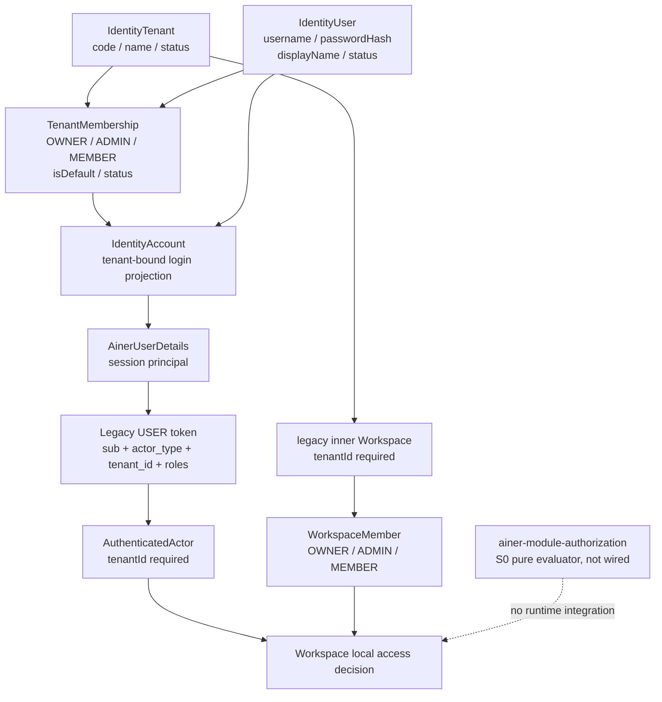
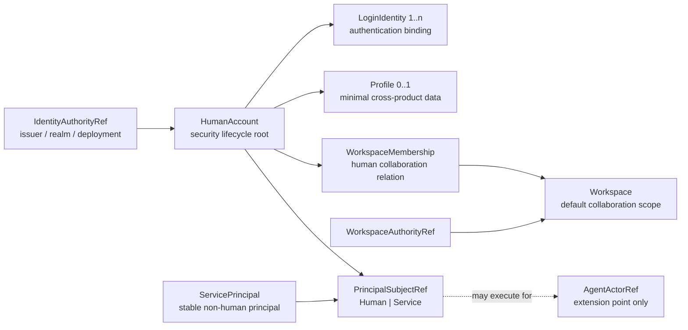
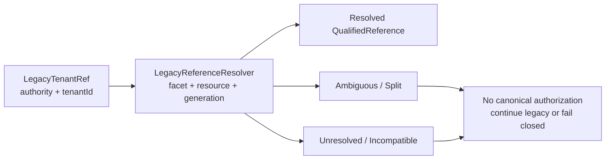
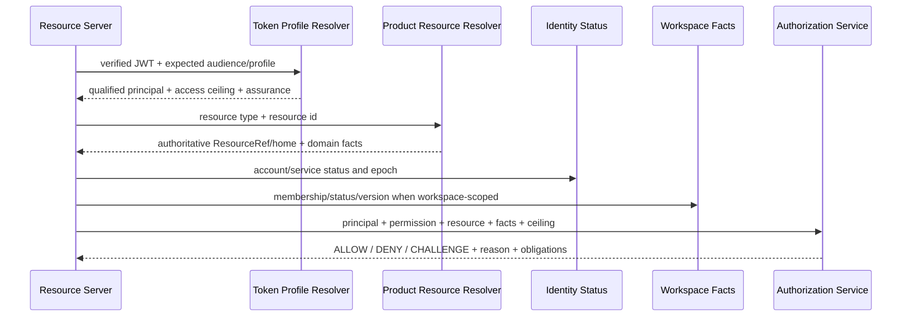
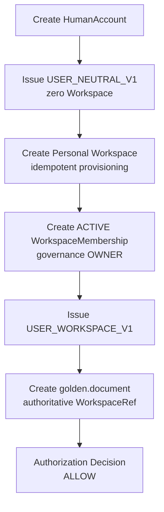
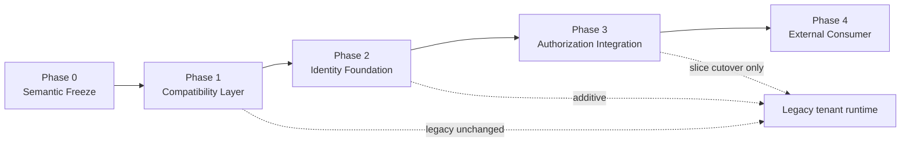

# Identity Foundation v1 Implementation Plan

## Document Status

- 状态：Implementation Planning Baseline
- 日期：2026-08-03
- 决策依据：[ADR-0033 v2：Account、Workspace、Subject 与 Isolation 模型基线](../decisions/0033-account-workspace-isolation-model-baseline-v2.md)
- 风险依据：[ADR-0033 对抗性架构审查](adr-0033-adversarial-review.md)
- 交付顺序依据：[Ainer Foundation v1 Implementation Roadmap](ainer-foundation-v1-roadmap.md)
- 范围：`ainer-module-identity`、`ainer-module-workspace`、`ainer-module-authorization`、
  `ainer-framework/ainer-security`、`ainer-framework/ainer-starter-security`、
  `ainer-authorization-server`、`ainer-server`
- 实现授权：无。本文不修改或授权立即修改 Java、Kotlin、POM、Flyway migration、API 或测试

本文回答的不是“如何重新设计 Identity”，而是：

> **如何在保持现有 tenant 安全链继续有效的前提下，用 additive schema、compatibility adapter、
> audience/profile 隔离和按资源切换，把 tenant-first Identity 渐进演进为 Foundation v1。**

核心迁移姿态是：

1. 当前安全行为继续作为 legacy authority，不通过 rename 改变含义；
2. `IdentityUser.id` 作为当前 Ainer Identity Authority 内的 HumanAccount 迁移锚点，但不把整条
   `IdentityUser` 记录原样宣布为 HumanAccount；
3. canonical Workspace 和 WorkspaceMembership 只服务新模型或已经显式完成 cutover 的资源；
4. 不进行 authority-bearing Membership 双写，不采用 `legacy OR canonical` 放行；
5. 新 Token Profile 使用新 audience/endpoint allowlist，旧消费者继续只接受 legacy profile；
6. 每个 cutover slice 都必须证明新权限不大于旧权限，并具备 fencing、watermark、撤销和安全回滚。

---

# Part 1：当前 Identity 模型分析

## 1.1 当前实体地图

### 1.1.1 当前运行模型

当前 Identity 的准确定位是：

> **以全局 `IdentityUser` 为主体记录、以默认 `TenantMembership` 为登录入口、以
> `IdentityTenant` 为授权上下文和治理容器的 tenant-bound Identity Directory。**

Authorization Server 已提供成熟的 OAuth/OIDC Provider、密码、Passkey、Token 存储、撤销和
introspection 基础，但这不等于已具备外部 OIDC、邮箱、手机号或微信 `LoginIdentity`。



`IdentityUser`、默认 Membership 和 Tenant 的状态合取决定当前账号能否进入登录投影。相关 SQL 强制
join `is_default=true` 的 Membership 和 Tenant，repository 再把 User/Tenant/Membership 的状态合成为
`enabled`；因此“数据库中存在 User”并不等于“该 User 可以在没有 Tenant 时认证”。证据见
[IdentityMapper.xml](../../ainer-module-identity/src/main/resources/mapper/identity/IdentityMapper.xml)和
[MybatisIdentityRepository.java](../../ainer-module-identity/src/main/java/dev/ainer/module/identity/account/infrastructure/mybatis/MybatisIdentityRepository.java)。

### 1.1.2 Entity / Table / Repository / Service / API / JWT / Event 地图

| Current entity / projection | Table | Repository / adapter | Service / runtime use | API | JWT claim | Event / audit |
|---|---|---|---|---|---|---|
| [`IdentityUser`](../../ainer-module-identity/src/main/java/dev/ainer/module/identity/account/domain/IdentityUser.java) | `ainer_identity_user` | [`IdentityRepository`](../../ainer-module-identity/src/main/java/dev/ainer/module/identity/account/application/IdentityRepository.java) → [`MybatisIdentityRepository`](../../ainer-module-identity/src/main/java/dev/ainer/module/identity/account/infrastructure/mybatis/MybatisIdentityRepository.java) | [`IdentityApplicationService`](../../ainer-module-identity/src/main/java/dev/ainer/module/identity/account/application/IdentityApplicationService.java)、`IdentityAccessLifecycleService`；同时承担 username、password hash、display name、status | 没有 account-neutral 注册/Profile API；通过 tenant provisioning、activation 和平台查询间接管理 | USER 的 `sub` 是 User ID；用户状态参与 token active 判断 | 禁用产生每个 ACTIVE tenant 一条 `IDENTITY_USER_DISABLED`；成员审计另表保存 |
| [`IdentityTenant`](../../ainer-module-identity/src/main/java/dev/ainer/module/identity/account/domain/IdentityTenant.java) | `ainer_identity_tenant` | 同一 Identity Repository | provisioning、activation、member governance、ownership transfer/recovery | `/api/me/tenants`、`/api/tenants/{tenantId}/members/**`、平台 provisioning/query、tenant selection | USER 必有 `tenant_id`；受管 SERVICE 可有 `tenant_id` | Tenant 状态进入 token active 判断；provisioning、ownership 和 security audit 均 tenant-scoped |
| [`TenantMembership`](../../ainer-module-identity/src/main/java/dev/ainer/module/identity/account/domain/TenantMembership.java) | `ainer_identity_membership` | 同一 Identity Repository | [`TenantMemberManagementService`](../../ainer-module-identity/src/main/java/dev/ainer/module/identity/account/application/TenantMemberManagementService.java)、ownership、tenant selection、token customizer | tenant member CRUD、ownership transfer、existing-user acceptance | `tenant_id` 与 `roles=[OWNER|ADMIN|MEMBER]` 来自签发前实时 ACTIVE Membership | `IDENTITY_MEMBERSHIP_REVOKED`、`IDENTITY_MEMBERSHIP_ROLE_CHANGED`；member/security audit |
| [`IdentityAccount`](../../ainer-module-identity/src/main/java/dev/ainer/module/identity/account/application/IdentityAccount.java) | 无独立表，是 User + default Membership + Tenant 的查询投影 | `IdentityRepository.findAccountByUsername` | [`AinerUserDetailsService`](../../ainer-authorization-server/src/main/java/dev/ainer/authorizationserver/identity/AinerUserDetailsService.java) 的认证输入 | `/login`、Spring WebAuthn/OAuth 流程内部使用 | 投影携带 tenantId 和 TenantRole；不是未来 HumanAccount | 无独立事件 |
| [`AinerUserDetails`](../../ainer-authorization-server/src/main/java/dev/ainer/authorizationserver/identity/AinerUserDetails.java) | 无独立表；浏览器 principal 位于 Servlet HTTP session，OAuth authorization/consent 另存 JDBC | UserDetailsService + OAuth authorization service | 浏览器 session principal；多 tenant 时选择一个 tenant | `GET/POST /select-tenant`、标准 OAuth/OIDC endpoints | tenantId 非空；token customizer 再实时校验该 Membership | session/logout 和 access-token revoke 是不同生命周期 |
| [`Workspace`](../../ainer-module-workspace/src/main/java/dev/ainer/module/workspace/workspace/domain/Workspace.java) | `ainer_workspace`，`tenant_id` 非空 | [`WorkspaceRepository`](../../ainer-module-workspace/src/main/java/dev/ainer/module/workspace/workspace/application/WorkspaceRepository.java) → MyBatis | [`WorkspaceApplicationService`](../../ainer-module-workspace/src/main/java/dev/ainer/module/workspace/workspace/application/WorkspaceApplicationService.java)；创建直接继承 actor.tenantId | 当前 [`/api/workspaces`](../../ainer-module-workspace/src/main/java/dev/ainer/module/workspace/workspace/api/WorkspaceController.java) CRUD、成员、OWNER 转移、审计 | 不产生 claim；请求使用 token 的 tenant ceiling | Workspace 自有 authorization audit、owner recovery；不是 generic Authorization audit |
| [`WorkspaceMember`](../../ainer-module-workspace/src/main/java/dev/ainer/module/workspace/workspace/domain/WorkspaceMember.java) | `ainer_workspace_member` | [`WorkspaceMemberRepository`](../../ainer-module-workspace/src/main/java/dev/ainer/module/workspace/workspace/application/WorkspaceMemberRepository.java) → MyBatis | ACTIVE Membership + WorkspaceRole 是当前内层 Workspace 访问实时权威 | `/api/workspaces/{id}/members/**` 等 | 不读取 JWT `roles`；OAuth scope 只是 ceiling | Identity disable/revoke consumer 将相应 Workspace membership 置为 REVOKED |
| [`AuthenticatedActor`](../../ainer-framework/ainer-security/src/main/java/dev/ainer/security/actor/AuthenticatedActor.java) | 无表，请求期投影 | [`SecurityContextAuthenticatedActorResolver`](../../ainer-framework/ainer-starter-security/src/main/java/dev/ainer/security/autoconfigure/SecurityContextAuthenticatedActorResolver.java) | Resource Server 的 USER/SERVICE actor；`subjectId`、`tenantId`、`actorType` 都必填 | 被 Workspace、AI Gateway 等 Controller 使用 | 读取 `sub`、`tenant_id`、`actor_type`；缺 tenant 会被拒绝 | 无自身事件；依赖在线校验或短 TTL 收敛 |
| Passkey credential/security lifecycle | `user_entities`、`user_credentials`、`ainer_passkey_credential`、recovery/enrollment/security-audit tables | [`AinerJdbcPasskeyCredentialRepository`](../../ainer-authorization-server/src/main/java/dev/ainer/authorizationserver/passkey/AinerJdbcPasskeyCredentialRepository.java) 及 recovery/enrollment services | WebAuthn credential 本体引用 User subject；管理、恢复和 enrollment guard 仍依赖 tenant/default membership | Spring WebAuthn endpoints、Passkey enrollment/recovery APIs | 认证后仍解析为 tenant-bound AinerUserDetails；`amr`/`auth_time` 记录因子 | 独立 credential/security audit；部分安全记录通过 `(tenant_id, subject_id)` FK 绑定 Membership |
| OAuth client / authorization / consent | `oauth2_registered_client`、`oauth2_authorization`、`oauth2_authorization_consent`，另有受管 browser/service client 表 | Spring JDBC repositories + managed client adapter | Authorization Code/PKCE、Client Credentials、introspection、revocation、OIDC Provider | 标准协议 endpoints 和 client-control APIs | SERVICE 当前 `sub=client_id`、`actor_type=SERVICE`，tenant 可选 | client retirement 影响 introspection；没有稳定 ServicePrincipal event |
| [`IdentityAccessEvent`](../../ainer-module-identity/src/main/java/dev/ainer/module/identity/account/domain/IdentityAccessEvent.java) | `ainer_identity_access_event`（同时承担 transactional outbox） | Identity access event outbox/recovery repositories → HTTP publisher | 将 User disable、Membership revoke/role change传播到 legacy consumer | recovery/replay 为内部受控 API | payload 固定 `tenantId + subjectId + payloadVersion`，不使用 qualified SubjectRef | 三类 access event；Workspace 当前只消费 disable/revoke，且以 receipt 保证幂等 |
| [`SubjectRef`](../../ainer-module-authorization/src/main/java/dev/ainer/authorization/domain/SubjectRef.java)、`SubjectBinding` | 无表 | `BindingResolver` 仅为端口 | [`AuthorizationService`](../../ainer-module-authorization/src/main/java/dev/ainer/authorization/AuthorizationService.java) 是 Spring-free S0 evaluator | 无运行 API | 不解析当前 JWT | 无持久化 decision audit/outbox；尚未接入 Server/Workspace |

核心 schema 分别见
[Identity 初始 migration](../../ainer-module-identity/src/main/resources/db/migration/V202607220300__create_identity.sql)、
[Workspace 初始 migration](../../ainer-module-workspace/src/main/resources/db/migration/V202607220100__create_workspace.sql)和
[Workspace tenant scope migration](../../ainer-module-workspace/src/main/resources/db/migration/V202607220320__tenant_scope_workspace.sql)。

### 1.1.3 当前 API 和安全路径

| Slice | 当前入口 | 当前安全含义 |
|---|---|---|
| 当前用户 tenant context | `GET /api/me/tenants` | 列出 ACTIVE TenantMembership，不是未来 Workspace 列表 |
| Tenant member | `GET/POST/PATCH/DELETE /api/tenants/{tenantId}/members/**` | Tenant OWNER/ADMIN 治理；不是通用 Authorization Role API |
| Tenant ownership | `/api/tenants/{tenantId}/ownership-transfers/**` | 单一 ACTIVE OWNER 的 legacy 治理流程 |
| Provisioning/activation | `/internal/platform/identity/tenant-provisioning-requests/**`、`/api/identity/tenant-activations/**` | 新用户、Tenant 和默认 OWNER Membership 被作为一个交付单元 |
| Tenant selection | `GET/POST /select-tenant` | 修改 browser session 中的 tenant-bound principal |
| Identity directory | `/internal/identity/directory/tenants/{tenantId}/members/**` | Workspace 邀请可选 eligibility 查询，不是 Workspace 授权源 |
| Workspace | `/api/workspaces/**` | legacy tenant 内层 Workspace；路径本身没有表达 canonical authority |
| Token status | introspection、RFC 7009、自助 access-token revoke、OIDC logout | access、refresh、session、logout 并非同一状态机 |

### 1.1.4 当前真正的 authority 划分

当前不是“两张 Membership 表共同放行同一个请求”，而是三个尚未统一的 facet：

| Decision facet | 当前唯一 authority | 明确不应推导 |
|---|---|---|
| Human 是否可进入某 legacy tenant、Token 可否携带该 `tenant_id` | Identity `TenantMembership` + User/Tenant 状态 | 不能由 WorkspaceMember 反推 |
| 某 Subject 是否可访问当前内层 Workspace | ACTIVE `WorkspaceMember` + WorkspaceRole | 不能由 JWT `roles` 或 Tenant OWNER 绕过 |
| 通用产品 Permission | 尚无运行 authority；Authorization 只有 S0 evaluator | 不能把现有 Tenant/Workspace role 当成已经接入的通用 Role |

Workspace 目前按 `OAuth scope ceiling ∩ ACTIVE WorkspaceMember ∩ WorkspaceRole` 直接裁决，
`ainer-module-authorization` 没有被 Workspace 或 `ainer-server` 装配。当前依赖和接线事实见
[Workspace POM](../../ainer-module-workspace/pom.xml)、
[Authorization POM](../../ainer-module-authorization/pom.xml)、
[Server POM](../../ainer-server/pom.xml)和
[AinerServerApplication.java](../../ainer-server/src/main/java/dev/ainer/server/AinerServerApplication.java)。

还存在一个应在 Phase 0 纳入 inventory 的事件合同缺口：Identity 可发布
`IDENTITY_MEMBERSHIP_ROLE_CHANGED`，Workspace consumer 只接受 disabled/revoked 两种类型。未来不能把
TenantRole change 镜像为 WorkspaceRole change；兼容 relay 必须显式路由或 ACK-ignore，而不是让同名
角色制造隐式同步。证据见
[IdentityAccessEventType.java](../../ainer-module-identity/src/main/java/dev/ainer/module/identity/account/domain/IdentityAccessEventType.java)、
[WorkspaceIdentityAccessEventType.java](../../ainer-module-workspace/src/main/java/dev/ainer/module/workspace/workspace/application/WorkspaceIdentityAccessEventType.java)和
[project-status.md](../project-status.md)。

## 1.2 当前模型与 ADR-0033 v2 差异

| Current Concept | Future Concept | Gap | Risk |
|---|---|---|---|
| `IdentityUser` | `HumanAccount + LoginIdentity 1:N + Profile 0..1` | username、passwordHash、displayName 和安全状态融合在一条记录；没有 account-only API | 直接 rename 会把单 username、单 credential、单 Profile 永久固化；企业身份可能接管个人账号 |
| `IdentityAccount` | account authentication projection + optional access context | 当前强制 default TenantMembership、tenantId 和 TenantRole | 零 Workspace Account 无法认证；把 tenant 改 nullable 会让大量旧调用在运行时失去 partition |
| `IdentityTenant` | `LegacyTenantRef` + facet-scoped mapping | 当前是有生命周期、成员、OWNER、provisioning、API 和 token context 的真实治理容器 | 表/API rename 会伪造语义完成；直接等同 Workspace 会再次形成 God Workspace |
| `TenantMembership` | legacy tenant eligibility；经显式迁移后才可能产生 canonical `WorkspaceMembership` | 连接的是 Tenant，含 defaultTenant 和 TenantRole；没有 qualified WorkspaceRef | 与 WorkspaceMember 按同名 role 双写/OR-read会扩权或复活已撤销权限 |
| `Workspace` | canonical `Workspace`，默认 collaboration/resource namespace/auth scope | 当前 Workspace 必须位于 Tenant 内，ID 只在 tenant context 下解释 | 直接复用当前 `/api/workspaces` 或表会固化 `tenant_id == workspace isolation` |
| `WorkspaceMember` | canonical human `WorkspaceMembership` | 当前 subject 是未限定 issuer/type 的字符串，且同时携带 legacy tenant；role/status 属当前内层 Workspace | 无法证明与 TenantMembership 等价；复制 OWNER 会把治理、法律或商业 owner 混同 |
| `AuthenticatedActor` | authority-qualified `PrincipalSubjectRef` + typed token context | 丢失 issuer/audience/contract version，tenant 必填，只有 USER/SERVICE | USER-neutral 不可表达；多个 issuer 下裸 `sub` 冲突；简单 nullable 会破坏旧安全不变量 |
| JWT `tenant_id` | legacy compatibility claim；新 profile 使用 typed subject 和 optional Workspace access ceiling | 当前 USER 必有 tenant，audience 单一，无 profile/version/workspace claims | 双 claim fallback、1:N/N:1 mapping 或不同消费者解释差异会产生 confused deputy |
| JWT `roles` | legacy TenantRole claim；未来由 Workspace facts + Authorization decision 组成 | 当前值来自 TenantMembership，虽未默认映射为 Spring authority，但容易被误用 | 把 `OWNER` 自动翻译为 Workspace owner 或业务 Permission 会提权 |
| OAuth `client_id` | credential/client binding → stable `ServicePrincipal` | SERVICE `sub` 直接等于 client ID；client 轮换即主体变化 | 审计身份不稳定，旧 credential revoke 与 Principal disable 无法区分 |
| 当前 `SubjectRef`/`Scope` | qualified Human/Service principal + Workspace/resource scope | SubjectRef 已有 issuer namespace 雏形，但类型仍为 USER/SERVICE；Scope/Resource 仍要求 tenant UUID；没有 runtime adapter | 错把 null tenant 当 global，或建立第二套不兼容 Subject 类型 |

---

# Part 2：Foundation v1 目标模型

## 2.1 目标边界



这不是一棵“所有资源都必须挂 Workspace”的树。Account、Workspace、商业合同、法律所有权和物理
隔离仍是正交生命周期。

## 2.2 IdentityAuthorityRef

`IdentityAuthorityRef` 限定 Account/ServicePrincipal ID 的解释范围。v1 最小合同是：

```text
IdentityAuthorityRef = trusted issuer + realm/deployment discriminator when required
```

- 当前单一 Ainer Authorization Server 可以由其受信 `iss` 解析为 authority，不要求立即建表；
- private deployment、federated issuer 或一个 issuer 下多个 realm 出现时，才增加受控 discriminator；
- 任何跨持久化、event、audit 或远程 API 的主体引用必须携带或可无歧义恢复 authority；
- 不用邮箱、手机号、username 或裸 UUID 推断 authority。

## 2.3 HumanAccount

HumanAccount 是**一个 Identity Authority 内的人类安全账户生命周期根**。

负责：

- 稳定 `accountId`；
- 账户 ACTIVE/LOCKED/DISABLED/CLOSED 等安全状态；
- account-wide security/revocation version；
- 登录恢复政策和关闭流程；
- LoginIdentity link/unlink 的安全治理。

不负责：

- Workspace、WorkspaceRole 或 Membership；
- Subscription、Plan、Entitlement、Quota；
- Organization、Employee、Customer、Creator persona；
- 内容、资产、版权或法律所有权；
- ServicePrincipal 或 Agent 生命周期。

迁移锚点：当前 Ainer authority 内复用 `ainer_identity_user.id` 作为 `HumanAccount.accountId`。这是 ID
连续性，不是表语义一次性重定义。`username/password_hash/display_name` 在过渡期继续留在旧表并由
adapter 使用，直到各自完成 fenced authority-generation cutover。

HumanAccount 生命周期必须允许：

```text
Account created
    -> zero Workspace
    -> link additional LoginIdentity
    -> create/join zero or more Workspace
    -> leave one Workspace without closing Account
    -> disable Account without deleting Workspace resources
```

## 2.4 LoginIdentity

LoginIdentity 表达“某认证命名空间中的标识如何受控绑定到一个 HumanAccount”，建议的逻辑字段为：

```text
LoginIdentity
  identityId
  accountId
  type
  providerAuthority
  normalizedIdentifier
  status
  verifiedAt / linkedAt / lastUsedAt
  credentialRef? / providerMetadata?
```

| Type | 稳定标识与唯一性边界 | Credential / verification | 特别约束 |
|---|---|---|---|
| username | current local authority + normalized username | password credential reference | 先把现有 username 投影为 legacy-local binding，不复制明文或自动换 hash |
| email | authority + normalized verified email | verification evidence，password 不是 email 字段 | 相同邮箱不得自动 merge Account；可被不同 realm 使用 |
| phone | authority + normalized E.164 phone | OTP/verification evidence | 手机号回收必须有重新验证和风险控制 |
| WeChat | provider + platform app ID + `openId` | provider assertion | `unionId` 只能作为关联证据，不能单独触发 Account merge |
| OIDC | external issuer + immutable `sub` | OIDC assertion、link ceremony | 当前 Ainer 只是 OIDC Provider；该外部 binding 尚未实现 |
| Passkey | account-bound WebAuthn user handle/credential reference | 独立 WebAuthn credential lifecycle | credential secret/public-key records继续由专用存储管理；Passkey 管理不应长期依赖 default tenant |

不能把这些字段直接塞进 HumanAccount，原因是：

1. 一个 Account 可以有多个登录方式，每个方式有不同 provider、验证、撤销和恢复生命周期；
2. 企业 OIDC offboarding 不应关闭个人微信/邮箱 Account；
3. username/email/phone 可以变更或回收，而 accountId 必须稳定；
4. Passkey 和 OAuth/OIDC credential 有独立轮换、审计和机密数据边界；
5. Account merge 是高风险显式操作，不能由标识相同隐式触发。

v1 不实现自动 Account merge。link 操作必须在已认证 Account 上完成 step-up 或经过受控恢复；当存在
冲突绑定时 fail closed 并进入人工/专用恢复流程。

## 2.5 Profile

Foundation Profile 是可选、最小、跨产品相对稳定的账户展示投影：

| Foundation candidate | 说明 |
|---|---|
| `displayName` | 私有或产品内默认展示名，不等于法律姓名或公开作者署名 |
| `avatarAssetRef?` | 指向 Asset 的引用，不把对象存储路径写入 Identity |
| `locale?` | 通用交互 locale |
| `timeZone?` | 通用时间显示偏好 |

以下内容属于产品或 Enterprise Extension：Creator handle、bio、笔名、品牌 persona、公众号身份、
Employee 编号、岗位、Department、Customer 档案、CRM 标签、法律姓名/KYC、内容偏好、营销同意、
订阅等级。Profile 不能成为新的万能 Person/Customer 表。

迁移时，当前 `display_name` 可先形成只读 Profile projection；在切换 writer 之前不能允许旧列和新
Profile 同时成为相同字段的 authority。

## 2.6 SubjectRef、ServicePrincipal 与 AgentActorRef

Foundation v1 的可认证 principal 只包含 Human 和 Service：

```text
PrincipalSubjectRef =
    HumanSubjectRef(identityAuthorityRef, accountId)
  | ServiceSubjectRef(identityAuthorityRef, servicePrincipalId)
```

当前 Authorization 的 `SubjectRef(issuerNamespace, subjectId, USER|SERVICE)` 是可复用的迁移起点，
不应另建一套无法互操作的 Subject 表。实现时可由 compatibility adapter 把 wire `USER` 映射为领域
Human 语义；不能在同一发布中全局 rename enum 并破坏旧数据。

`ServicePrincipal` 是稳定非人安全主体；OAuth `client_id` 是可轮换 credential/client identifier。
新 SERVICE profile 必须先把 client 绑定到稳定 ServicePrincipal，再令 `sub` 表示后者。旧 SERVICE
profile 保持 `sub=client_id`，不可静默改变审计身份。

`AgentActorRef(agentAuthorityRef, agentId, version)` 只保留扩展位，用于未来行为归因。v1：

- 不创建 Agent 表、Credential、Membership 或 API；
- 不向当前 `AuthenticatedActor` 增加 `AGENT`；
- Agent 不作为 JWT credential `sub`；
- Agent 不成为通用 OWNER/ADMIN；
- 未来 Agent 由 Human/Service principal 在受控 grant 下执行，并在审计中附带 AgentActorRef。

Anonymous request 没有 SubjectRef。v1 不创建假 Account 或公共共享 Subject。

---

# Part 3：Tenant 演进方案

## 3.1 最终角色

当前 `IdentityTenant` 不 rename。它在兼容期的未来语言是：

> **LegacyTenantRef：对现有 tenant row、claim、API、event、audit 和 partition 的有类型引用。**

这不改变数据库对象名，也不声称当前 Tenant 已经“变成”引用。当前运行时仍使用完整
IdentityTenant/TenantMembership 行为；LegacyTenantRef 是新代码跨边界解释它时使用的兼容合同。

## 3.2 必须保留的内容

| 保留项 | 兼容要求 | 退出条件 |
|---|---|---|
| `ainer_identity_tenant` 表和 UUID | 不 rename、不重建 ID、不修改历史审计引用 | 所有 legacy readers/writers、retention 和审计义务结束后另作决定 |
| `ainer_identity_membership` | legacy tenant eligibility、role、default selection 继续有效 | 相关 resource/API 完成逐 slice cutover，Token 全部 drain |
| 现有 `tenant_id` 列 | 在 current Workspace、audit、event、service-client 等表保持原义 | 不能因 canonical model 上线就置空或改名 |
| JWT `tenant_id` / `roles` | legacy profile + legacy audience 继续原样签发和校验 | 所有旧 Resource Server 升级且最长 token/refresh/session 窗口结束 |
| `/api/tenants/**`、`/api/me/tenants`、`/select-tenant` | 保持 legacy contract；不伪装 canonical Workspace API | consumer inventory 为零并有替代路径、deprecation 和审计证据 |
| provisioning、ownership、recovery | 继续服务 legacy Tenant | 新 onboarding 不复用这些 endpoint 语义；旧流程自然退休 |
| Identity access events/audit | tenant + subject payload 按原版本解释 | 新 event 有独立 version/qualified refs，旧 consumer 全部 drain |

## 3.3 必须退出的语义

新 Foundation 代码不得继续推导：

- `tenant = company/customer/legal entity/commercial account`；
- `tenant = canonical Workspace`；
- `tenant_id = physical isolation key`；
- Tenant OWNER = Workspace governance owner = legal/billing owner；
- default tenant = HumanAccount home；
- 没有 TenantMembership 就没有 HumanAccount；
- 相同 tenant UUID 在不同 issuer/deployment 下代表同一对象。

退出语义不等于删除旧功能；它意味着新模型必须通过 typed resolver，而不是继续添加依赖。

## 3.4 Legacy mapping compatibility layer



建议的 resolver 合同是：

```text
resolve(
  LegacyTenantRef,
  MappingFacet,
  optional ResourceRef,
  expectedGeneration
) -> Resolved | Ambiguous | Unresolved | Incompatible
```

`MappingFacet` 至少区分 `COLLABORATION_WORKSPACE` 与 `ISOLATION_CONTEXT`。未来商业或法律关系由相应
owning domain 建模，不塞进一个万能 Tenant mapping。

| Cardinality | 合法示例 | Resolver 行为 | 授权不变量 |
|---|---|---|---|
| 1:1 | 一个 legacy tenant 的协作 facet 经核验对应一个 Enterprise Workspace | 返回 qualified WorkspaceRef，并携带 mapping version/generation | 只证明该 facet 的映射，不证明 contract、legal、billing 或 isolation 等价 |
| 1:N | 一个 tenant 的不同产品/资源被拆到多个 Workspace | 必须带 resource/product/provisioning discriminator；没有足够事实时返回 Ambiguous | 不能任选第一个 Workspace，不能把 TenantMembership 扩散为所有 Workspace Membership |
| N:1 | 合并后的一个 canonical Workspace 承接多个历史 tenant | 保留全部 source lineage；每个 source 独立迁移 | 不能把多个 TenantMembership 做集合并集后自动授权；canonical Membership 必须显式建立 |
| Unresolved | orphan、脏数据、私有部署导入、尚未分类资源 | 只允许继续走明确 legacy path；canonical path fail closed | 不生成 synthetic Workspace，不把裸 tenant ID 当 Workspace ID |

Mapping 必须服务端控制、可审计、可版本化。JWT/Header/URL 只能提交 selector，不能声明映射事实。

---

# Part 4：Workspace 演进方案

## 4.1 模型转变

```text
Current
IdentityTenant -> legacy inner Workspace -> WorkspaceMember

Foundation v1
HumanAccount -> WorkspaceMembership -> canonical Workspace
```

箭头表示关系而非 Account 拥有 Workspace。Workspace 可在创建者离开、Account 禁用或治理转移后继续
存在。

## 4.2 当前能力如何处理

| 当前能力 | Foundation 处理 | 说明 |
|---|---|---|
| 稳定 Workspace ID、name、status/version | 保留概念，不能自动复用当前 row | 当前 row 被 mandatory tenant 和 legacy API 约束；是否 promotion 必须逐 Workspace 决定 |
| member/invite/accept/revoke | 保留 collaboration 能力 | canonical Membership 只绑定 qualified HumanAccount；Service 走 SubjectBinding |
| OWNER/ADMIN/MEMBER | 保留最小 governance profile，但重新限定含义 | OWNER 是 governance owner，不是 legal、copyright、billing owner；profile 可有不同 cardinality |
| ownership transfer/recovery | 保留治理需求 | Personal/Team/Enterprise 可以采用不同 policy，不能把当前单 OWNER 索引宣布为全平台永久不变量 |
| audit | 保留安全审计需求 | 最终 decision audit 与 generic Authorization 对接；不能丢失 current audit |
| tenant eligibility directory | 仅作为 legacy adapter | canonical Workspace invitation 不要求目标先属于某 Identity Tenant |

必须移出 Workspace core 的职责：Subscription/Billing、Contract/Payer、LegalEntity、Copyright/
RightsHolder、Object placement/KMS/region/retention、Identity realm、Organization/Department/Brand/
BusinessUnit。它们可以引用 Workspace，但不由 Workspace 状态机拥有。

## 4.3 Canonical Workspace API

当前 `/api/workspaces` 是 legacy tenant-scoped API，**不得**通过返回字段或文档改名直接宣布为未来
API。Foundation v1 建议冻结独立 namespace：`/api/foundation/v1/workspaces`。最终公开路径仍应由
API contract review 接受，但下列语义必须保持：

| Operation | Proposed canonical endpoint | Contract invariant |
|---|---|---|
| 创建 Workspace | `POST /api/foundation/v1/workspaces` | USER-neutral 可调用；必须有 `Idempotency-Key`；服务端从 token 取 HumanAccount，不接受 caller-supplied owner |
| 列出可访问 Workspace | `GET /api/foundation/v1/workspaces` | 由 canonical ACTIVE Membership 列出，不读取 `/api/me/tenants` 投影 |
| 读取/更新 Workspace | `GET/PATCH /api/foundation/v1/workspaces/{workspaceId}` | authority 由可信 deployment/route 限定；跨 authority 时使用 qualified ref |
| Membership | `GET/POST /api/foundation/v1/workspaces/{workspaceId}/memberships` | Human only；邀请、接受与激活是显式状态，不因 Account 存在自动加入 |
| Membership 变更 | `PATCH/DELETE .../memberships/{accountId}` | 经 Authorization decision；不能用 Identity TenantRole 绕过 |
| Governance transfer/recovery | `/api/foundation/v1/workspaces/{workspaceId}/governance-transfers/**` | `OWNER` 只表示治理责任；所有权 policy 由 Workspace profile 决定 |

这里冻结的是最终 canonical contract，不表示所有 operation 在同一 Phase 开放。Phase 2 只开放原子
Personal provisioning、调用者自己的 Membership read 和 Workspace read；邀请、角色变更、移除、治理
转移/恢复以及 Team/Enterprise 的任意成员管理必须保持关闭，直到 Phase 3 的 Authorization decision
spine 接入。Phase 2 唯一允许的 OWNER 建立是 provisioning transaction 内“创建者 HumanAccount → 新建
Personal Workspace”的 server-side bootstrap invariant，不能作为通用管理权限或复用于既有 Workspace。

响应必须包含 `WorkspaceRef(workspaceAuthorityRef, workspaceId)`，不能只让远程消费者长期保存裸 UUID。

Personal Workspace 幂等键的业务唯一性是：

```text
(IdentityAuthorityRef, HumanAccountId, Product/ProvisioningScope)
```

它不是“每个自然人全球只能有一个 Personal Workspace”。重复或并发请求返回同一 WorkspaceRef 和同一
ACTIVE OWNER Membership；部分失败后可安全重试。Team/Enterprise 创建同样要求 request idempotency，
但不使用 Personal 唯一性。

## 4.4 Legacy Workspace 与 canonical Workspace 共存

在某 legacy inner Workspace 被 promotion 前：

- `/api/workspaces/**`、`ainer_workspace`、`WorkspaceMember` 是唯一 authority；
- canonical API 不列出或授权该 Workspace，除非 resolver 明确标记为 migrated generation；
- 相同 UUID 不能作为“它们是同一个对象”的证据；
- promotion 需要 resource inventory、member/role privilege diff、audit continuity 和 rollback plan；
- 新建 Personal Workspace 不创建虚假 IdentityTenant，也不写 legacy Workspace 表。

---

# Part 5：Membership 演进

## 5.1 是否需要双写

**答案：NO。禁止 authority-bearing 双写。**

不允许一个成员变更同时写 `TenantMembership`、`WorkspaceMember` 和 canonical
`WorkspaceMembership`，然后让任意一张表都能放行。理由：

1. 三者当前或未来负责的 facet 不同；同名 `OWNER/ADMIN/MEMBER` 不代表 privilege 等价；
2. outbox 延迟、乱序、蓝绿部署和回滚会造成撤销复活；
3. 两侧唯一 OWNER 约束分别成立，不代表全局状态一致；
4. OR-read 会扩大权限，AND-read 会在 projection 延迟时破坏可用性且掩盖 authority 不清。

允许的是：**唯一 writer/reader + 非权威 projection + shadow compare**。Compatibility projection 可以
写第二份数据用于对账，但必须标记 source generation，且不得参与放行。

## 5.2 Membership authority matrix

| Aggregate/resource generation | Writer | Authorization reader | Shadow source |
|---|---|---|---|
| legacy tenant facet | TenantMembership | legacy Identity/token status | canonical candidate 只做对账 |
| legacy inner Workspace | WorkspaceMember | WorkspaceApplicationService 当前关系检查 | canonical candidate 只做对账 |
| 新 canonical Workspace | WorkspaceMembership | canonical Workspace fact provider + Authorization | 不创建 legacy Tenant/WorkspaceMember |
| 已 promotion Workspace/resource | canonical WorkspaceMembership | canonical Authorization path | legacy projection只用于兼容响应且不可授权 |

Identity role change 不自动改变 WorkspaceRole；WorkspaceMembership 也不再复制为同义
SubjectBinding。协作成员关系应作为 Authorization 的实时 relation fact，只有产品额外 Role/Permission
才进入 SubjectBinding。

## 5.3 Migration phases

### Phase 0：Inventory

- 为每个 tenant、inner Workspace、API、resource type、event、claim consumer 建立 facet inventory；
- 记录 current writer、authorization reader、owner cardinality、撤销方式、token audience、最大 TTL；
- 证明或否定 legacy TenantMembership → canonical WorkspaceMembership 的 role/privilege 映射；
- 将 1:1、1:N、N:1、Unresolved 分类写入 migration ledger；
- 明确 Passkey recovery/enrollment 等 `(tenant_id, subject_id)` 隐式依赖。

退出条件：没有“默认等价”项；每个 facet 都有唯一 current authority 和 owner 团队。

### Phase 1：Adapter

- 建立 `LegacyTenantRef`、qualified principal/workspace ref 和 mapping resolver 端口；
- 用 adapter 从旧表提供 HumanAccount status、legacy membership 和 Workspace facts；
- legacy endpoint/token 行为完全不变；
- 对 `IDENTITY_MEMBERSHIP_ROLE_CHANGED` 进行显式兼容路由，不同步 WorkspaceRole；
- 记录 mapping version、source version、projection watermark。

退出条件：compatibility adapter 的结果可与当前 direct reader 逐项比对，且没有业务请求改由新表放行。

### Phase 2：Dual Read

- 线上请求仍由该 facet 的 legacy authority 决策；
- canonical reader 在 shadow 路径计算 decision/facts，结果不影响响应；
- `canonical allow / legacy deny` 记为最高等级 privilege expansion，绝不放行；
- `legacy allow / canonical deny` 阻止 cutover 并进入数据/语义修复；
- 对撤销、角色变更、owner transfer、并发邀请测量 propagation watermark；
- 不允许 fallback 为 `legacy OR canonical`。

退出条件：目标 slice 在规定观察窗口内零 unexplained privilege expansion、零 stale revoke，并完成
人工抽样和负向测试。

### Phase 3：Cutover

- 按 Workspace/resource class，而不是全平台开关，分配 `cutoverGeneration`；
- 先 fence legacy writer，再等待 outbox/projection 达到已知 watermark；
- 在单个原子/可审计步骤中切换 writer generation 和 authorization reader；
- 切换后 canonical 是唯一 authority，legacy 只能接收单向非权威兼容 projection；
- rollback 只能回到已同步到相同 watermark 的 authority；否则保持 fail closed，不能恢复旧 reader；
- 旧 Token 若缺少新 profile/context，不得借 mapping 自动升级。

退出条件：新旧 pod 不可能分别写不同 authority；撤销不会因回滚复活；decision/audit 可追溯 generation。

### Phase 4：Legacy retirement

- 停止为已迁 slice 发行 legacy Token/API 写入；
- 等待 access token、refresh authorization、session、consent 和 event retry 最大窗口结束；
- 对历史 API 返回 deprecation/consumer telemetry，确认零 consumer；
- 冻结旧表为 read-only/archive，保留审计和 lineage；
- 删除/rename 表或列不属于 Foundation v1 的默认动作，必须另立数据保留决策。

退出条件：没有 legacy writer/authorization reader、没有可恢复旧权限的未 drain token、历史审计可查。

---

# Part 6：JWT / Security 演进

## 6.1 Token Profile baseline

所有新 profile 都必须有受控 `token_profile`、`claim_contract_version`，并结合可信 `iss`、`aud`、
`actor_type` 解释。未知 profile/version 必须失败关闭。业务 Controller 不再自行 fallback 解析 raw claim。

| Profile | Principal / claims | 用途 | 明确禁止 |
|---|---|---|---|
| `USER_NEUTRAL_V1` | `sub=HumanAccountId`、`actor_type=USER`、`token_profile`、version；authority 从 `iss`/受控 realm 解析；无 tenant/workspace role | registration completion、Profile、LoginIdentity、安全设置、Personal Workspace provisioning | 不能访问 legacy tenant API 或 product resource；不能因缺 context 自动使用 default tenant |
| `USER_WORKSPACE_V1` | 同一 Human `sub` + `workspace_authority` + `workspace_id` + optional membership/account epoch；无 legacy `roles` authority | canonical Workspace/resource access | Workspace claim 只是 access ceiling，不是 resource owner/isolation truth；不能自动映射 TenantRole |
| `SERVICE_V1` | `sub=stable ServicePrincipalId`、`actor_type=SERVICE`、authority/profile/version；credential client ID 单独绑定 | service-to-service | Service 不能持有 Human WorkspaceMembership 或通用 OWNER；client 轮换不改变 subject |
| `LEGACY_TENANT_V1` | 保持当前 `sub`、`actor_type`、`tenant_id`、`roles`、scope、amr/auth_time | 所有未迁 current consumers | 不增加 workspace fallback；不重新解释 tenant 为 canonical Workspace |

兼容期可以让一个新 token 同时带 `tenant_id` 与 Workspace context，**仅限**特定 audience、特定 facet
已经证明 1:1、claim contract 明确且 resolver generation 固定的场景。1:N、N:1、Unresolved 一律禁止
双发。旧 audience 不能接受 USER-neutral 或 USER-workspace profile。

`AuthenticatedActor` 应保留为 legacy tenant-bound adapter，不把 `tenantId` 简单改成 nullable。
Foundation 需要一个新的严格 token-profile resolver，输出 authority-qualified principal、token ceiling 和
assurance；旧 Controller 可通过 adapter 继续得到原 `AuthenticatedActor`。

## 6.2 Token issuance and selection

- 登录 session 只表示已认证 HumanAccount 和 assurance，不把 selected Workspace 写成 Account 固有字段；
- selected Workspace 是某次 authorization request 的上下文；签发前实时验证 Account、Workspace 和
  Membership 状态；
- token profile 由注册 client、audience/resource indicator、允许 scope 和 endpoint policy共同决定，
  不能由调用方任意请求降级；
- USER-neutral scope 采用 allowlist，只包含 account/profile/onboarding；
- USER-workspace token 的 Workspace context 不能覆盖产品 ResourceResolver 返回的 authoritative home；
- current `/select-tenant` 继续只服务 legacy profile。

## 6.3 Access / Refresh / Session / Consent / Introspection 兼容矩阵

| Protocol state | Legacy behavior to preserve | Foundation v1 behavior | Cutover control |
|---|---|---|---|
| Access Token | 当前 issuer/audience、tenant claim、scope、短 TTL、选择性在线校验 | profile-specific audience；typed principal；neutral/workspace status path 分离 | endpoint/audience allowlist；未知 profile 401/403；不做 claim fallback |
| Refresh Token | JDBC schema 和 revocation-aware lookup 已支持协议字段，但当前真实 browser clients 未形成完整 refresh consumer 基线 | refresh family 固定原 profile、subject、audience/context；每次刷新重查 Account/Membership/mapping/client status | 不允许 refresh 时从 legacy 自动升级新 profile；revoke/ambiguity 时拒绝并撤销 family |
| Browser Session | tenant selection 修改 session principal；OIDC logout 与 access revoke 分离 | account-global session；Workspace selection 只绑定当前 authorization request | legacy/new session principal 类型可反序列化；不重用旧 session 自动升级 |
| Consent | Spring JDBC consent 已装配，但当前 browser clients 通常不要求 consent | key 到 qualified HumanAccount + client + audience/profile + scope/purpose；Workspace context按真实需求显式绑定 | legacy consent 不自动授权新 profile/Workspace；需要新 consent 或受控迁移证据 |
| Introspection | USER 解析 `tenant_id+sub`，检查 User/Tenant/Membership/revocation epoch；managed client 状态也参与 | neutral 检查 Account/epoch；workspace 检查 Account+Workspace+Membership+mapping generation；SERVICE 检查 Principal+credential/client | profile-specific validator；unknown/inconsistent/missing context 返回 `active=false` |

新 Token Profile 不复用 current `(registered_client_id, principal_name)` consent row。Foundation v1 冻结
以下 additive persistence 边界：

- `ProfiledConsent` 以 qualified HumanAccount、registered client、audience、token profile、purpose 为 key，
  保存 scopes、contract version、status 和时间；legacy consent table 继续只解释 legacy authorization；
- `ProfiledAuthorizationContext` 以 OAuth authorization ID 为 key，保存 qualified principal、profile/version、
  audience、optional WorkspaceRef、mapping generation 和 revocation/status version；
- 新 access/refresh issuance 必须存在且校验该 context；没有 context 的历史 authorization 一律分类为
  legacy，不能猜测或 backfill 成新 profile；
- 新 profile 需要新的 consent ceremony；旧 consent 只在原 client/profile 内 drain；若产品选择独立
  client-per-profile，它仍不能省略上述 profile/version context 和 subject qualification。

Servlet HTTP session 与 OAuth JDBC authorization 是不同 persistence。新 account-global session principal
必须有独立序列化/version contract；legacy session 不原地升级 Workspace/profile，无法证明兼容时直接要求
重新认证。OAuth authorization JSON 中的旧 `AinerUserDetails` 则必须在 drain 期保持可反序列化。

当前 OAuth/JWT 证据见
[AinerAuthorizationServerConfiguration.java](../../ainer-authorization-server/src/main/java/dev/ainer/authorizationserver/config/AinerAuthorizationServerConfiguration.java)、
[RevocationAwareOAuth2AuthorizationService.java](../../ainer-authorization-server/src/main/java/dev/ainer/authorizationserver/config/RevocationAwareOAuth2AuthorizationService.java)、
[OAuth schema](../../ainer-authorization-server/src/main/resources/db/migration/V202607220310__create_oauth2_authorization_server.sql)和
[AinerResourceServerAutoConfiguration.java](../../ainer-framework/ainer-starter-security/src/main/java/dev/ainer/security/autoconfigure/AinerResourceServerAutoConfiguration.java)。

## 6.4 Revocation invariants

| Security event | USER-neutral | USER-workspace | Legacy tenant | SERVICE |
|---|---|---|---|---|
| HumanAccount disable | inactive | inactive | 保持当前 User disable 收敛，同时增加 account-qualified event/epoch | 不相关 |
| WorkspaceMembership revoke | 不影响 Profile/恢复 token | inactive for that Workspace | 不自动改变 TenantMembership；已迁 mapping按 generation处理 | 不相关；Service 走 binding revoke |
| legacy TenantMembership revoke | 不影响 neutral | 只有显式 1:1 migrated relation policy 才影响 | 当前 token inactive、legacy Workspace event继续 | tenant-bound legacy client按原行为 |
| ServicePrincipal disable | 不相关 | 不相关 | legacy client按现有 client retirement | 所有其 credentials inactive |
| 单 credential/LoginIdentity revoke | Account 仍可由其他 LoginIdentity认证 | 已签 token按风险/epoch policy收敛 | legacy password/passkey兼容路径保持 | 只撤销对应 client/credential，不等于 Principal disable |

低风险离线 JWT 可能存活到短 TTL 的当前窗口必须被明确记录；高风险路径继续在线验证。新 profile 上线
前必须有 account-wide 与 membership-wide epoch/status 查询，不能复用只接受 `(tenantId, subjectId)` 的
当前 token status query。

---

# Part 7：Authorization 接入

## 7.1 Responsibility split

Identity 不直接负责业务权限。职责冻结如下：

| Domain | Provides | Must not own |
|---|---|---|
| Identity | authentication result、HumanAccount/ServicePrincipal status、LoginIdentity assurance、qualified PrincipalSubjectRef、account revocation facts/events | Workspace Membership、产品 Role、Permission、Subscription/Entitlement |
| Workspace | Workspace lifecycle、human Membership、governance profile、membership version/revoke facts | 业务 Permission、Plan、legal/billing/isolation owner |
| Authorization | Permission catalog、Role/SubjectBinding、Scope、policy evaluation、Decision/obligation/audit、default deny | 登录凭据、Account 生命周期、产品 resource truth |
| Product / GoldenConsumer | ResourceRef、authoritative home/custody、domain relation/state facts、Permission contributor、query constraint | Identity 私表、Workspace 私表、raw JWT parsing |

Workspace OWNER/ADMIN/MEMBER 是 relation fact。Authorization 可以把它映射为有限 governance
Permission，但不能在 Identity token 中把它复制成永久业务 Role。Pro/Plan/Quota 由 Entitlement 处理，
不进入 Role。

## 7.2 Request decision spine



强制顺序：先由产品 resolver 解析 resource truth，再与 token ceiling 求交集。Header、path tenant/workspace
或 JWT workspace 都不能决定资源实际归属。

当前 Authorization 的 `Scope.Tenant`、`Scope.Resource(tenantId, ...)` 和
`ResourceRef.authoritativeTenantId` 仍是 tenant-first。Phase 3 必须先增加 qualified Workspace/resource
compatibility shape，不能用 `tenant=null` 冒充 global。相关代码见
[Scope.java](../../ainer-module-authorization/src/main/java/dev/ainer/authorization/domain/Scope.java)、
[ResourceRef.java](../../ainer-module-authorization/src/main/java/dev/ainer/authorization/domain/ResourceRef.java)和
[SubjectBinding.java](../../ainer-module-authorization/src/main/java/dev/ainer/authorization/domain/SubjectBinding.java)。

## 7.3 Integration rules

1. Resource Server 只通过 security adapter 获取 typed principal，不自行解析 JWT；
2. Authorization 通过端口读取 Identity/Workspace facts，不查询其私表；
3. Membership relation 不复制为同义 Binding；Binding 只表达额外、可撤销的 Role/Scope grant；
4. 每次 sensitive decision 使用 live status/version，缓存 key 必含 authority、profile 和 generation；
5. cache miss、resolver error、mapping ambiguous、unknown subject/profile 均 default deny；
6. decision audit 记录 credential/effective principal、resource、permission、Workspace/mapping generation、
   policy version、reason 和 obligation；
7. Workspace 当前 local audit 在其 slice cutover 前继续存在，不因 generic Authorization 接入而丢弃。

---

# Part 8：数据库迁移策略

## 8.1 总体原则

- additive first；不 rename/drop current table/column；
- 先 backfill/shadow verification；对每个 slice 只允许一次 fenced authority generation cutover，不能把
  reader 与 writer 切换暴露为两个运行阶段；
- 每个字段和关系始终只有一个 authority writer；
- migration 可重入、可断点续跑，记录 version/watermark；
- 数据不确定时保持 legacy 或 fail closed，不自动 synthesize/merge；
- schema rollout、application rollout、claim rollout 和 authority cutover 是四个独立步骤。

## 8.2 Logical storage decisions

| Logical need | v1 decision | Reason / migration treatment |
|---|---|---|
| HumanAccount row | 复用 `ainer_identity_user.id` 作为当前 authority 的 account ID；v1 不要求复制一张 account 表 | 保持所有 subject、Passkey、event、audit 引用连续；通过新 domain adapter缩小语义 |
| `account_id` | **不在 `ainer_identity_user` 自身再加同值 `account_id`**；在新 `login_identity`、`profile`、canonical Membership/credential binding 等关系上使用 account FK | 避免双 ID；远程引用仍必须 authority-qualified |
| LoginIdentity | 需要 additive storage | 支持 1:N、provider scoped uniqueness、verification/link/unlink status；现有 username先 backfill 为 local binding |
| Profile | 需要 additive optional storage | 当前 displayName先 shadow projection；切 writer 前保持旧列 authority |
| Password credential | 初期保留 current `password_hash` authority，并由 LoginIdentity 指向 legacy credential locator；后续再单独迁 credential store | 避免复制 hash 后产生两个 writer；不在 v1 强制重写密码 |
| Passkey | 保留现有 WebAuthn/credential 表并建立 account-level adapter | recovery/enrollment 当前 tenant FK 必须单独迁移，不能只改登录 query |
| ServicePrincipal/client binding | 需要 additive stable principal 与 credential/client relation | legacy client继续 `sub=client_id`；新 profile才使用稳定 principal ID |
| Canonical Workspace/Membership | 推荐 additive、与 legacy inner Workspace物理区分的 storage | current table有 mandatory tenant和既有 API/owner不变量；新 Personal Workspace不能伪造 tenant |
| Legacy mapping | 需要 additive、facet-scoped、versioned relation/ledger | 表达 1:1/1:N/N:1/Unresolved、lineage、generation、cutover state |
| Authorization binding/decision audit | Phase 3 additive storage | 当前只有 S0 端口/纯 evaluator；不能复用 Workspace local audit伪装完成 |
| Profiled consent / authorization context | 新 profile 使用 additive store/companion metadata；current SAS consent/authorization rows保持legacy解释 | subject、audience、profile/version、purpose、Workspace/mapping generation必须可验证；禁止旧row自动升级 |
| `tenant_id` | 保留在全部 current schema | 它继续是 legacy partition/reference；新 canonical table不强制携带它 |

上述是 logical schema 计划，不冻结具体表名或 SQL；每个实际 migration 仍需独立 review。

复用 `ainer_identity_user` 作为 account row 还必须处理一个物理约束：当前 `username`、
`password_hash`、`display_name` 都是 NOT NULL。迁移期间禁止为 OIDC-only、微信或 Passkey-only Account
生成假 username/password。启用顺序必须是：

1. Foundation v1 首个 account-only slice 仍以 existing local username/password 作为 bootstrap
   LoginIdentity，同时证明“无 Membership 也可认证”；
2. email/phone/WeChat/OIDC/Passkey 可以先作为附加 LoginIdentity 完成 link/unlink contract；
3. 只有旧登录、session、Passkey recovery 和 provisioning reader 全部改读新 Account/LoginIdentity/
   Credential/Profile authority 后，才能通过后继 contract migration 放宽旧列 NOT NULL 并停止写入；
4. 放宽前不开放 non-local-only Account 创建；放宽后旧列只作为 legacy projection，不得重新成为
   identifier/credential authority。

这样既避免新建一张同样拥有 status 的第二 Account 表，也避免用 synthetic legacy credential 污染安全
模型。若实施验证发现旧表 contract 无法安全收缩，才由后继 ADR 选择 additive canonical account table；
该选择不能在本计划中以双 status writer 的方式暗中发生。

## 8.3 Backfill and cutover sequence

1. **Schema expand**：新增 LoginIdentity/Profile/ServicePrincipal/canonical Workspace/Membership/mapping
   所需结构，不修改旧 NOT NULL/unique/FK；
2. **Account anchor**：为每个 IdentityUser 建立 migration ledger，以同一 UUID 识别 HumanAccount；状态映射
   可验证且不改变旧读；
3. **LoginIdentity backfill**：每个 existing username 生成一个 current-authority local username binding；
   password hash 保持旧 authority；重复执行不产生第二 binding；
4. **Profile shadow**：从 displayName 建立 Profile projection，按 source version 对账；
5. **Passkey inventory**：校验 `subject_id`、WebAuthn user handle、recovery/enrollment 的 tenant dependency，
   不因 Account anchor 成功就宣布 Passkey account-neutral；
6. **Workspace classification**：不从每个 Tenant 自动建 Workspace；只为新 Personal onboarding 创建 canonical
   row，旧对象按 mapping ledger 分类；
7. **Shadow reads**：记录 entity count、identifier uniqueness、status、Membership/role/owner、revocation和
   authorization decision差异；
8. **Authority cutover**：按 token profile/API/resource generation，先 fence old writer，等待 outbox/
   projection 达到已知 watermark，再以 generation CAS/同一受控事务同时切换 authoritative writer 和
   authorization reader；切换后只允许向 legacy 写非权威兼容 projection；
9. **Contract/column retirement**：只在所有 token/session/consent/event/API consumer drain 后另行决策。

关键禁止项：

- 不因邮箱/手机号/OIDC claims相同合并 Account；
- 不把 `tenant_id` 批量复制为 `workspace_id`；
- 不把 Tenant OWNER 批量复制为 canonical OWNER；
- 不在两张 Profile/LoginIdentity表之间双写后同时读取；
- 不将 legacy orphan 自动归入公共 Workspace；
- 不修改历史 audit/event 中 tenant 的含义。

---

# Part 9：第一个 Foundation Internal GoldenConsumer

## 9.1 定位

GoldenConsumer 是仓库自有、产品无关的组合验收 fixture，不使用 mdpress 或 xq 代码。它使用一个最小
资源类型，例如 `golden.document`，只证明 Foundation contract 可被正常消费者使用。

现有
[GoldenConsumerAuthorizationTest](../../ainer-module-authorization/src/test/java/dev/ainer/authorization/consumer/GoldenConsumerAuthorizationTest.java)
只证明纯 Authorization API/真值表可消费；它没有 JWT adapter、PostgreSQL Binding、Workspace、Account
disable/revoke 或 HTTP 组合链，不能作为本计划退出门禁。

## 9.2 Golden path



步骤与验收事实：

1. 创建 HumanAccount，只绑定 local test LoginIdentity；数据库中没有 Tenant/Workspace Membership；
2. 使用 USER-neutral token 读取最小 Profile，访问 product resource 必须 DENY；
3. 使用相同 `Idempotency-Key` 并发/重试创建 Personal Workspace；
4. 得到一个 canonical Workspace、一个 ACTIVE Human OWNER Membership；不创建 IdentityTenant；
5. 为该 Workspace 发行 USER-workspace token；
6. GoldenConsumer 创建 `golden.document`，resource row 是 authoritative Workspace home；
7. 调用 Authorization，Membership relation + Permission + resource facts 得到 ALLOW 并写 decision audit。

## 9.3 Required negative cases

| Case | Operation | Expected result / invariant |
|---|---|---|
| revoke | 撤销 WorkspaceMembership 后复用旧 access token读 resource、再尝试 refresh | sensitive access DENY；introspection inactive或在声明的短 TTL窗口收敛；refresh不得复活 membership |
| disable | 禁用 HumanAccount 后使用 neutral/workspace token | 两种 profile均 inactive；Workspace/resource不被级联删除；audit保留 account ref |
| wrong workspace | token选择 Workspace B，请求路径声称 B，但 resource resolver返回 A | DENY；path/header/token不能覆盖 resource home；不能 fallback tenant mapping |
| duplicate creation | 同 account + provisioning scope 的相同/并发 request重复提交 | 返回同一 WorkspaceRef；恰好一个 Workspace和一个 ACTIVE OWNER Membership |
| mapping unresolved | legacy tenant request尝试进入 canonical resource，但 resolver无 mapping | DENY canonical path；legacy path按原契约继续 |
| role name collision | legacy Tenant OWNER没有 canonical Membership | DENY；不能因字符串 OWNER相同产生权限 |
| stale event | revoke事件重复、延迟、乱序 | 幂等且不回退 status/version；旧事件不能复活成员 |

## 9.4 Test boundary

后续实现应把它放在 repository-owned integration/e2e test fixture 中，通过公开 application ports/HTTP 和
真实 PostgreSQL 执行；不得查询 Identity、Workspace、Authorization 私表来伪造通过。它可以复用现有
应用模块，不为 GoldenConsumer 新建产品模块，也不改变本任务“不修改测试”的约束。

---

# Part 10：实施路线

本实施路线属于 Roadmap 的 `FV1-P0 Identity / Workspace / Authorization spine`，且必须服从 Scaffold
P0–P3 发布门禁。文档和 inventory 可以先完成；外部 consumer 不得绕过 Initializer/consumer gate。

## Phase 0：语义冻结

| Item | Plan |
|---|---|
| Goal | 冻结 legacy/current authority、未来术语、Token Profile、mapping facet、resource/membership inventory；任何实现前先消除“rename 即迁移”的歧义 |
| Code area | 只读审查本文范围内所有 entity/repository/service/controller/claim/event/SQL；维护 architecture inventory，不改 runtime |
| Migration | 无 schema/data migration；为每个 tenant/workspace/resource/token consumer设计 migration ledger和 privilege matrix |
| Risk | 文档把 Proposed 目标误写成 Implemented；遗漏 Passkey、session、consent、event retry或私有 client |
| Exit criteria | 每个 facet有唯一 current writer/reader；所有 1:1/1:N/N:1/Unresolved可表达；四类 Token Profile和endpoint allowlist评审通过；所有未知项默认 legacy/fail closed |

Phase 0 的强制交付物：

- current API/claim/event consumer registry；
- resource type → authority → isolation resolver matrix；
- TenantRole/WorkspaceRole → future permission privilege diff；
- token/session/refresh/consent 最大生命周期与 drain 计划；
- Passkey/password/OAuth client credential inventory；
- cutover generation、fencing、watermark、rollback protocol 的实现 ADR。

## Phase 1：Compatibility Layer

| Item | Plan |
|---|---|
| Goal | 在不改变 legacy行为的情况下建立 qualified refs、LegacyTenantRef resolver、token-profile resolver和只读 account/workspace facts adapter |
| Code area | future changes集中于 identity application adapter、`ainer-security` typed principal contract、starter resolver、Authorization Server token/introspection adapter、Workspace legacy adapter；保留当前 `AuthenticatedActor` |
| Migration | 优先无数据变更的 adapter；确需 persistence 时只添加 mapping/ledger/version，不改旧列；收集 shadow telemetry |
| Risk | adapter变成永久万能翻译层；consumer自行 fallback claim；role-change event被错误同步 |
| Exit criteria | legacy regression零行为漂移；所有请求可分类为明确 profile；unknown/ambiguous fail closed；direct reader与adapter结果一致；无新数据参与授权 |

Phase 1 不签发 USER-neutral token给旧 audience，也不建立 canonical Membership authority。它的价值是让
后续迁移有受控入口，而不是增加第二条安全真相。

## Phase 2：Identity Foundation

| Item | Plan |
|---|---|
| Goal | 交付 account-only authentication/status、LoginIdentity/Profile、stable ServicePrincipal基础、canonical Workspace/Membership和Personal provisioning最小闭环 |
| Code area | `ainer-module-identity` 新 account/login/profile application ports与adapters；Authorization Server new profile issuance/status；Workspace canonical application boundary；security typed resolver |
| Migration | additive storage；reuse User ID；username/Profile shadow backfill；Passkey分步解绑 tenant安全操作；新 canonical tables与legacy mapping分离 |
| Risk | old/new credential或Profile双 writer；个人/企业 LoginIdentity自动 merge；Personal Workspace重复；legacy Workspace被误 promotion |
| Exit criteria | Account可在零 Workspace认证/恢复；USER-neutral仅能访问allowlist；Personal provisioning并发幂等；恰好一个OWNER Membership；新 Account不创建Tenant；legacy token/API全部仍通过 |

Phase 2 的 writer 切换顺序必须是：LoginIdentity binding → account-only status path → neutral session/token →
canonical Personal provisioning。不能先让旧 `IdentityAccount` 的 tenantId nullable，再尝试补安全语义。
本 Phase 不开放 canonical invitation、role change、member removal 或 governance transfer；Personal
provisioning 的 self OWNER 由单个幂等事务建立，除 self/read allowlist 外的 Workspace 操作必须等到
Phase 3 通过 Authorization decision。

## Phase 3：Authorization Integration

| Item | Plan |
|---|---|
| Goal | 把 typed principal、canonical Workspace facts和产品 ResourceResolver接入 generic Authorization decision spine，并执行首个资源 slice cutover |
| Code area | `ainer-module-authorization` qualified Scope/Resource compatibility、Binding persistence port实现、decision audit；`ainer-server` composition adapter；Workspace relation facts；GoldenConsumer resolver/contributor |
| Migration | additive Binding/decision audit storage；shadow decisions；按 resource generation fence/cutover；legacy Workspace audit继续保留 |
| Risk | `legacy OR canonical`、tenant-null当global、Membership复制成Binding、缓存未含generation、回滚复活撤销 |
| Exit criteria | Golden path与全部负向用例通过；ResourceResolver先于decision；disable/revoke即时或在声明窗口收紧；无跨Workspace访问；decision可按generation审计；一个请求只读一个authority |

Phase 3 结束才可以称 Identity + Workspace + Authorization 最小闭环。仅有 entity/class/table 或纯 evaluator
不满足 Roadmap 的 `Implemented` 口径。

## Phase 4：External Consumer

| Item | Plan |
|---|---|
| Goal | 让首个外部产品通过公开 Foundation contract验证，不复制私表/源码；随后用企业 consumer验证第二种形状 |
| Code area | 产品只实现 ResourceResolver、PermissionContributor、domain facts/query constraint和onboarding adapter；Foundation保持产品无关 |
| Migration | 新 consumer默认走canonical profile/workspace；既有xq资源只按approved slice迁移，未分类部分保持legacy |
| Risk | 为首个consumer塞产品字段进Profile/Workspace；绕过Scaffold制品门禁；把产品deadline变成全量tenant rename |
| Exit criteria | consumer不查询Foundation私表、不解析raw JWT；Account/Workspace/Authorization contract可升级；第二consumer无需复制Identity模型；legacy与canonical指标可独立观测 |

按当前 Roadmap，mdpress 是首个真实 consumer 候选，xq-platform 是 Enterprise Extension 验证者；但本计划的
GoldenConsumer 不依赖两者，Phase 4 的实际启动仍受 consumer-order ADR 和 Scaffold gate 约束。

## 10.1 Phase dependency



任何 Phase 可以拆成更小 pull request，但不能跳过前一 Phase 的安全退出条件。尤其不能用“代码可编译”
替代 shadow privilege diff、revocation test 和 token drain。

---

# Part 11：风险分析

## Risk 1：Tenant rename trap

**失败方式：** 将 class/table/API 中 `tenant` 批量 rename 为 `workspace`，造成 ID、Membership、claim、
isolation 和 owner 在语义上被错误等同。

**控制：** 保留物理名称和 legacy contract；新代码只通过 `LegacyTenantRef` + facet resolver；canonical API/
storage独立；任何 1:1 都只对已声明 facet有效。

**停止信号：** migration proposal包含 `tenant_id -> workspace_id` 全局 rename、current `/api/workspaces`
直接提升、或没有 resource inventory。

## Risk 2：Two membership authority

**失败方式：** TenantMembership、WorkspaceMember、canonical WorkspaceMembership 双写，并通过 OR-read、
fallback或相同 role字符串共同授权。

**控制：** 每个 facet/resource generation唯一 writer/reader；Dual Read只做shadow；cutover使用fencing和
watermark；role privilege diff；Membership relation不复制为同义Binding。

**停止信号：** 同一请求任意一张成员表 ACTIVE 即ALLOW；撤销只写一侧；回滚没有同步watermark。

## Risk 3：JWT migration

**失败方式：** 将 `tenant_id` 改nullable或新增 `workspace_id` 后让consumer自行“优先新claim、否则旧claim”；
refresh/session/consent沿用旧语义升级新profile。

**控制：** issuer + audience + token_profile + contract_version封闭解析；endpoint allowlist；旧
`AuthenticatedActor`不放宽；refresh不跨profile升级；1:N/N:1/Unresolved不双发；unknown inactive。

**停止信号：** 新旧profile共用一个audience且consumer没有版本检查，或workspace/tenant不一致时仍放行。

## Risk 4：Permission escalation

**失败方式：** Tenant OWNER自动成为Workspace OWNER/业务Admin；Workspace claim被当resource truth；
Plan/Pro被建成Role；shadow canonical权限大于legacy。

**控制：** resource-first resolver、default deny、explicit PermissionContributor、role privilege matrix、
canonical allow/legacy deny视为最高等级迁移缺陷；Entitlement与Role分离。

**停止信号：** 产品可以只凭token role访问resource，或mapping/member数据缺失时fallback到global。

## Risk 5：Account merge mistake

**失败方式：** 因邮箱、手机号、微信unionId或OIDC email相同自动合并个人与企业Account，导致内容、恢复权
或企业offboarding越权。

**控制：** authority-scoped LoginIdentity唯一性；OIDC使用issuer+sub；WeChat使用app+openId；link需已认证
Account和step-up；v1无自动merge；冲突fail closed。

**停止信号：** upsert-by-email/phone直接返回既有Account，或SCIM disable关闭整个HumanAccount。

## Risk 6：Personal vs Enterprise identity conflict

**失败方式：** 企业IdP/SCIM接管个人mdpress路径，或个人LoginIdentity绕过企业Workspace offboarding；同一
自然人在不同realm被错误要求只有一个Account。

**控制：** HumanAccount只在明确Identity Authority内稳定；企业只管理自己的LoginIdentity binding、
Workforce relation和Workspace access；offboarding撤销企业路径，不自动删除个人Account；跨realm link为
显式高风险流程。

**停止信号：** enterprise email域名决定Account owner，或离职事件级联删除个人Profile/Content。

## 11.1 Additional migration risks

| Risk | Control |
|---|---|
| Passkey credential接近account-level，但recovery/enrollment仍tenant-bound | 单列迁移inventory和status path；在全部安全操作解绑前不宣称Passkey account-neutral |
| SERVICE `sub=client_id`在轮换后变化 | 新profile先引入stable ServicePrincipal；legacy client继续旧sub，审计明确profile |
| Account disable事件当前按tenant fan-out，零Workspace账号无法表达 | 增加account-qualified event/epoch作为新profile authority；legacy events继续发给旧consumer |
| Mapping cache陈旧 | cache key含facet/version/generation；撤销和cutover主动失效；ambiguous/unknown不缓存为allow |
| 两个pod跨cutover generation写不同authority | DB/lease级writer fencing + deployment gate；不能仅靠发布顺序约定 |
| 历史audit被新术语重解释 | audit保留original profile、tenant ref、subject和payload version；展示层可补充resolved ref但不改原事实 |

---

# Final Answer

把当前 tenant-first Identity 演进为 Ainer Foundation v1 Identity，而不破坏已有安全边界，需要遵守以下
不可妥协的顺序：

1. **先冻结 legacy authority，不 rename。** Tenant、TenantMembership、`tenant_id`、旧 API、事件和
   Token继续原义运行；
2. **以 `IdentityUser.id` 锚定 HumanAccount，但通过 additive LoginIdentity/Profile 拆职责。** 不复制
   account ID，不自动merge，不先放宽 tenant必填；
3. **为新 Account 建独立 neutral security path。** 新profile只进入新audience和allowlisted endpoint，
   旧Resource Server不会误接收；
4. **canonical Workspace/Membership独立建立。** 新Personal Workspace不创建假Tenant，旧inner
   Workspace不自动提升；
5. **Membership不做授权双写。** 旧authority决定旧slice，新authority决定新slice；Dual Read只做
   shadow compare，cutover按resource generation执行；
6. **Authorization在resource truth之后裁决。** Token context只是ceiling，Mapping歧义、状态未知、
   claim版本未知全部fail closed；
7. **以GoldenConsumer负向门禁证明迁移。** revoke、disable、wrong workspace、duplicate creation和
   rollback均不能扩大或复活权限，之后才允许外部consumer接入。

这条路线的本质不是把 `Tenant` 改名成 `Workspace`，而是在长期保留历史可解释性的同时，逐个安全
切片把“登录身份、协作范围、授权决策和隔离解析”从同一个 tenant 假设中解开。
