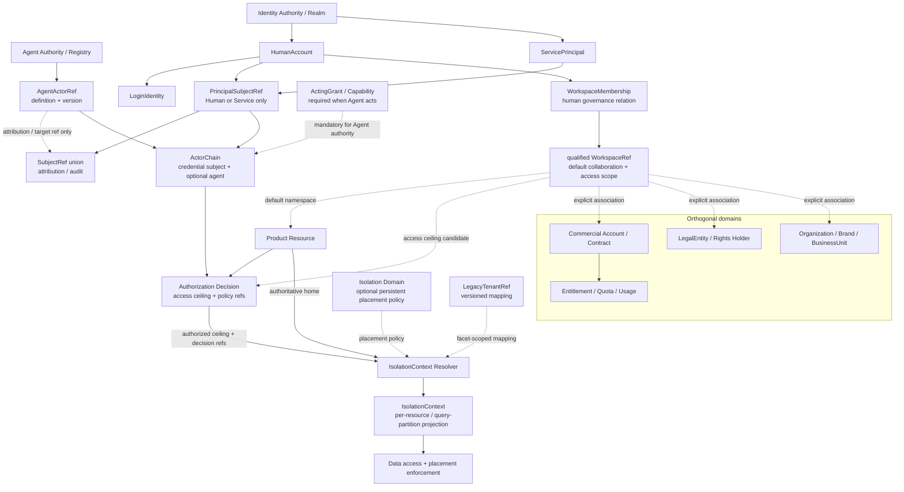

# ADR-0033 v2：Account、Workspace、Subject 与 Isolation 模型基线

## Status

Historical draft · Never Effective

- 日期：2026-08-03（Proposed）· 2026-08-04（标记 Historical）
- 修订：v2，迁移兼容路线草案
- 状态变更：2026-08-04 维护者选定 [ADR-0033 Greenfield（Option B）](0033-account-workspace-subject-isolation-greenfield-baseline.md)
  作为 Foundation 目标基线；v2 的 LegacyTenantRef / facet mapping / dual-claim 迁移路线不再采用，保留为决策
  历史与迁移备选语境。若未来 Greenfield 前提失效，需另立 migration ADR，而非直接复活 v2
- 前一草案：[ADR-0033 v1](0033-account-workspace-isolation-model-baseline.md)（Proposed，Never Effective）
- 审查依据：[ADR-0033 对抗性架构审查](../architecture/adr-0033-adversarial-review.md)（结论：C. Major revision required）
- 相关决策：[ADR-0034：Knowledge Foundation 与 AI Context Model 基线](0034-knowledge-foundation-and-ai-context-model.md)（Proposed）
- 接受阻断（历史）：ADR-0030/0031/0032/0034 的 Subject、Scope、Agent、Organization 与 home 术语尚需对齐；
  该阻断随 v2 转为 Historical 而失效
- 决策关系（历史）：Proposed 期间不改变任何 Accepted ADR；若 v2 被接受，将局部修订
  ADR-0019 关于“tenant 是未来客户、资源、配额与隔离主边界”的前瞻语义，但不自动
  切换任何当前 runtime。该路线未被采用，ADR-0033 已由 Greenfield（Option B）收口
- 实现授权：无；本 ADR 不授权修改 Java、POM、数据库、migration、API 或运行配置

v1 与 v2 均从未进入 Accepted，因此保留为历史提案，而不是使用正式的 `Superseded` 生命周期改写其状态。
ADR-0033 已由 Greenfield（Option B）收口；在 Greenfield reset 各切片落地并验收前，ADR-0005 至 ADR-0019
中已经 Accepted 的 tenant、JWT、内层 Workspace、成员、单一 OWNER、撤销和审计规则仍是当前运行权威。

### Existing ADR Relationship

| Existing ADR | v2 Proposed 期间 | v2 若 Accepted | Runtime cutover |
|---|---|---|---|
| ADR-0005 / 0018 | 现有 USER/tenant claim 与 tenant 管理语义继续有效 | 允许新 audience 引入 qualified Subject 与 Workspace-neutral profile | 按 audience 以后继实现 ADR 切换，不全局翻转 |
| ADR-0006 / 0007 | 继续规范当前 tenant 内层 Workspace 及其唯一 OWNER | 仅作为 legacy inner Workspace 的安全权威，不定义 canonical Workspace 的永久本质 | 资源类别重分类前仍保持原行为 |
| ADR-0019 | tenant 仍是现行 Identity 供应、成员、撤销与审计事实 | 局部修订其“tenant 是未来产品、商业、配额与隔离主边界”的目标结论 | 每个 slice 的 writer、reader、claim 与 rollback 由后继实现 ADR 明确 |
| ADR-0024 | 模块化单体与产品边界继续有效 | 不变 | 不因本 ADR 引入微服务 |
| ADR-0030 / 0031 / 0032 / 0034 | 均仍是 Proposed，不是当前 runtime authority | 必须在 v2 Accepted 前对齐 Subject、Workspace、Agent、Organization 与 resource home 语义 | 各自另行验收 |

“局部修订”是决策权威关系，不是 schema 或代码迁移。任何当前 tenant/Workspace 读写权威只能
在实现 ADR 列明资源类型、generation、fencing、privilege diff 和 rollback 后切换。

## Context

Ainer 正在从企业 Spring Boot 脚手架演进为同时服务 `mdpress`、`xq-platform` 和 Agent Runtime 的
AI Application Foundation。ADR-0033 v1 选择了 Account-first，并试图让 Workspace 统一个人、团队
和企业空间。这一方向解决了“所有用户都必须先属于企业 Tenant”的问题，但
[对抗性审查](../architecture/adr-0033-adversarial-review.md)指出，v1 又建立了新的危险等价关系：

```text
Account = every security subject
Workspace = resource owner = collaboration = subscription = isolation
IdentityTenant.id = Workspace.id = IsolationContext.key
```

这些等价关系在 mdpress MVP 中看似方便，但无法长期解释：

- 人类 Account、Service Principal、AI Agent 和 Anonymous request 的认证与归因差异；
- 作者、资源保管者、版权人、发布方、付款方并非同一个主体；
- 企业集团的合同、法人、品牌、组织、经营单元和 Workspace 可能是 N:M；
- 多个 Workspace 可以共享一个部署、数据库或 KMS 域，同一 Workspace 的不同资源也可能有不同
  residency、retention 或 legal-hold 约束；
- legacy tenant 可能与未来 Workspace 形成 1:1、1:N、N:1 或无法自动解析的关系；
- Agent 的凭据主体、行为身份、代表对象、授权来源、运行 Workspace、账单归因和 Memory scope 并不
  属于一个对象。

[ADR-0034](0034-knowledge-foundation-and-ai-context-model.md)又提供了一个直接反例：Knowledge 可以有
`AccountPrivate`、`Workspace` 或 `PlatformCatalog` home；home/custody、访问、applicability、法律权利
和物理存储是不同维度。Foundation 因而不能要求所有 Knowledge、Content、Asset 或 AI Context 都由
Workspace 法律拥有。

当前实现仍存在两层有效但语义不同的空间关系：

```text
Identity Tenant
├── Identity TenantMembership (OWNER / ADMIN / MEMBER)
└── legacy inner Workspace
    └── WorkspaceMember (OWNER / ADMIN / MEMBER)
```

两层均已有 Accepted ADR、migration 和安全行为，不能通过术语替换自动合并。当前
`ainer_workspace` 继续是 tenant 内层资源；当前 Identity tenant/membership 继续是现行身份治理事实。
本 ADR 只冻结未来语义和迁移不变量，不把候选模型描述为已实现。

### Scope

本 ADR 决定：

- 人类身份生命周期的根；
- Human、Service、Agent 与 Anonymous 的引用和请求期关系；
- Workspace 的最小职责与非职责；
- governance owner、custodian、legal owner 和 billing owner 的区别；
- Workspace、IsolationContext 与 Isolation Domain 的关系；
- legacy Tenant 到 canonical reference 的兼容原则；
- JWT、API、数据与授权迁移必须遵守的不变量。

本 ADR 不决定：

- 任何物理表、列、索引或 migration；
- 当前 Identity Tenant 或内层 Workspace 的立即 rename、删除或重分类；
- 完整 Billing、Contract、LegalEntity、Organization、Rights、Guest 或 Agent Installation 模型；
- 微服务、跨地域部署或远程授权服务；
- mdpress 与 xq 的产品资源、价格、流程和 UI。

### Decision Drivers

- 人类注册、认证、恢复和关闭不能依赖企业容器；
- 非人主体不能被伪造成 Human Account，也不能继承人员治理角色；
- Workspace 应解决跨产品稳定的协作问题，而不是吸收所有 owner 概念；
- 简单产品可以低成本使用 Workspace 隔离，企业部署又不能被强制为 1:1；
- 资源归属必须由服务端事实解析，JWT、Header 和路径不能成为 owner 真相；
- 现有 tenant claim、API、SQL、审计和撤销链必须渐进兼容且不扩大权限；
- Foundation 只冻结被真实消费者需要的最小概念，不预建万能 Subject、Space 或关系图；
- 默认交付形态保持模块化单体。

## Decision

### 1. 总体结论

Ainer 不选择一个对象作为所有领域的唯一顶层根。v2 冻结以下组合：

> **Subject-qualified security；Human Account-first human lifecycle；Workspace as the default
> collaboration and access scope；ownership、commercial、trust 与 physical isolation 相互正交；
> Tenant 仅作为 legacy compatibility reference。**

| Concept | 唯一职责 | 明确不负责 |
|---|---|---|
| `IdentityAuthorityRef` | 限定 issuer、realm、deployment 与 subject ID 的解释范围 | 人员组织、Workspace、商业合同 |
| `HumanAccount` | 一个 Identity Authority 内的人类安全账户、恢复和关闭生命周期 | Service、Agent、Person 主档、Workspace、Employee |
| `LoginIdentity` | 外部或本地登录标识到 HumanAccount 的受控绑定 | 授权 Role、Workspace Membership |
| `ServicePrincipal` | 非人凭据、轮换、禁用与调用身份 | Human Profile、Workspace 治理 owner |
| `SubjectRef` | authority-qualified、typed 的 Human/Service/Agent 引用总合同，便于通用归因与审计 | 直接作为 SubjectBinding principal、万能 Subject 表或聚合生命周期 |
| `PrincipalSubjectRef` | Human/Service 子集，是可作为 JWT `sub`/`act.sub`、credential/effective principal 和 SubjectBinding target 的值类型 | Agent 定义、代行授权或业务 owner |
| `AgentActorRef` | Agent definition/version 的稳定行为与审计归因 | JWT 凭据、Human Account、普通 Membership |
| `WorkspaceAuthorityRef` | 限定 Workspace ID 的 deployment/namespace 解释范围 | Identity realm、商业客户或物理隔离 |
| `Workspace` | 默认协作范围、资源 namespace 与常用授权 scope | 法律、版权、合同、付款、身份 realm、物理隔离的自动等价物 |
| `WorkspaceMembership` | HumanAccount 与 Workspace 的协作/治理关系 | Service/Agent capability、Plan、Entitlement、业务 Role |
| `IsolationDomain` | 在真实需求出现时表达持久的部署、地域、密钥、保留或专属隔离策略 | Workspace 成员、产品客户、合同或组织 |
| `IsolationContext` | 请求期由服务端解析的不可变 enforcement projection | 新的领域聚合、万能 tenant key |
| `LegacyTenantRef` | 对现有 tenant claim、列、API、事件与审计的有类型兼容引用 | 新产品领域对象或新的治理容器 |

这组对象不是一棵树。HumanAccount、Workspace、Commercial Account、Legal Entity、Rights Holder、
Isolation Domain 和 Agent 的生命周期可以独立，并只通过有名称的关系连接。

### 2. Workspace 重新定位

Workspace 定义为：

> **跨产品可复用的默认协作与访问范围，提供稳定空间身份、资源 namespace、成员治理以及常用
> authorization scope。**

跨持久化、API、event、private deployment 或导入边界传递时，空间引用必须是
`WorkspaceRef(workspaceAuthorityRef, workspaceId)`，不能只传裸 UUID。只在单一 authority 的本地模块内部，
且 authority 由调用合同无歧义限定时，才可以使用 compact ID 作为实现细节。

Workspace 可以承担：

1. collaboration boundary：谁可以在这个产品空间中共同工作；
2. resource namespace：默认让 Document、Project、Knowledge 或 Asset reference 获得稳定空间坐标；
3. authorization scope：作为 SubjectBinding、resource policy 和查询过滤的常用范围；
4. governance continuity：空间暂停、关闭、转移或失去管理员时仍有受审计恢复路径。

Workspace 不自动代表：

- legal ownership 或法人；
- commercial account、contract、payer 或 invoice customer；
- copyright、authorship、rights holder 或 licensee；
- database、region、cell、KMS key、retention、legal hold 或 private deployment；
- identity issuer、SSO realm 或 SCIM authority；
- Organization、Department、Brand、BusinessUnit、Store 或 Marketplace party；
- 所有资源都必须拥有的唯一 parent。

每类资源必须由 owning domain 声明自己的 home/ownership policy。Foundation 允许但不要求以下模式：

| Resource scope policy | 典型场景 | 权威来源 |
|---|---|---|
| `workspace-scoped` | 团队文章、企业知识、协作项目 | Workspace relation + 产品资源记录 |
| `account-private` | 私有草稿、个人知识或偏好 | qualified HumanAccount relation |
| `platform-catalog` | 经许可和策展的平台知识 | 明确的平台 owner/policy |
| `party-or-contract-scoped` | 商业合同、跨空间采购或结算 | 产品/Commercial domain |
| `multi-party` | 联合创作、Marketplace、版权或 escrow | 产品 rights/transaction domain |

实现不得创建一个同时承担 `ownedBy`、`custodiedBy`、`createdBy`、`rightsHolder`、`billedTo` 和
`placedIn` 的万能 `owner_id`。具体资源只记录真实需要且有权威来源的关系。

### 3. Account 模型修正

保留 Account-first，但只限定于**人类身份生命周期**：

```text
Identity Authority / Realm
  └── HumanAccount
      ├── LoginIdentity 1..n
      └── minimal Profile 0..1

HumanAccount ── WorkspaceMembership ── Workspace
```

规范性规则：

1. HumanAccount 是一个明确 Identity Authority 内的稳定安全账户，不是全球自然人主档；
2. 同一自然人在不同 issuer、企业 realm 或私有部署拥有不同 HumanAccount 是合法状态；
3. 邮箱、手机号、用户名、微信标识或显示名相同不得自动 merge Account；
4. HumanAccount 可以在零个 Workspace 时完成认证、恢复、Profile 管理和允许的公开行为；
5. 加入、退出或被移除一个 Workspace 不改变 HumanAccount 生命周期；
6. HumanAccount 禁用是全局于该 authority 的安全事件，Membership revoke 是 Workspace 范围事件；
7. Account 关闭不级联删除 Workspace、Content、Asset、Knowledge、Subscription、Usage 或审计；
8. 当前 Ainer realm 可以兼容复用 `IdentityUser.id` 作为 HumanAccount ID，但不能据此宣称跨 issuer
   或跨部署全局唯一；
9. Foundation Profile 只保存跨产品稳定的最小资料。CreatorIdentity、Employee、Customer、Seller、
   Brand persona 和公众号身份属于产品或扩展域。

企业 IdP/SCIM 可以管理企业 LoginIdentity binding、WorkforceEngagement 和企业 Workspace access，
但不得因为邮箱相同接管或关闭个人 mdpress Account。企业 offboarding 默认只撤销企业登录路径、
任职及其派生授权；是否撤销某个独立 WorkspaceMembership 必须由显式政策决定。

### 4. SubjectRef 与请求期 Actor 模型

`SubjectRef` 是用于通用归因、资源 created-by 和审计的稳定 actor 引用总合同，不要求创建
统一 Subject 表，也不表示所有 variant 都是 authorization principal：

```text
SubjectRef =
    PrincipalSubjectRef
  | AgentActorRef(agentAuthorityRef, agentId, version)

PrincipalSubjectRef =
    HumanSubjectRef(authorityRef, humanAccountId)
  | ServiceSubjectRef(authorityRef, servicePrincipalId)
```

三种引用的能力不同：

| Subject kind | 可以持有认证凭据 | 可以作为 JWT `sub` | 可以拥有 Human WorkspaceMembership | 授权方式 |
|---|---:|---:|---:|---|
| Human | 是 | USER profile 中是 | 是 | Membership、Role/Binding、产品关系 |
| Service | 是 | SERVICE profile 中是 | 否 | 最小 scope + SubjectBinding / service policy |
| Agent | 否；runtime 使用 Service 凭据 | 不单独作为 v1 credential `sub` | 否 | AgentActorRef + ActingGrant + Capability |

`AgentActorRef` 可作为总类型 `SubjectRef` 中的归因、资源创建者或审计引用；它不属于
`PrincipalSubjectRef`，也不是 credential principal。`SubjectBinding`、`ActingGrant.principalSubjectRef`、
JWT parser 和任何直接 principal API 必须在类型上只接受 `PrincipalSubjectRef`，不得接受总类型
`SubjectRef`，因而 Agent 无法直接 Binding，也无法 Agent-to-Agent delegation。Agent definition/version 由
AI Runtime/Agent Registry 拥有，远程 runtime 先以 ServicePrincipal 认证，再携带服务端验证的
AgentActorRef 与 ActingGrant。v1 不向现有
`AuthenticatedActor.actor_type` 增加 `AGENT`，也不允许 Agent 通过伪造 HumanAccount 或
WorkspaceMembership 成为通用 OWNER/ADMIN。

请求期必须区分：

```text
ActorChain
├── credentialPrincipalRef     PrincipalSubjectRef: who actually authenticated
├── effectivePrincipalRef       PrincipalSubjectRef: whose authority is exercised
├── agentActorRef?             which Agent definition/version acts
├── grantRef?                  why delegation is allowed
└── invocationContext          workspace/resource/purpose/as-of
```

Anonymous request 没有 SubjectRef。只有产品确认需要持久游客草稿、AI 试用或转正流程后，才可设计
短期 `GuestSession/GuestRef`、额度和显式 claim/transfer protocol；不得为匿名请求创建假 Account、
假 Membership 或固定公共 subject。

### 5. JWT `sub` 与 Token Profile

JWT `sub` 不再被规定为永远代表 HumanAccount。主体必须结合 `issuer`、`audience`、受控 token/actor
profile 和 claim-contract version 解释；业务模块仍不得自行解析 JWT。

| Token profile | `sub` 语义 | Workspace / tenant context | 约束 |
|---|---|---|---|
| USER neutral | HumanAccount | 无 | 仅 allowlisted audience/scope，用于 Account、公开访问和 onboarding |
| USER workspace-selected | HumanAccount | 一个可信 `workspace_id` access ceiling | 签发前实时验证 Membership；资源 home 仍由 resolver 决定 |
| SERVICE direct | ServicePrincipal | 可无；需要时由 scope/binding 或 legacy contract 限定 | 不能使用 Human Membership 或人员治理角色 |
| delegated Agent | represented Human/Service 由 profile 明确；credential actor 另记 | invocation Workspace/resource scope | runtime ServicePrincipal、Agent ref、grant ref 均需可验证；`sub` 不能独自表示整条 actor chain |
| legacy tenant | 由现有 audience 合同解释 | `tenant_id` | 只供未迁移 consumer，保持现有 Accepted 语义 |

规范性规则：

- `iss + aud + profile + contract_version + sub` 才能形成 typed `PrincipalSubjectRef`；直接
  USER/SERVICE profile 中它同时是 credential/effective principal，delegated profile 中它只是
  effective/represented principal；
- delegated Agent profile 与 ADR-0031 对齐：`sub` 是被代表的 Human/Service，RFC 8693
  `act.sub` 是实际认证的 runtime ServicePrincipal，`agent_id + agent_version` 指向
  authority-qualified AgentActorRef，`grant_id` 指向可撤销 ActingGrant；
- `act.sub` 与 `sub` 都必须在各自 issuer/profile 合同下解释；`sub` 形成
  `effectivePrincipalRef`，`act.sub` 形成 `credentialPrincipalRef`；Agent 永不进入 JWT
  `sub`、`act.sub` 或 `PrincipalSubjectRef`，任一必需 claim 缺失/矛盾都 fail-closed；
- Workspace selector 是 access ceiling，不是 resource home、legal owner 或 Isolation Domain；
- Membership、完整动态 Permission、Entitlement 和 Quota 不进入 JWT；
- `tenant_id` 与 `workspace_id` 只有在 `TOKEN_ACCESS_CEILING + audience` facet 的映射已证明
  1:1，且两个 claim 在该 audience 下表达同一 access ceiling 时才能受控双发；字符串相等不是
  语义证明，split/merge 场景禁止双 claim 假装全对象等价；
- compatibility adapter 只解析一次 raw claim，领域层只消费 typed `WorkspaceRef`、
  `LegacyTenantRef` 和 `ActorChain`；
- Refresh Token、authorization、session、consent、introspection、revocation epoch、managed service
  client 和缓存均属于 claim/profile 迁移矩阵，不能只改 access token；
- Workspace switch 产生新的授权上下文或 Token，不修改 HumanAccount 的全局默认状态。

### 6. Isolation 模型

Workspace、IsolationContext Resolver 与 Isolation Domain 是三个不同职责：

```text
Workspace / Resource Home
          +
Authorization access ceiling
          +
Data placement / deployment policy (when present)
          +
Legacy mapping (during migration)
          ↓
IsolationContext Resolver
          ↓
IsolationContext for one resource access / query partition
```

`IsolationContext` 是针对**一个资源访问或一个查询分区**的请求期不可变 enforcement
projection，至少逻辑表达：

- authoritative resource/home reference；
- 当前 ActorChain 与 optional Workspace access ceiling；
- resolved typed partition binding，而不只是没有类型的 key；
- optional IsolationDomain 以及 region/KMS/retention/legal-hold 等 typed policy refs；
- legacy mapping version；
- authorization/policy decision references。

它不是新的数据库聚合，也不能仅剩一个 `key` 后再次承担所有 tenant 语义。集合查询或多资源
操作必须构建 `IsolationEnforcementPlan` 与一组 typed Context/partition binding，按资源或分区执行；禁止
用一个 request-global isolation key 覆盖多个 home/domain。

简单产品和默认共享数据库可以采用：

```text
WorkspaceRef -> row partition key
```

这只是 deployment profile，不是平台不变量。企业场景允许：

- 多个 Workspace 映射到同一 Isolation Domain、cell、database 或 private deployment；
- 一个 Workspace 的不同资源按 region、KMS、retention 或 legal hold 映射到不同 Isolation Domain；
- 资源没有 Workspace home，但仍由 AccountPrivate、PlatformCatalog、Contract 或 product domain
  解析出明确 IsolationContext。

只有出现真实 region/cell/database/KMS/retention/private-deployment 生命周期后才建立持久
`IsolationDomain` 或 `DataPlacementBinding`。IsolationDomain 是 placement/isolation 范围身份，不自动拥有所有
region、KMS、retention 和 legal-hold 规则；这些规则可以是独立、类型化、可版本化的 policy binding。
Foundation v1 不为可能性预建空表或微服务，但任何新
schema、对象存储 key 或 API 都不得假设 `isolation_domain_id == workspace_id`。

### 7. Owner、Custodian、Legal Owner 与 Billing Owner

`OWNER` 一词只保留为**治理职责**，不得推导其他所有权：

| Relationship | 回答的问题 | Authority |
|---|---|---|
| Human Governance Owner / Steward | 哪些 active human 承担日常治理、转移和关闭职责 | Workspace governance policy + active Human Membership |
| Governance / Recovery Authority | 当人员缺位、离职或受管状态时，何种受审计政策能恢复治理连续性 | 职责分离的 recovery policy/ceremony，不等于非人 OWNER |
| Custodian | 谁维护资源的可用性、生命周期、保留和交付 | Workspace 或具体 Product/Asset/Knowledge domain |
| Legal Owner / Rights Holder | 谁依法拥有主体、版权、许可或财产权 | 产品 rights/legal domain；必要时为 LegalEntity/Party |
| Billing Owner / Payer | 谁签约、付款、接收账单或承担商业责任 | Commercial Account/Contract/Billing domain |

当前 Accepted ADR 对 legacy Identity Tenant 和内层 Workspace 的“恰好一个 ACTIVE OWNER”继续有效。
v2 不把该基数提升为所有未来 Workspace 的永久平台不变量。未来 canonical Workspace 只冻结：

> active Workspace 必须拥有明确、可恢复且可审计的 governance policy；日常 human
> steward/owner 与异常 recovery authority 是两种职责。

不同治理 profile 的初始策略为：

| Profile | Governance | Custody | Legal / Billing |
|---|---|---|---|
| Personal | v1 可由一个 active Human Governance Owner 负责；转移/关闭需显式流程 | 默认 Workspace 或产品域 | 内容 rights 逐资源决定；payer 可为 Account 或独立 Commercial ref |
| Team | v1 可为兼容保留单一 owner + admins；多 steward 只有真实需求时另立决策 | 默认 Workspace，跨空间分享不改 custody | rights、publisher、payer 独立，不因 ADMIN 自动取得 |
| Enterprise | 由 enterprise governance policy、受控人员集合和恢复 authority 决定，不绑死某个员工的法律身份 | Workspace/产品运行域 | LegalEntity、Contract、Payer 均为显式外部关系，可能覆盖多个 Workspace |

`PERSONAL/TEAM/ENTERPRISE` 是治理或 provisioning profile，不是 Plan，也不承诺任意双向转换。Profile
不能授予 Pro、SSO、无限 AI、版权或商业权益。非人 Subject 不成为人员 Governance Owner/Steward；
职责分离的恢复流程可以执行 authority policy，但不因此把 ServicePrincipal 升为万能 OWNER。

### 8. Workspace 周围的正交关系

Foundation 允许以下对象关联 Workspace，但不在本 ADR 中把它们全部建成 Foundation 聚合：

| Boundary | 常见关系 | 所有者候选 |
|---|---|---|
| Commercial Account / Contract | 一个合同覆盖一个或多个 Workspace；也可跨产品 allocation | 商业/Entitlement 域 |
| LegalEntity / Party | 与 Workspace、Content rights、Contract 可为 N:M | xq 或产品 Legal/Rights 域 |
| Organization / Workforce | 目录或任职可以服务一个或多个 Workspace | Enterprise Extension / xq |
| Brand / Publication | 位于 Workspace 内或跨 Workspace 协作 | mdpress/xq 产品域 |
| Rights Holder / License | 对 Content/Asset/Knowledge 建立有期限权利 | 产品 Rights 域 |
| Agent Scope / Installation | Agent definition、安装、grant 与运行 scope 分离 | AI Runtime + Authorization |
| Isolation Domain | N Workspace : 1 Domain，或资源级跨多个 Domain | 平台部署/合规域 |

这些是扩展许可，不是 v1 建表清单。只有某个概念出现独立生命周期、不同 authority 或非 1:1 基数，
且真实产品需要时才引入。禁止为这些关系建立新的通用 `Space` 父节点或无限层级树。

Organization 继续属于 Enterprise Extension 候选，但不再规定“Organization 必须只属于一个
Workspace”。ADR-0032 若继续推进，必须把 `Tenant -> OrganizationDirectory` 的 Proposed 父关系改为
显式、可验证的 enterprise association，并允许 xq 的 LegalEntity、Brand、BusinessUnit、Store 与
Workspace 各自保持产品语义。

### 9. Authorization、Entitlement 与 Usage

五个概念继续严格正交：

```text
HumanAccount
  └── WorkspaceMembership
        └── limited governance role

PrincipalSubjectRef (Human / Service)
  └── SubjectBinding / product relation
        └── Permission

AgentActorRef
  └── ActingGrant
        └── Permission subset + Scope subset + Capability

Commercial source
  └── Entitlement allocation
        └── Quota reservation
              └── Usage settlement / release
```

硬性规则：

- `PRO`、`CREATOR_PRO`、`TEAM` 和 `ENTERPRISE` plan 永远不是 Role；
- Workspace OWNER/ADMIN 只映射有限治理 Permission，不自动获得 Billing、AI、密钥或全部产品数据；
- ServicePrincipal 使用 SubjectBinding/service policy，不使用人员 Membership；
- Agent 使用一层 ActingGrant，不复制 represented/granting principal 的全部 Role 或 effective
  access，只保存并实时校验显式最小子集，也不通过 Membership 获得永久权限；
- Entitlement 可以 allocation 到 Account、Workspace、Workspace 集合或产品 scope，不固定为
  Subscription : Workspace = 1:1；
- Usage 同时记录 consumption scope、effective actor 和 billed-to reference，不能从 workspace_id 猜
  payer；
- 资源查询、Knowledge retrieval 和 Context materialize 都必须在读取正文前执行授权；
- authoritative resource scope 由产品资源记录或可信 resolver 提供，Token selector 不能覆盖。

### 10. Tenant 的最终角色

最终仍选择：**C. Tenant 是历史兼容概念。**

Tenant 不再作为新产品可见的 Company、Customer、Workspace、Plan、Organization 或纯技术隔离聚合。
同时，v2 不再要求 `tenant_id == workspace_id`，也不通过删除 Tenant 名称删除真实的隔离能力。

兼容引用定义为：

```text
LegacyTenantRef(
  sourceAuthority,
  sourceDeployment,
  rawId)

LegacyReferenceMapping(
  mappingSetId,
  version,
  legacyRef,
  facet,
  audience?,
  resourceType?,
  cardinality?,
  typedQualifiedTargetRefs[],
  selectorPolicyRef?,
  validPeriod,
  status)

facet = TOKEN_ACCESS_CEILING
      | RESOURCE_HOME
      | ROW_PARTITION
      | GOVERNANCE_SUCCESSOR
      | PLACEMENT
      | COMMERCIAL_REFERENCE

cardinality = ONE_TO_ONE | ONE_TO_MANY | MANY_TO_ONE
status = ACTIVE | UNRESOLVED | RETIRED

TypedQualifiedTargetRef(
  targetType,
  authorityRef,
  id)
```

这是逻辑合同，不授权当前创建 mapping 表。它故意不提供无 facet 的 `EQUIVALENT_TO`：
legacy Tenant 可以对 `TOKEN_ACCESS_CEILING` 1:1 映射到 Workspace，对 `ROW_PARTITION` N:1 映射到
Isolation Domain，同时对 `COMMERCIAL_REFERENCE` 映射到另一对象，这些都不证明两个聚合整体等价。

规范性约束：

- `typedQualifiedTargetRefs` 必须携带 target type 与对应 authority/deployment；裸 UUID 不能
  跨边界比较；
- `UNRESOLVED` 时 target 集合必须为空，不得携带“默认”、猜测或 fallback target；
- ONE_TO_MANY/MANY_TO_ONE 使用显式 mapping set、lineage 和 deterministic selector/deny 规则，不靠多行
  `targetRef` 或顺序猜测；
- 只有 inventory 证明某一 `facet + audience/resourceType` 是 1:1 时，才可以沿用同 UUID
  作为实现优化；该优化不赋予其他 facet 语义；
- 相同字符串或 UUID 出现在不同 issuer、部署、facet 或 target type 中不表示同一对象。

ACTIVE mapping 的必填矩阵：

| Facet / state | Required qualifiers | Target / selection rule |
|---|---|---|
| Any `ACTIVE` | `mappingSetId` 与 `cardinality` | 至少一个 typed qualified target；不允许 null/fallback target |
| `TOKEN_ACCESS_CEILING` | `audience` | 只表达该 audience 的 access ceiling；用于签发 `workspace_id` 时必须恰好有一个 qualified WorkspaceRef target；不赋予 resource home/commercial/placement 语义 |
| `RESOURCE_HOME` | `resourceType`，或可审计的 deterministic selector policy | target 必须是具体 Workspace/Account/Contract/产品 home type |
| `ROW_PARTITION` / `PLACEMENT` | `resourceType`，或可审计的 deterministic selector policy | target 必须是 typed partition/IsolationDomain/DataPlacement ref |
| `GOVERNANCE_SUCCESSOR` / `COMMERCIAL_REFERENCE` | target type，以及存在多选一时的 selector policy | 不得被 Authorization 或 Isolation resolver 默认当成 Workspace |
| `ONE_TO_ONE` | 一个 legacy source + 一个 target | 该 active `facet + qualifiers` 内 target 也只能被这一个 source 引用；双 claim 必须满足正反向唯一 |
| `ONE_TO_MANY` | 一个 legacy source + 至少两个 active targets + `mappingSetId`/lineage | 必须有 deterministic selector 或明确 deny；禁止按数组顺序选择 |
| `MANY_TO_ONE` | 每个 source 恰好一个 target，且 mapping set 至少有两个不同 source 指向同一 target | 必须保留 source lineage；禁止用单行伪装 N:1 |
| `UNRESOLVED` | 可无 cardinality/audience/resourceType | target 必须为空，resolver 必须 fail-closed |

当前 `/api/tenants/**`、`/api/me/tenants`、`tenant_id` claim/列/事件和 Identity membership 保持原有
Accepted 语义。新产品 API 不再增加 product-visible Tenant；未来 canonical Workspace API 也不能
静默复用当前 `/api/workspaces/**`，因为后者仍表示 legacy inner Workspace。

### 11. 产品接入解释

#### mdpress

```text
HumanAccount
  └── product-scoped, idempotent Personal Workspace provisioning
       ├── mdpress Content / Publication / Brand
       ├── Workspace-custodied Asset
       └── Workspace or Account-private Knowledge
```

- Account/Profile 不兼任公开 CreatorIdentity；笔名、品牌和公众号身份由 mdpress 拥有；
- Article 的 custody Workspace、author、rights holder、publisher 和 billed-to 可以不同；
- Personal Workspace 的唯一性由 mdpress provisioning scope 决定，不从 Identity realm 自动推导；
- AI Memory 可以属于 Account、Workspace、Brand、Document、Agent 或 Run，不能默认全部挂 Workspace；
- Pro/Creator Pro/Team 是 Entitlement 结果，不是 Workspace profile 或 Role。

#### xq-platform

```text
HumanAccount / ServicePrincipal
  └── Enterprise Workspace access
       ├── Organization / Workforce association (optional extension)
       └── xq Product Domains
            ├── LegalEntity / Brand / BusinessUnit / Store
            ├── CRM / ERP / Product / Supply Chain
            └── product-specific authorization facts
```

- Workspace 提供默认协作/访问范围，不代表集团、法人、合同或所有经营单元；
- Organization、LegalEntity、Brand、BusinessUnit 和 Store 可与 Workspace 为 N:M；
- 员工离职撤销 WorkforceEngagement 及其派生 grant，不自动关闭 Account 或删除独立 Membership；
- 产品事实留在 xq，Foundation 只消费显式 ResourceRef、授权决策、snapshot 或 Tool receipt。

### 12. 逻辑架构



### 13. Normative Invariants

1. HumanAccount 是人类身份生命周期根，不是所有 Subject 或全球 Person 主档。
2. `sub` 必须按 issuer、audience、token profile、actor type 和 contract version 解释；不能永远假设为 Account。
3. Agent 不持有 Human Account，不进入 `PrincipalSubjectRef`，不能直接 SubjectBinding 或成为 ActingGrant principal，不通过人员 Membership 获权，也不成为通用 OWNER/ADMIN。
4. Workspace 只提供默认协作、namespace 和授权 scope；不自动代表法律、商业、版权、身份或物理隔离。
5. Human governance steward、recovery authority、custodian、legal owner 和 billing owner 是不同关系。
6. Resource home、访问权、applicability、rights、billed-to 与 placement 不从单一 `owner_id` 推导。
7. IsolationContext 由服务端 resolver 按资源/查询分区产生；客户端 selector 和 JWT context 只能缩小、不能扩大资源范围；多资源不能压成单一 request-global key。
8. 简单部署可以用 Workspace 作为 row partition key，但不得冻结 `Workspace == IsolationDomain`。
9. WorkspaceRef 与 legacy mapping target 跨 API/event/deployment 边界时必须 authority-qualified。
10. Tenant 只作为 legacy reference；不强制 `tenant_id == workspace_id`，也不删除历史审计语义；legacy mapping 只表达 facet-scoped relation，不表达聚合全对象等价。
11. 对每个正在迁移的 aggregate/resource class 与 cutover generation，恰好有一个 lifecycle/membership writer 和一个授权 reader authority；不同 aggregate 的现行 authority 可并存。
12. legacy 到 canonical 的任何角色映射必须证明 privilege 不扩大；同名 OWNER/ADMIN 不代表等价。
13. rollback 不得复活已经撤销的 Membership、Binding、Agent grant 或 Token。
14. Organization、Commercial、Rights 和 Isolation 等扩展只在真实生命周期和消费者证明后引入。
15. 本模型以模块化单体和 typed port/ref 实现，不以新微服务证明边界。

## Alternatives Considered

### A. 保留 ADR-0033 v1 的 Account + God Workspace

短期最直接，但会继续把资源、订阅、版权、商业和隔离绑定到一个 ID，并与 Agent/Service 主体冲突。
对抗性审查已证明其长期风险，拒绝。

### B. Tenant-first

最接近当前实现，却要求个人创作者先属于企业/租户，并继续混淆客户、公司、隔离和治理。仅保留为
兼容输入，不作为未来产品模型。

### C. 引入 Tenant -> Space -> Workspace 通用层级

可以给未来概念预留节点，但没有稳定生命周期，最终会成为任意类型树、通用 ACL 和新的 God Object。
拒绝。

### D. Organization-first 或 CommercialAccount-first

适合部分企业 SaaS，却迫使 mdpress 个人用户拥有虚构企业或合同，也不能解释 Account-private
Knowledge。拒绝作为 Foundation 根。

### E. xq 与 mdpress 完全独立建模

避免过度抽象，但会重复身份、协作、授权、AI、Asset 和 Knowledge 基线，使 Ainer 无法成为平台。
产品资源保持独立，稳定安全原语仍由 Foundation 提供，因此不采用完全分离。

### F. 万能 Subject 聚合与统一 Subject 表

表面上统一 Human、Service、Agent、Guest，实际会把不同凭据、生命周期、恢复、删除和治理规则塞入
一张表。选择 typed reference family，不要求共同持久化聚合。

### G. HumanAccount-first + default Workspace + orthogonal boundaries（采用）

它保留个人与企业共同需要的最小协作模型，同时为合同、权利、组织、Agent 和隔离保留显式扩展点，
不要求 v1 一次实现全部概念。

## Consequences

### Positive

- mdpress 可以提供无企业前置的注册和个人空间，xq 可以组合企业扩展；
- Human、Service、Agent 与 Anonymous 的认证、授权和审计语义不再混为 Account；
- Workspace 仍可作为默认协作坐标，又不会成为新的万能 Tenant；
- Knowledge、Content、Asset、Commercial 和 Isolation 可以按真实 owner 演进；
- legacy tenant 支持 facet-scoped 1:1、split、merge 和 unresolved，而不是被裸 ID 等值锁死；
- 模块化单体足以实施，当前不需要远程 Identity、PDP 或 Workspace 服务。

### Negative and Risks

- typed reference、Token profile 和 resolver 比单一 `tenant_id` 更复杂；
- 产品必须明确 custody、rights、billing 和 placement，不能继续依赖含糊的 owner；
- 兼容 inventory 和逐资源 privilege diff 会增加迁移成本；
- Workspace profile 的治理基数不再由一个全局枚举自动决定；
- legacy 与 canonical 过渡会持续一段时间，必须投资 observability、fencing 和 rollback；
- 若没有真实 consumer 约束，正交关系仍可能被团队过度抽象为大量空对象。

### Security, Data and Privacy

- 所有 SubjectRef 都必须 authority-qualified；裸 subject ID 不跨 issuer、deployment 或 private realm 比较；
- 企业 LoginIdentity 不得因属性相同自动 merge 或接管个人 Account；
- 非人主体不得继承人员 OWNER/ADMIN 或通过 WorkspaceInvitation 获权；
- 资源和 IsolationContext 必须从服务端权威事实解析，未知或冲突映射 fail-closed；
- 迁移期间不得先把 tenant 成员提升为 inner Workspace、Content 或 Knowledge 成员再补授权；
- 历史 audit/event 保留原 LegacyTenantRef，并追加 mapping/version，不改写当时证据；
- Token、密码、secret、prompt 和产品正文不进入 mapping、决策或兼容错误信息。

## Migration Plan

迁移是未来实施路线，不在本 ADR 中执行。所有阶段 additive、forward-oriented、可观测，并保持当前
Accepted ADR 的安全行为。

### Phase 0：冻结语义并停止扩大旧模型

- 接受前完成 Human/Service/Agent/Anonymous、Workspace、owner 和 Isolation walkthrough；
- 停止新增 product-visible Tenant、`tenant = company`、`tenant = plan` 或
  `workspace = legal/billing/isolation owner` 契约；
- 不创建第二套 canonical WorkspaceMembership，不把 Identity membership 双写到 inner
  `ainer_workspace_member`；
- v1、Review 和 v2 同时保留为历史记录；v2 不再是候选，ADR-0033 已由 Greenfield（Option B）收口。

### Phase 1：全 data-plane inventory

盘点范围至少包括：

- 所有数据库 tenant/workspace/owner 列、类型、约束、索引和查询；
- Identity membership、inner WorkspaceMember、Role/Binding 和 owner privilege；
- JWT audience/client/profile、Refresh Token、authorization、session、consent、introspection 和缓存；
- event/outbox/receipt/DLQ、audit、Webhook 与外部契约；
- Redis、搜索/向量索引、对象存储/CDN key、KMS/AAD、备份、导出与数仓；
- 非 UUID、`legacy-unassigned/*`、孤儿、重复 owner、跨 tenant 引用和私有部署 UUID 碰撞；
- 每个 legacy ref 到候选 Workspace、Isolation、Commercial 或 unresolved target 的基数。

无法证明的映射进入显式 `UNRESOLVED`/quarantine 清单。禁止按名称、创建者、默认 tenant、最近访问
或字符串相等猜测。

### Phase 2：Canonical Reference 与兼容 Resolver

- 定义 authority-qualified `HumanSubjectRef`、`ServiceSubjectRef`、`PrincipalSubjectRef`、
  `AgentActorRef`、`WorkspaceRef`、`LegacyTenantRef` 和 facet-scoped mapping contract；
- 只对 inventory 证明某个 `facet + audience/resourceType` 为 1:1 的映射允许同值 UUID 优化；
- split/merge 映射保留 mappingSetId、lineage、selector/deny 规则、valid period、version 和
  tombstone，不复用旧语义；
- 每类资源声明 authoritative home、授权 resolver 和 isolation rule；
- 当前 `/api/tenants/**`、`/api/me/tenants` 与 `/api/workspaces/**` 保持现行语义；新的 canonical
  Workspace API 使用明确 version/namespace，由后继实现 ADR 决定。

### Phase 3：JWT Claim 与 Actor Profile 演进

按 audience 独立演进，不把所有 consumer 同时切换：

1. legacy audience 继续只接受现有 `tenant_id` profile；
2. 新 allowlisted audience 增加 USER-neutral、USER-workspace、SERVICE 和 delegated Agent contract；
3. 只有 `TOKEN_ACCESS_CEILING + audience` 已证明 1:1 的 mapping profile 才可进入受控
   dual-claim 窗口；不一致或 mapping miss 失败关闭；
4. 新业务域只消费 typed principal/ActorChain，不解析 raw JWT；
5. 覆盖 Refresh Token、session、consent、managed client、introspection 与 revocation epoch；
6. 旧 claim 只有在 consumer 遥测为零并经独立 ADR 后停止签发。

### Phase 4：资源与 Membership 逐类迁移

- 先选一个低风险真实产品 slice，不批量迁移全部 tenant 资源；
- 对每个 resource type 建立 privilege diff，证明新 Membership/Binding 不扩大旧权限；
- 当前 inner Workspace 在重分类为 Project/ResourceGroup 或退出前保持独立授权；
- 对每个正在迁移的 aggregate/resource class 与 cutover generation，恰好有一个
  lifecycle/membership writer 和一个授权 reader；不同 aggregate 的现行 authority 可并存；
- 投影事件携带 aggregate version/watermark，旧事件可判 stale；
- writer cutover 使用 fencing，shadow compare mismatch 失败关闭并告警；
- 高风险 revoke/owner change 在投影未追平时读取当前 authority 或拒绝；
- rollback 必须反向同步、重新 fencing 或只允许 roll-forward，不能回到会复活权限的旧 reader。

### Phase 5：产品语言退出 Tenant

- mdpress、xq 的新 UI、SDK、审计查询和产品 API 只使用 Workspace 或具体产品概念；
- `tenant_id` 只存在于明确 legacy persistence/claim/event adapter；
- legacy API、claim 和 adapter 均有 usage、mapping miss、mismatch、fallback 和 deny 指标；
- rename/drop 旧表、列、claim 或 API 必须另立 ADR，并证明无外部 consumer、无 orphan、无双 authority；
- 历史 audit、event、receipt、backup 与导出不改写，只通过 versioned resolver 解释。

### Rollback and Operational Controls

- 任一双写必须有唯一 writer、截止日期、幂等 replay、差异报表和失败关闭策略；
- mixed-version pod 不得分别写不同 authority；部署控制必须能 fencing 旧 writer；
- reader cutover 前后记录 per-scope watermark、mapping version 和 shadow mismatch；
- 监控至少包括 legacy profile/API 使用量、mapping miss、ambiguous mapping、claim mismatch、
  cross-scope deny、owner/governance gap、authority divergence 和 revoke propagation age；
- 回滚二进制不得删除或覆盖 Workspace、Membership、Binding、grant、Usage、audit 或 mapping lineage；
- 安全撤销优先于可用性，不能因 Workspace 暂时无治理 owner 而继续放行禁用主体。

### Acceptance Gates Before Accepted

- 完成 USER-neutral、USER-workspace、SERVICE 和 legacy Token profile 矩阵；在文档契约中冻结
  delegated profile 的 `sub`/`act.sub`/AgentActorRef/grantRef 解释，但不以签发 Agent Token 或实现
  ActingGrant 作为本 ADR 接受前置；
- 完成 mdpress Content/rights、Knowledge mixed home、Asset custody、AI Run、xq Product/Order 和
  Marketplace multi-party 的 resource ownership matrix；
- 完成跨产品 Personal Workspace、企业托管身份与个人身份并存、集团多法人/多合同/多 Workspace、
  多 region/KMS、Workspace split/merge walkthrough；
- 用真实样本覆盖不同 facet 的 legacy 1:1、1:N、N:1、non-UUID、`legacy-unassigned/*`
  和 unresolved mapping；
- 对 Identity tenant role、inner Workspace role 和未来 governance role 完成 privilege diff；
- 证明 mixed-version deployment 中 revoke、owner change、writer cutover 和 rollback 不扩大或复活权限；
- 确认 ADR-0030、0031、0032 与 0034 的 Subject、Workspace、Agent 和 home 术语已对齐；
- 每个实现切片只在 `project-status.md` 记录真实代码、测试和部署状态。

delegated token、ActingGrant、Agent installation 和运行时 checkpoint 的实现/证明门禁属于 ADR-0031
及未来真实 Agent slice，不是 Ainer Foundation v1 前置。该 slice 未来必须证明：被代表/授予
principal 或 GrantSource 丧失 effective authority 时 ActingGrant 停止；creator 只有在同时是该授权源时才相关。

## Open Questions

以下问题由真实纵向切片或后继 ADR 决定：

1. 当前 inner Workspace 最终是 Project/ResourceGroup，还是在迁移后退出？
2. canonical Workspace metadata 和 Membership 的长期物理 authority 位于哪个 bounded context？
3. mdpress Personal Workspace 的唯一性是每个产品、每个 deployment 还是每个 provisioning scope？
4. Personal、Team、Enterprise governance profile 的 owner/steward cardinality 和转换门禁是什么？
5. HumanAccount 的最小 Profile、LoginIdentity link/merge/recovery ceremony 如何设计？
6. 企业 OIDC/SCIM 与个人 LoginIdentity 共存时，谁可以 link、unlink 和恢复？
7. 哪个真实场景首次需要持久 IsolationDomain/DataPlacementBinding？
8. Account-private、Workspace 和 PlatformCatalog 资源如何在通用 Authorization scope 中映射？
9. 跨 Workspace rights、resource transfer、Contract allocation 和 Usage billed-to 的首个产品 owner 是谁？
10. 长期运行的 Workspace Agent 需要何种 installation、rotation、continuity 和 offboarding protocol？
11. 明确持久游客行为出现时，GuestSession、额度和转正如何避免账号接管与资源丢失？
12. legacy API、claim、列和事件字段的兼容窗口与退出版本是什么？

以下条件出现时必须重新评审本基线，而不是把它们硬塞进 Workspace：

- legacy tenant 与 canonical Workspace 在任一所需 facet/audience 下不是 1:1；
- 一个合同覆盖多个 Workspace 或多个产品；
- 一个 Workspace 跨多个 residency、KMS、retention 或 legal-hold domain；
- 私有部署需要 federation、跨 realm 导入或 ID translation；
- Workspace split/merge；
- Service、Agent 或 Guest 无法由当前 profile/ActingGrant 安全表达；
- 资源出现 multi-party ownership、跨 Workspace rights/custody 或 Marketplace transaction scope；
- Organization、Commercial Account 或 Isolation Domain 被第二个独立消费者证明具有稳定公共语义。

## References

- [ADR-0033 v1：Account、Workspace 与 Isolation 模型基线](0033-account-workspace-isolation-model-baseline.md)
- [ADR-0033 对抗性架构审查](../architecture/adr-0033-adversarial-review.md)
- [ADR-0034：Knowledge Foundation 与 AI Context Model 基线](0034-knowledge-foundation-and-ai-context-model.md)
- [ADR-0005：Identity 与 OAuth 2.1 安全基线](0005-identity-and-oauth2-security-baseline.md)
- [ADR-0006：Workspace tenant 与资源授权基线](0006-workspace-tenant-authorization-baseline.md)
- [ADR-0007：Workspace 成员生命周期与审计](0007-workspace-membership-lifecycle-and-audit.md)
- [ADR-0018：管理授权模型与 tenant 成员管理](0018-management-authorization-and-tenant-member-management.md)
- [ADR-0019：Identity 供应、tenant 上下文与所有权治理](0019-identity-provisioning-tenant-context-and-ownership-governance.md)
- [ADR-0024：演进式模块化平台架构](0024-evolutionary-modular-platform-architecture.md)
- [ADR-0030：通用混合细粒度授权基线](0030-hybrid-fine-grained-authorization-baseline.md)
- [ADR-0031：Agent 代行与 AI 上下文授权](0031-agent-delegation-and-ai-context-authorization.md)
- [ADR-0032：组织与员工目录基线](0032-organization-workforce-directory-baseline.md)
