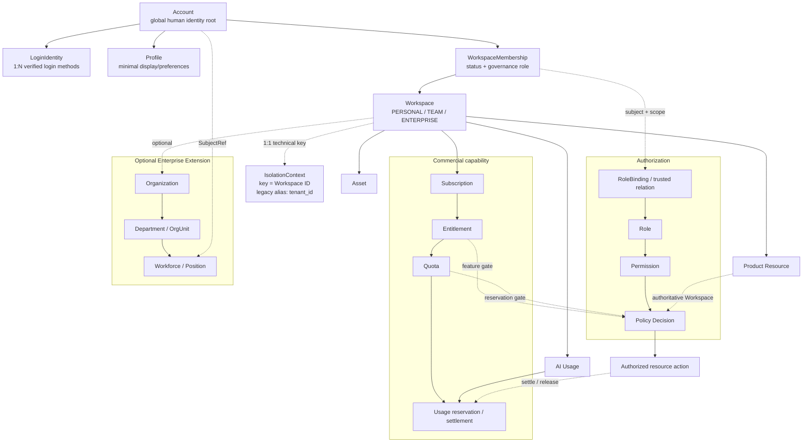

# ADR-0033：Account、Workspace 与 Isolation 模型基线

## Status

Historical draft · Never Effective

- 日期：2026-08-03（Proposed）· 2026-08-04（标记 Historical）
- 决策者：Ainer 项目维护者
- 取代：无（Proposed 期间）
- 被取代：2026-08-04 由 [ADR-0033 Greenfield（Option B）](0033-account-workspace-subject-isolation-greenfield-baseline.md)
  作为 Foundation 目标基线收口；v1 的 God Workspace 方向被
  [对抗性审查](../architecture/adr-0033-adversarial-review.md) 否决，保留为决策历史

本 ADR 在 Proposed 状态期间不改变任何 Accepted ADR 的现行有效性，也不宣称下述模型已经实现。
若本 ADR 被接受，则按本 ADR 的 [Migration Plan](#migration-plan) 和验收门禁逐项迁移；只有对应切片
完成后，才局部取代以下长期语义：

- ADR-0005 中所有人员 Token 必须携带 `tenant_id` 的普遍约束；
- ADR-0018 中产品可见 tenant 管理与 `TenantRole` 作为未来顶层治理模型的语义；
- ADR-0019 中 tenant 是客户、资源、订阅、配额与 entitlement 主要边界的语义。

ADR-0006、0007 对现有内层 Workspace 的可信上下文、显式隔离、成员校验、唯一 OWNER、专用转移和
审计不变量继续有效。现有对象被重分类或退出时必须另立实现 ADR，不能借本 ADR 静默改写历史。
Proposed ADR-0030、0032 在接受前必须与本决策的 Workspace 与 Isolation 术语对齐。

## Context

[`ainer-boot AI Application Foundation 架构审计`](../architecture/ainer-boot-ai-application-foundation-audit.md)
确认 Ainer 正在从企业后台脚手架演进为多个产品共同消费的 AI Application Foundation。首批消费者
具有不同形态：

- `xq-platform` 是企业数字化平台，需要企业 Workspace、Organization、Workforce、CRM、ERP、供应链和阿米巴业务；
- `mdpress` 是 Creator Platform，需要个人创作者、团队与企业内容空间，不应被假设为企业 SaaS 后台。

当前实现同时存在两层空间治理：

```text
IdentityTenant
├── TenantMembership (OWNER / ADMIN / MEMBER)
└── inner Workspace
    └── WorkspaceMember (OWNER / ADMIN / MEMBER)
```

这两层在现有安全切片中各自有清楚的数据所有权，不能直接删除或合并；但若把它们原样推广到新产品，
会产生两个顶层 owner、两套邀请/撤销、两份角色权威，以及无法回答的资源、订阅、资产和 AI 用量归属。

现有模型还有以下约束：

- `ainer_identity_tenant.id` 是 Identity 的顶层隔离与治理 ID；
- `ainer_workspace.id` 是 tenant 内层资源 ID，两者不是同一个 Workspace ID；
- Workspace/AI 的部分 `tenant_id` 历史列是字符串，且 Workspace migration 存在
  `legacy-unassigned/<workspace-id>`，不能假设全部可直接转换为 UUID；
- `/api/tenants/**`、`/api/me/tenants` 与 `/api/workspaces/**` 已经分别具有现行语义；
- Identity 已支持一个 Account/Subject 拥有多个 active tenant membership，并在签发前实时校验选择；
- Accepted ADR 要求 tenant/subject 来自可信认证上下文，不接受客户端自报。

问题不是是否保留一个列名，而是未来开发者必须知道：身份从哪里开始、业务资源属于谁、谁负责协作
治理，以及 `tenant_id` 究竟是产品概念还是隔离实现。

### Scope

本 ADR 只冻结未来的领域语义、兼容契约和迁移门禁。它不执行以下动作：

- 不修改 Java、POM、模块装配或运行时；
- 不新增、重写或执行 migration；
- 不 rename `tenant` 表、列、claim、API 或现有 Workspace；
- 不创建 Subscription、Asset、Organization 或新的 Workspace module；
- 不拆微服务，不设计远程 Workspace/Identity 服务；
- 不决定当前内层 Workspace 最终是 Project、ResourceGroup 还是退出。

## Decision Drivers

- Account 必须能支持无企业、无 Workspace 的注册、恢复与公开访问生命周期；
- xq 与 mdpress 必须共享同一种资源归属和协作边界，同时保留各自产品领域；
- Workspace 必须能自然承载 Personal、Team、Enterprise，而不是把 Plan 或 Company 换一个名字；
- Organization/Workforce 不能成为 C 端产品的必装前置；
- Role、Permission、Membership、Entitlement 与 Quota 必须正交；
- 现有 `tenant_id`、JWT、API、审计和安全不变量必须渐进兼容；
- 迁移期间只能有一个顶层 membership 和 owner 事实源；
- 默认交付形态继续是模块化单体，不用微服务掩盖语义冲突；
- 不创建 `Tenant -> Space -> Workspace` 或其他没有独立生命周期的万能抽象。

## Decision

### 1. 规范性结论

**Account 是全局人类身份根，Workspace 是空间型业务资源与协作治理根，Tenant 不是第三个业务根。**

| Concept | 冻结后的唯一职责 | 不负责 |
|---|---|---|
| `Account` | 全局人类身份、安全状态和稳定 subject | Workspace、企业任职、Role、Plan、Quota |
| `Workspace` | 资源归属、协作治理、Subscription/Entitlement、Asset、Usage 和默认隔离边界 | 登录凭据、Company/LegalEntity、产品业务流程 |
| `WorkspaceMembership` | Subject 与 Workspace 的有效关系及治理职责 | 凭据、产品 Permission、套餐或用量 |
| `Tenant` | **历史兼容概念**；不再产生新的领域聚合或产品 API | 客户、公司、组织、套餐或永久父空间 |
| `IsolationContext` | 由服务端解析的技术访问上下文，默认以 canonical Workspace ID 为 key | 产品生命周期、成员、角色或订阅 |
| `Organization` | 可选 Enterprise Extension 中的组织/任职容器 | 全局身份、默认隔离根或所有产品前置 |

这不是一个新的单根大聚合。`Account` 与 `Workspace` 是两个独立聚合根，通过
`WorkspaceMembership` 关联。Account 不在聚合内部“拥有”Workspace；Workspace 也不包含 Account。

### 2. 顶层身份根：选择 Account-first 的修正版

在题设方案中选择 **方案 B 的修正版**：

```text
Account ── WorkspaceMembership ──> Workspace ──> Resource
```

修正点是 Workspace 不作为 Account 的子实体。一个 Workspace 可以有多个成员，并在某个 Account
离开、停用或关闭后继续存在；一个 Account 也可以在零个、一个或多个 Workspace 中存在。

身份不变量：

1. `sub` 始终表示 Account 的稳定安全主体，不随 Workspace 切换；
2. Account 可以在不属于任何 Workspace 时完成注册、认证、恢复和 Profile 管理；
3. Account 停用是全局安全事件，Membership 撤销只是一个 Workspace 范围的访问事件；
4. Account 关闭不能级联删除 Workspace、Asset、Document、Subscription 或审计事实；
5. Account 若仍是某个 active Workspace 的唯一 owner，关闭前必须完成 owner 转移、Workspace 关闭或受审计恢复流程；
6. 非人主体在真实需求出现时通过 `SubjectRef(ServiceAccount|Agent)` 参与授权，不为它们伪造 Account。

### 3. Tenant 的最终角色：选择 C，历史兼容概念

**最终选择：C. Tenant 是历史兼容概念。**

不选择 A：Tenant 不再是产品可见的客户、公司、Organization、Workspace、Subscription 或 Plan。

也不选择永久的 B：技术隔离能力命名为 `IsolationContext`，而不是继续维护一个“纯技术 Tenant”
领域实体。否则 Tenant 仍可能被不断添加 owner、member、name、plan 等业务职责。

迁移期允许以下兼容事实，但不改变最终结论：

- 现有 `ainer_identity_tenant` 继续存在，并以其 ID 作为未来顶层 Workspace 的 canonical ID；
- 现有 `tenant_id` 列、JWT claim、事件字段和 API 字段继续表示同一 ID 的历史别名；
- 默认共享数据库部署中，`IsolationContext.key == Workspace.id`；不新增独立 Isolation aggregate/table；
- 将来若出现 cell、shard、region 或独立 database 路由，使用明确的 `cell_id`、`shard_id`、
  `region_id` 等基础设施术语，不能重新让 Tenant 成为业务父对象；
- 新公共契约不得再创建 `TenantRole`、`TenantMembership` 或 `Tenant -> Workspace` 语义。

最终产品 API 和领域语言只使用 Account、Workspace、Organization 及具体产品资源。`tenant_id` 是否
最终物理删除，由所有消费者完成迁移后另立 ADR 决定，本 ADR 不承诺删除。

### 4. Workspace 成为顶层业务空间

Workspace 被证明可统一两个产品，因为以下生命周期在 Personal、Team、Enterprise 中一致：

- 空间型资源拥有一个稳定 owner boundary；
- Subject 通过 Membership 加入或退出；
- 资源、Asset、Subscription、Entitlement、Quota 和 Usage 需要同一个归属键；
- active Workspace 必须存在治理 owner，并支持专用转移与恢复；
- 隔离与授权可以从资源反查 Workspace，不接受客户端自报；
- Workspace 的关闭/暂停不等于 Account 删除。

Workspace mode 只表达治理模式，不表达价格或功能套餐：

| Mode | 治理含义 | 不自动获得 |
|---|---|---|
| `PERSONAL` | 一个 OWNER；邀请第二个自然人成员前必须显式转为 TEAM | Free/Pro、无限 AI、公开发布 |
| `TEAM` | 多人协作、成员治理和可选席位计量 | Enterprise、Organization、SSO |
| `ENTERPRISE` | 允许装配企业治理与 Organization/Workforce 扩展 | 任何具体 Entitlement、Company 或阿米巴模型 |

Free、Pro、Creator Pro、Team Plan 是 mdpress 的 Plan/Entitlement 组合，不能隐式改变 Workspace
mode。Workspace mode 的升降级必须使用显式命令并验证成员数、owner、Organization、Subscription
和资源约束；本 ADR 不冻结具体命令或状态枚举。

active Workspace 的治理不变量：

1. 必须有且仅有一个 active `OWNER`；
2. 通用角色变更不能授予、降级或移除 OWNER；
3. owner 转移/恢复必须延续 ADR-0007、0019 的专用事务、强认证、唯一性和审计不变量；
4. Membership 只有 active 后才参与授权；未注册受邀人使用 `WorkspaceInvitation`，不能创建假 Account 或可授权 Membership；
5. Subscription 取消或 Entitlement 失效不能被实现为 Workspace 删除。

当前 `ainer_workspace` 是 tenant 内层资源，**不得直接解释成新的顶层 Workspace**。在它被另一个
实现 ADR 重分类前：

- canonical 顶层 Workspace ID 复用 `ainer_identity_tenant.id`；
- 现有 `ainer_workspace.id` 继续表示 legacy nested resource ID；
- 现有 `ainer_workspace_member` 继续只服务该 legacy nested resource；
- 现有 Identity membership 是 canonical 顶层 WorkspaceMembership 的唯一物理事实源；
- 禁止把两套 Membership 双写并同时用于顶层授权。

### 5. Account 模型与生命周期

| Model | Responsibility | Lifecycle |
|---|---|---|
| `Account` | 全局稳定 subject、账户状态、安全生命周期与恢复约束 | 注册/激活、锁定、禁用、恢复、受控关闭；不随 Membership 离开而删除 |
| `LoginIdentity` | Account 的 1:N 登录标识与验证方式 | link、verify、rotate/recover、revoke；至少保留一个可用登录或恢复路径 |
| `Profile` | 最小展示与偏好资料 | 可独立更新和按保留策略清理；不参与认证或授权决策 |
| `WorkspaceInvitation` | 尚未成为 Account/Member 的邀请意图 | pending、accepted、revoked、expired；本身不可授权 |
| `WorkspaceMembership` | SubjectRef 与 Workspace 的关系、状态、治理 role、有效期、邀请来源和版本 | invite/accept、activate、role change、leave/revoke、owner transfer；不影响 Account 生命周期 |

兼容期复用现有 `IdentityUser.id` 作为 Account 的稳定 ID，不创建第二个 1:1 Account ID 或要求立即
rename 表/类。`IdentityAccount` 继续只被视为认证读模型，不成为另一个领域根。

`LoginIdentity` 的唯一性至少由 `provider/issuer + normalized subject` 决定。username/password、email、
phone、WeChat、OIDC 与 Passkey 是登录方式或 credential adapter，不得静默重绑到另一个 Account；
Account merge 必须强认证、显式确认并审计。

Foundation Profile 只保存跨产品稳定的最小展示/偏好字段。Creator 品牌、公众号资料、Employee 人事
信息、Customer/CRM 资料属于产品或扩展模块，不能回填 Account。

生命周期允许：

```text
Account Created
    ↓
Authenticated without Workspace
    ↓
Personal Workspace provisioning requested (mdpress policy)
    ↓
Workspace + OWNER Membership created idempotently
    ↓
Join Team Workspace
    ↓
Join Enterprise Workspace
    ↓
Leave any non-owner Membership without changing Account
```

Personal Workspace 是 mdpress 的 onboarding policy，不是所有 Account 的 Foundation 强制副作用。
xq 被邀请的员工 Account 可以直接加入 Enterprise Workspace 而没有 Personal Workspace。Personal
Workspace 创建失败时 Account 仍然有效；通过幂等重试/outbox 收口，不能创建半激活 Workspace，
也不能回滚或删除已经验证的 Account。

### 6. Organization 的位置

**Organization 属于 Enterprise Extension，不是 Foundation 必装能力。**

它可以作为 Ainer 可选、incubating 的 Organization/Workforce 扩展交付，但必须满足：

- Organization 属于一个 Workspace；Workspace 可以没有 Organization，也可以按真实需求关联多个 Organization；
- `WorkspaceMembership != WorkforceEngagement != legacy WorkspaceMember`；
- 员工任职不能自动创建 WorkspaceMembership，离职也不能猜测性关闭 Account；
- Foundation/Identity/Workspace 不反向依赖 Organization 实现；
- Position、Department、Team 或 Business Unit 名称不能自动成为 Role、Permission 或数据范围；
- LegalEntity、Company、Merchant、门店、阿米巴核算单元、CRM Party 等产品概念由 xq 拥有；
- mdpress 的最小部署不装配 Organization。

若 ADR-0032 继续推进，其逻辑父级必须从 `Tenant -> OrganizationDirectory` 调整为
`Workspace -> OrganizationDirectory`；表中的 `tenant_id` 仅保留为兼容 isolation key。

### 7. Authorization 边界

本 ADR 冻结根概念之间的关系；Role/Permission/Binding/Policy 的实现细节仍由 ADR-0030 或其后继
决策拥有。

| Concept | 唯一问题 | Authority / lifecycle |
|---|---|---|
| `Membership` | Subject 是否以何种治理身份属于 Workspace？ | Workspace authority；邀请、激活、撤销、owner 转移 |
| `WorkspaceGovernanceRole` | 谁能管理 Workspace 自身？ | Membership 上的 OWNER/ADMIN/MEMBER；只映射有限治理权限 |
| `Role` | 在一个明确 scope 下，哪些 Permission 便于成组授予？ | Authorization authority；版本、绑定、撤销，不等于 Membership |
| `Permission` | 对某类资源可执行哪个稳定动作？ | 代码注册/受控 catalog；Role 是其集合 |
| `Subscription` | Workspace 当前处于什么商业合同/订阅状态？ | Billing/Entitlement authority；试用、续费、取消、暂停 |
| `Entitlement` | Workspace 当前获得哪些功能能力？ | PlanVersion/合同计算结果；不是 Role 或 Permission |
| `Quota` | 某 Entitlement 在一个计量周期可消费多少？ | Metering authority；limit、period、reservation policy |
| `Usage` | 实际预占、结算或释放了多少？ | append-only/可追溯 usage fact；不能只靠请求结束后记账 |

受保护动作按适用能力求交集，而不是把所有条件塞进 Admin 或 JWT：

```text
Authentication
∩ resource-resolved Workspace / IsolationContext
∩ active Membership or trusted domain relation
∩ Permission granted by Role or explicit policy
∩ Entitlement (when feature-gated)
∩ Quota reservation (when consumptive)
∩ product-owned resource state
→ execute → Usage settlement or release
```

硬性约束：

- `PRO`、`CREATOR_PRO`、`TEAM_PLAN` 永远不是 Role；
- Workspace OWNER/ADMIN 不自动获得所有产品数据、Billing、密钥、AI 或平台运维权限；
- `Workspace Admin`、`Billing Admin`、`Content Admin` 与 `Platform Operator` 是不同 scope/permission；
- Membership governance role 可实时映射有限治理 Permission，但不与通用 RoleBinding 永久双写；
- Entitlement、Quota、Membership 列表和完整动态 Permission 不进入 JWT；
- AI 消耗顺序是 Permission/Entitlement 检查、幂等 Quota reservation、provider 调用、Usage
  settlement/release；仅在调用结束后记录 Token 无法防止并发超额；
- Workspace-selected claim 是访问 ceiling，不是资源归属事实源；资源 Workspace 必须由数据库或可信 resolver 取得。

### 8. 资源归属、隔离与既有 ADR 边界

Workspace 是“空间型业务资源”的默认归属根，但不是所有数据的万能父对象：

- Account、LoginIdentity 与认证安全事件属于全局 Identity；
- Permission catalog、Plan template 等平台 catalog 可以是 platform-global；
- Document、订单、商品、Asset、AI Run 等产品资源默认保存 authoritative Workspace reference；
- 公开内容仍属于 Workspace，只是通过显式 public policy/projection 对外可见；
- 跨 Workspace 分享通过显式 grant/share relation 建模，不改变资源 owner；
- 任何 tenantless 产品数据例外必须有明确 owner、授权和删除语义，不能因“公共”而无归属。

服务端从资源记录或可信 resolver 得到 authoritative Workspace，再创建 IsolationContext。路径、Header、
请求体、Cookie 或 JWT 中的 Workspace selector 只能作为候选或访问上限，不能覆盖资源事实。已选择
Workspace 与资源 Workspace 不一致时默认拒绝并避免泄漏资源存在性。

既有 ADR 的关系如下：

| ADR | 本 ADR 延续的内容 | 接受/迁移后需要调整的内容 |
|---|---|---|
| ADR-0005 | OAuth/OIDC、稳定 `sub`、可信 claim、禁止自报 Header、Identity/协议数据分离 | Account-only profile 允许无 Workspace；Workspace-bound profile 使用可信 `workspace_id/isolation key` |
| ADR-0006/0007 | 显式隔离 SQL、成员校验、不泄漏、PENDING/ACTIVE、唯一 owner、专用转移、审计 | 现有 `ainer_workspace` 继续是 legacy nested resource；不得作为顶层 Workspace 或第二套顶层 membership |
| ADR-0018 | 平台 SERVICE 与空间内 USER 管理分离、scope + live membership、无 USER 跨空间超管 | `TenantRole` 是过渡期 WorkspaceGovernanceRole 的物理表示；tenant API 最终成为兼容 facade |
| ADR-0019 | 安全激活、可信上下文选择、单 Token 单空间、owner 治理、审计/outbox、Role 与商业能力正交 | Workspace 取代 tenant 成为客户资源、Subscription、Entitlement、Quota 边界；Account 可短暂无 Membership |
| ADR-0030（Proposed） | tenant-optional principal、Role/Permission/Binding/Scope、关系授权 | 逻辑 `TENANT` scope 对齐 `WORKSPACE` scope；`credentialTenantId` 仅为兼容 isolation claim |
| ADR-0032（Proposed） | Workforce 与 Account 分离、Position ≠ Role、xq 产品边界 | Organization 的父级改为 Workspace；tenant_id 只作兼容 isolation key |

ADR-0030 负责 tenant-optional 认证投影的实现，本文不再设计第二套 principal/JWT parser。ADR-0032
负责 Organization/Workforce 细节，本文不把其 Proposed 模型描述为已交付能力。

### 9. mdpress 接入模型

mdpress 的默认注册编排为：

```text
Register / Verify LoginIdentity
            ↓
       Account Created
            ↓
Idempotent Personal Workspace Provisioning
            ↓
Workspace + OWNER Membership ACTIVE
            ↓
Free Entitlement + Initial AI Quota Assigned
            ↓
       Create Document
```

该流程在模块化单体中也应跨领域边界幂等编排。Account 创建成功而 Workspace 创建暂时失败时，
Account 保持有效，Workspace provisioning 进入可重试状态；Document 创建只有在 Workspace ready、
Membership active 且对应权限/权益满足后才执行。不得以分布式微服务或全局数据库事务作为前提。

| Ainer Foundation target | mdpress owns |
|---|---|
| Account、LoginIdentity/Profile 基线与可信 subject | 注册体验、服务条款、CreatorProfile、品牌资料 |
| Workspace、Membership、owner 转移、IsolationContext | Personal Workspace 自动创建策略、产品 onboarding UI |
| Authorization 机制与 Permission/Role 端口 | `document.*`、`publishing.*` 等产品 Permission 和资源 policy |
| Subscription/Entitlement/Metering 原语 | Free/Pro/Creator Pro/Team catalog、定价、促销和支付编排 |
| Object Storage/Asset 生命周期与 ACL 端口 | Markdown、文章版本、主题、素材业务关系和微信公众号发布 |
| AI provider/router/job/invocation/Usage fact | AI Writing workflow、Prompt 内容、选题/改写/发布状态机 |
| Audit、outbox、notification delivery 机制 | 产品事件、通知模板与触达策略 |

表中标注的 Foundation target 只定义未来所有权，不表示 Subscription、Asset 或可靠 AI Job 已在当前
仓库交付；实际能力状态仍以 `project-status.md` 为准。

### 10. xq-platform 接入模型

企业客户接入结构为：

```text
Account
   │ WorkspaceMembership
   v
Enterprise Workspace
   │
   ├── Organization / OrgUnit / Workforce (optional Ainer Enterprise Extension)
   │       └── Department / Position / Engagement
   │
   └── xq Product Domain
           └── LegalEntity / Merchant / Store / BusinessUnit / Amiba / CRM / ERP
```

| Layer | Responsibility |
|---|---|
| Ainer Foundation | Account、Enterprise Workspace、WorkspaceMembership、IsolationContext、安全、授权、审计及通用资源能力 |
| Ainer Enterprise Extension（可选） | OrganizationDirectory、OrgUnit、WorkforceEngagement、Position/Assignment 等最小访问型目录 |
| xq-platform | LegalEntity/Company、Merchant、门店、阿米巴 BusinessUnit、CRM/ERP、商品、供应链、财务和行业授权 policy |

Employee/Workforce 是 Account subject 在 Organization 中的一段任职，不是 Account 本身。员工离职
使该任职和由其派生的 grant 失效，但不自动关闭 Account、删除客户身份或猜测性移除所有
WorkspaceMembership。Organization、Department 或 Position 也不会自动成为 Workspace、Role 或
产品数据范围。

### 11. 最终逻辑架构图



## Alternatives Considered

### 方案 A：Tenant-first

```text
Tenant -> User -> Workspace
```

优点是最贴近当前企业后台实现，现有 JWT、管理 API 和 SQL 改动最少。缺点是 Account 的全局生命
周期依赖企业容器，个人创作者、公开用户和跨 Workspace 身份都需要伪造 Tenant；Subscription、
Organization 与隔离也会继续混在同一对象。不采用为未来模型，现有实现只作为兼容输入。

### 方案 B：Account 直接包含 Workspace

```text
Account -> Workspace -> Resource
```

比 Tenant-first 更适合 C 端，但若把 Workspace 放入 Account 聚合，一个团队/企业空间会被错误绑定
到单个 Account 生命周期，owner 离开或关闭账号会危及空间。**采用其 Account-first 方向，但修正为
Account 与 Workspace 两个独立聚合，由 Membership 关联。**

### 方案 C：Organization-first

```text
Account -> Organization -> Workspace
```

适合部分企业 SaaS，却强迫 Personal Creator 拥有虚构 Organization，并把 Workforce 复杂度带入
所有产品。不采用。Organization 是 Workspace 下可选 Enterprise Extension。

### 方案 D：永久保留 Tenant -> Workspace 双层治理

可以分别表达客户和项目，但当前两层都拥有 OWNER/ADMIN/MEMBER，生命周期和权限没有足够差异。
它会形成双重 owner、双重 Subscription/Quota 归属和撤销同步。不采用。若内层对象以后被证明是
Project/ResourceGroup，应按该真实语义另立 ADR，而不是继续称第二个 Workspace。

### 方案 E：xq 与 mdpress 分别设计顶层空间

产品可以最快优化自己的模型，但 Account、协作、订阅、Asset、AI Usage 和授权会重复实现，Ainer
也无法成为 Platform Foundation。不采用。产品差异通过 Workspace mode、可选扩展和产品资源表达。

## Consequences

### Positive

- 个人、团队和企业使用同一 Workspace 资源根，不再假设所有产品都是企业 SaaS 或纯 C 端；
- Account 可先于 Workspace 存在，多 Workspace 身份不再修改全局账户归属；
- Tenant 不再吸收 Company、Organization、Subscription 和 Plan；
- Role、Permission、Membership、Entitlement、Quota 的事实源和生命周期清楚；
- xq 可装配 Organization/Workforce，mdpress 可完全不装配；
- 现有 tenant claim/列/API 可以渐进兼容，不要求重写或立即 rename；
- 模块化单体足以实现该模型，不引入微服务或远程一致性成本。

### Negative and Risks

| Risk / cost | Required control |
|---|---|
| Identity tenant ID 与内层 Workspace ID 被混用 | canonical 顶层 ID 明确复用 Identity tenant ID；内层 ID 在处置前标记 legacy nested resource |
| 两套 Membership 产生幽灵权限 | 兼容期 Identity membership 是唯一顶层事实源；禁止同步到内层 WorkspaceMember 后双边授权 |
| Workspace 演化成 God aggregate | Account、catalog、Organization、产品状态各自保留 owner；Workspace 只提供归属/治理引用 |
| PERSONAL/TEAM/ENTERPRISE 重新包装 Plan | mode 只表达治理；价格/功能只来自 Subscription/Entitlement |
| `tenant_id` 与 `workspace_id` claim 不一致造成 confused deputy | 双 claim 必须同值并由 issuer 验证；不一致立即 401/403 失败关闭 |
| 非 UUID legacy tenant 值错误回填 | 迁移前盘点并显式映射/隔离；禁止 cast、猜测或静默选择 |
| Account 关闭导致唯一 owner 丢失 | 关闭前 owner guard、专用转移/恢复与审计 |
| Organization/Workforce 被误当成 Workspace 访问 | 任职与 Membership 分离，授权需要显式 policy/binding |
| 注册编排留下半完成状态 | Account 可独立有效；Workspace provisioning 幂等重试，资源创建要求 Workspace ready |
| Subscription 取消删除 Workspace | Subscription 与 Workspace 生命周期分离，取消只改变 entitlement |
| JWT 承载实时权益导致撤销延迟 | JWT 只保留身份与 context ceiling；live membership/entitlement/quota 服务端查询 |

### Security, Data and Privacy

- `sub`、Workspace selector 和 IsolationContext 只来自受信 issuer、实时 Membership 和资源 resolver；
- Account-only 与 Workspace-selected Token 使用不同受控 client/audience profile；
- 一个 Workspace-selected Token 至多表达一个 Workspace，不放入 Membership 列表；
- Account disable、Membership revoke、Workspace suspend 和 Workforce termination 使用不同事件语义与 epoch；
- 所有 workspace-owned SQL 继续显式绑定 isolation key；RLS 或 interceptor 不能替代应用授权；
- 跨 Workspace 访问默认拒绝，错误响应不能泄漏资源是否存在；
- Account/Profile、Workforce、Subscription、Asset 和产品正文按各自数据 owner 与保留策略处理；
- 审计记录稳定 Account/Workspace/operation/reason/request ID，不保存 Token、密码、Prompt 或业务正文。

## Migration Plan

迁移采用 forward-only、additive、可观测的分阶段路线。每一阶段都保持现有 Accepted ADR 的安全门禁，
不得用临时兼容路径放宽身份、owner、跨空间或审计规则。

### Phase 0：语义冻结（本 ADR）

- 不改 schema、Java、claim 或 API；
- 停止新增 Tenant-first 公共领域契约、TenantRole、TenantMembership 和 `Tenant -> Workspace` 设计；
- 指定现有 `ainer_identity_tenant.id` 为未来 canonical Workspace ID；
- 指定现有 Identity membership 为兼容期唯一顶层 WorkspaceMembership 事实源；
- 明确现有 `ainer_workspace.id` 与 `/api/workspaces/**` 仍代表 legacy nested resource；
- 所有实现工作另立或更新实现 ADR，并在 `project-status.md` 维护交付事实。

### Phase 1：资产盘点与兼容映射

数据库实施前必须生成可重复的 inventory：

- 所有 `tenant_id` 列、类型、索引、复合约束、事件字段、审计字段和查询入口；
- `ainer_identity_tenant.id` 到各运行时 isolation value 的映射；
- 非 UUID、`legacy-unassigned/*`、孤儿资源、无 owner、重复 owner 和跨 tenant 引用；
- 当前内层 Workspace 的实际消费者、父 tenant、member/owner 和 API 调用量；
- 所有 JWT audience/client、claim parser、`/api/tenants` 与 `/api/workspaces` 客户端。

不能验证归属的数据进入显式 quarantine/remediation 清单。禁止按名称、创建者、默认 tenant 或最近
访问猜测 Workspace。

### Phase 2：数据库加法兼容

数据库策略如下，均属于未来 migration，不在本 ADR 中执行：

| Current object | Compatible evolution |
|---|---|
| `ainer_identity_tenant` | 保留表与 ID；在兼容期物化 canonical Workspace identity/isolation projection，不增加 Company/Plan 语义 |
| `ainer_identity_membership` | 继续作为顶层 WorkspaceMembership 唯一物理 authority；治理角色解释为 WorkspaceGovernanceRole |
| `ainer_workspace` | 保持 legacy nested resource；若需指向顶层根，使用无歧义的 `root_workspace_id`，不能覆盖现有不同含义的 `workspace_id` |
| legacy `tenant_id` columns | 原列保留并继续执行隔离；可验证时回填同值 canonical Workspace ID，非 UUID 值先显式修复 |
| new product/foundation tables | 业务归属使用 `workspace_id UUID`；只有 legacy adapter 需要时才额外投影旧 `tenant_id`，不得接受两个独立 owner key |

未来 Workspace bounded context 可以创建自己的 root metadata/projection，并复用 Identity tenant UUID；
它与 Identity 跨运行时只通过稳定 ID、Directory/event/outbox 协作，不建立跨数据库 FK。Workspace
名称、mode、状态的最终物理 authority 与切换顺序属于实现 ADR，但不得改变本 ADR 的 logical root。

如果未来把 Identity membership 迁到新的 Workspace-owned store，必须具备：

1. 明确 cutover epoch 与单一 writer；
2. 幂等复制、可回放 outbox 和全量校验；
3. shadow comparison 与 mismatch 指标；
4. 每个请求只读取一个授权 authority；
5. 有截止日期的双写窗口，且双写失败默认拒绝高风险变更；
6. owner、邀请、撤销与审计的并发验收。

不得把 Identity membership 同步到现有 `ainer_workspace_member` 后让两边同时授权。

### Phase 3：JWT claim 演进

`sub` 在所有阶段保持 Account 的稳定 subject。合法 Token 分为：

- **workspace-neutral**：注册、Account/Profile、恢复、公开或 Workspace onboarding；不含
  `workspace_id`/`tenant_id`，只能取得 allowlisted audience/scope；
- **workspace-selected**：访问 Workspace-owned 资源；只表达一个经实时 Membership 验证的 Workspace。

claim 兼容按受控 client/audience profile 推进：

| Stage | Claims | Consumer behavior |
|---|---|---|
| J1 legacy | `tenant_id` | 现有 tenant-bound consumer 保持原行为；其值解释为 compatibility isolation key |
| J2 dual | `workspace_id` + `tenant_id` + claim contract version | 两值必须由 issuer 生成且相等；Resource Server 发现缺失映射或不一致立即拒绝 |
| J3 canonical | `workspace_id` | 已迁移 audience 只接受 canonical claim；旧 audience 继续独立 legacy profile |
| J4 exit candidate | `workspace_id` 或 workspace-neutral | 只有旧 consumer 使用量为零并经独立 ADR 才停止签发 `tenant_id` |

Workspace selector 仍只是候选；Authorization Server 必须实时查询 active Membership 后才能签发。
Token 中的 Workspace 是访问 ceiling，资源的 authoritative Workspace 仍从数据库/可信 resolver 取得。
不在 JWT 中放 Workspace 列表、Entitlement、Quota 或完整动态 Permission。现有 role claim 在兼容期
只表示有限 Workspace governance projection，高风险治理继续实时查 Membership。

ADR-0030 提出的 tenant-optional `AuthenticatedPrincipal` 是承载 J1–J4 的候选安全类型；本文不新增
第二套 JWT parser 或允许客户端通过参数选择 claim contract。

### Phase 4：API 与事件兼容

当前 `/api/workspaces/**` 已表示 tenant 内层 Workspace，新的顶层 Workspace API **不得静默复用
同一路径或同一 ID 语义**。在处置该冲突前：

- `/api/tenants/**`、`/api/me/tenants` 作为兼容 API 保持原安全语义；
- 新 canonical Workspace API 使用明确版本/namespace，例如候选 `/api/v2/workspaces/**` 与
  `/api/me/workspaces`，最终路径由 API 实现 ADR 决定；
- 兼容 tenant API 与 canonical Workspace API 必须调用同一 membership/owner authority，不得双写；
- compatibility response 返回相同 canonical Workspace ID，并通过版本、Deprecation/Sunset 或等价
  契约声明迁移窗口；
- 客户端同时提交 `tenantId` 与 `workspaceId` 时，两者必须映射到同一 canonical ID，否则拒绝；
- 产品新 API、SDK 与 UI 只使用 Workspace 术语，不新增 product-visible tenant；
- 事件采用 additive/versioned schema；兼容期可同时包含 `workspaceId` 与 `legacyTenantId`，不能在
  原 `tenantId` 字段下静默改变对象层级；
- 若现有内层 Workspace 最终成为 Project/ResourceGroup，再通过版本化 Project API 迁移。

旧 API 只有在调用遥测为零、外部 consumer 完成升级、文档/SDK 已切换、撤销与 owner 流程验收后，
才可在 major version 中退出。现有错误码和“不泄漏资源存在性”规则在兼容 facade 中保持。

### Phase 5：产品语言退出 Tenant

- mdpress 与 xq 的产品模型、UI、SDK、审计查询只展示 Workspace；
- `tenant_id` 仅留在明确的 legacy persistence/claim adapter 和运维映射中；
- 新 migration 默认使用 `workspace_id` 表达业务 owner；
- 所有 legacy adapter 都有调用量、mismatch、fallback 与拒绝指标；
- 是否 rename/drop 旧表、列和 claim 必须另立 ADR，并证明可回滚、无孤儿、无双重 authority。

### Rollback and operational controls

- J2 双 claim 窗口允许单个 consumer 回退 J1，但不能关闭两值一致性校验；
- 数据读路径切换前后执行 shadow comparison，mismatch 失败关闭并告警；
- 回滚二进制不删除 Workspace、Membership、审计、Subscription 或 Usage 事实；
- 监控至少包括 legacy claim/API 使用量、mapping miss、claim mismatch、跨 Workspace 拒绝、无 owner、
  重复 owner、membership authority divergence 和 provisioning retry age；
- 任一阶段若需要双写，必须有 replay、差异报表、截止日期和明确 owner，不能成为永久架构。

## Open Questions

以下问题可以在实现 ADR 中决定，但不能重新打开“Account 身份根、Workspace 资源根、Tenant 历史兼容”
三个核心结论：

1. 当前内层 Workspace 最终被证明为 Project/ResourceGroup，还是在数据迁移后退出？
2. canonical 顶层 Workspace API 使用 `/api/v2/workspaces`、其他 namespace，还是在内层 API 退出后复用路径？
3. Workspace root metadata 的最终物理 authority 位于哪个模块，Identity compatibility projection 何时降为只读？
4. Personal Workspace 的唯一性范围是每个 Identity realm、每个产品还是每个部署？
5. PERSONAL/TEAM/ENTERPRISE 允许哪些显式升级、降级与关闭约束？
6. 一个 Workspace 是否需要多个 Organization，以及 Organization Extension 在第二个消费者前承诺何种兼容等级？
7. Account merge、外部 LoginIdentity 冲突和唯一 owner 恢复的完整 ceremony 是什么？
8. Foundation Profile 的最小稳定字段和删除/匿名化政策是什么？
9. ServiceAccount/Agent 应使用 WorkspaceMembership、RoleBinding 还是两者的受控组合？
10. 跨 Workspace 分享、资源转移和导出如何建模，而不改变原 owner 或绕过 IsolationContext？
11. 是否存在真实的跨 Workspace Account-level commercial entitlement；若存在，如何避免破坏 Workspace usage 归属？
12. legacy tenant claim、API、列和事件字段的最早退出版本与兼容窗口多长？

## Acceptance Record

截至 2026-08-03，本 ADR 只完成领域模型与迁移策略设计，没有修改 Java、migration、模块或运行配置，
状态保持 Proposed。

接受前至少需要：

- xq-platform 与 mdpress 各完成一次 Account/Workspace/资源/订阅/授权 walkthrough；
- 完成 Phase 1 inventory，确认所有非 UUID/`legacy-unassigned`/孤儿/owner 冲突的处理策略；
- 给出 Identity tenant ID、内层 Workspace ID 与未来 canonical Workspace ID 的样本映射；
- 评审数据库、JWT、API、事件兼容矩阵和 rollback；
- 证明迁移期只有一个顶层 membership/owner authority；
- 对 workspace-neutral/workspace-selected Token、claim mismatch、跨 Workspace、Account disable 与
  Membership revoke 完成安全威胁建模；
- 确认 ADR-0030、0032 的术语与 scope 已对齐；
- 每个实施切片在 `project-status.md` 记录真实测试和部署状态，不能把本文计划写成已交付事实。

## References

- [AI Application Foundation 架构审计](../architecture/ainer-boot-ai-application-foundation-audit.md)
- [ADR-0005：Identity 与 OAuth 2.1 安全基线](0005-identity-and-oauth2-security-baseline.md)
- [ADR-0006：Workspace tenant 与资源授权基线](0006-workspace-tenant-authorization-baseline.md)
- [ADR-0007：Workspace 成员生命周期与审计](0007-workspace-membership-lifecycle-and-audit.md)
- [ADR-0018：管理授权模型与租户成员管理](0018-management-authorization-and-tenant-member-management.md)
- [ADR-0019：Identity 供应、租户上下文与所有权治理](0019-identity-provisioning-tenant-context-and-ownership-governance.md)
- [ADR-0024：演进式模块化平台架构](0024-evolutionary-modular-platform-architecture.md)
- [ADR-0030：通用混合细粒度授权基线](0030-hybrid-fine-grained-authorization-baseline.md)
- [ADR-0032：组织与员工目录基线](0032-organization-workforce-directory-baseline.md)
