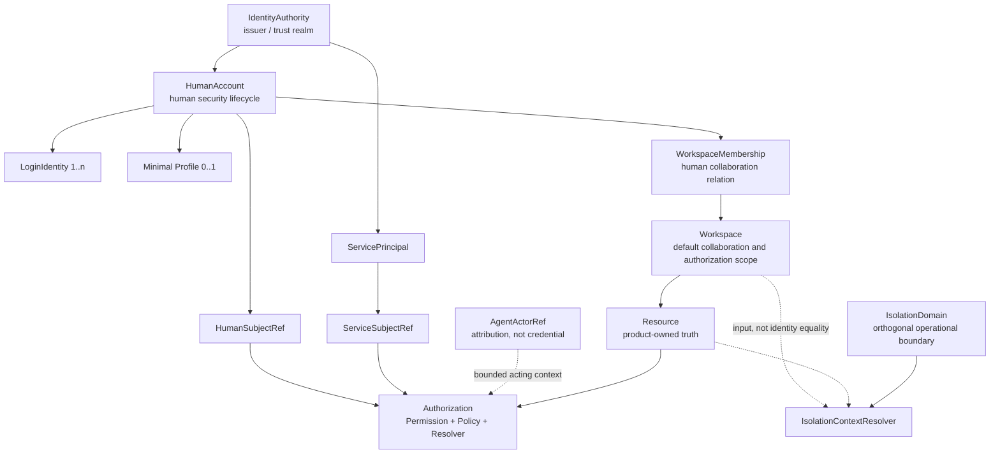
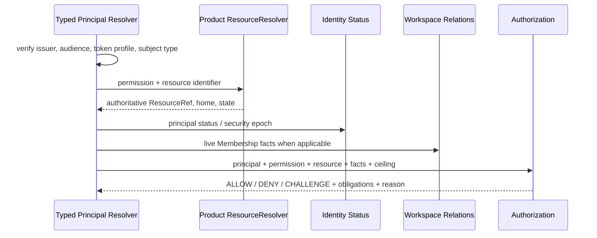
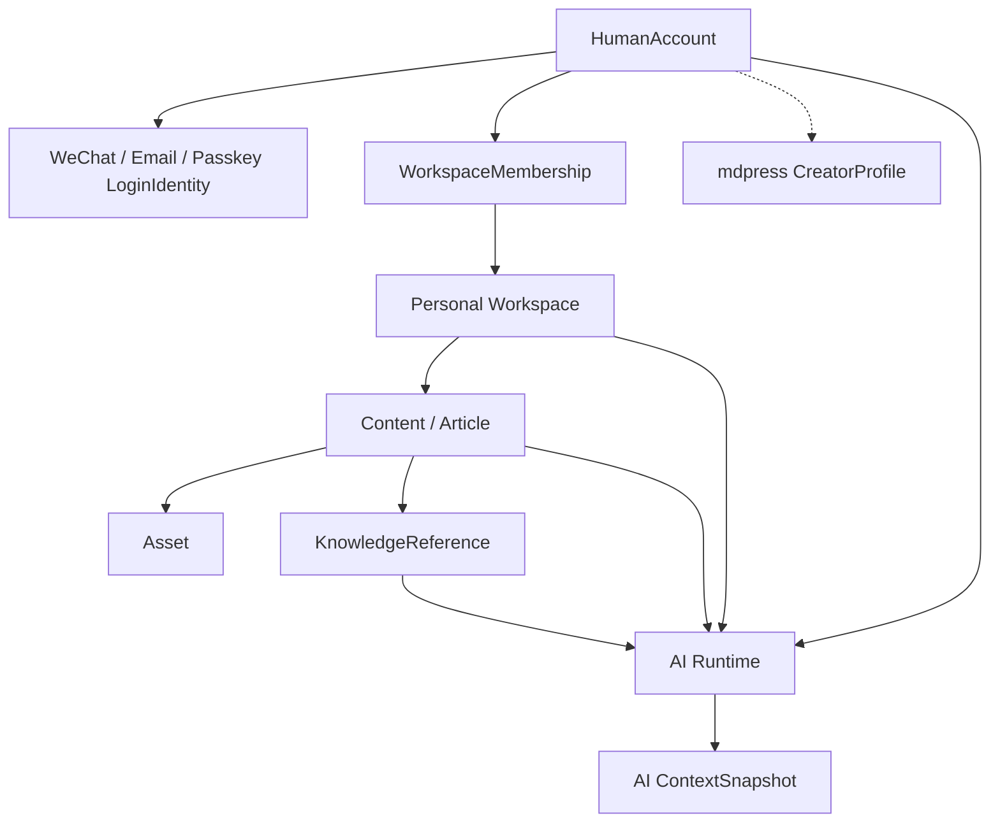
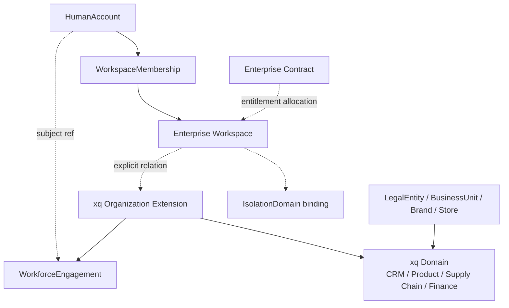
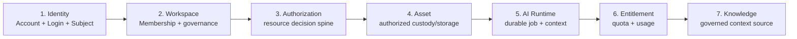

# ADR-0033 Greenfield：Account、Workspace、Subject 与 Isolation 基线

## Status

Accepted（作为 Foundation 目标基线）

- 日期：2026-08-03（Proposed）· 2026-08-04（Accepted）
- 类型：Greenfield Foundation baseline；不是 migration plan
- 适用前提：没有外部消费者、正式发布制品、生产数据、必须保持的公开 API 或不可重建环境
- 最终选择：**Option B — 完全移除 Tenant 一等概念**
- 实施影响：[Ainer Foundation Greenfield Reset Impact](../architecture/ainer-foundation-greenfield-reset-impact.md)
- 相关决策：[ADR-0034：Knowledge Foundation 与 AI Context Model](0034-knowledge-foundation-and-ai-context-model.md)
- 决策血缘：取代 [ADR-0033 v1](0033-account-workspace-isolation-model-baseline.md)（Historical，Never Effective）
  与 [ADR-0033 v2](0033-account-workspace-isolation-model-baseline-v2.md)（Historical，迁移路线不采用）；
  修订语境见 [ADR-0033 对抗性审查](../architecture/adr-0033-adversarial-review.md)
- 实现授权：无；接受仅确立目标基线与不变量，不授权立即修改 Java、Kotlin、POM、migration、API、测试、
  数据库或运行环境。Reset 按 [Impact 文档](../architecture/ainer-foundation-greenfield-reset-impact.md)
  Stage 0–8 顺序执行，每个 Stage 独立验收；Stage 0 决策门已于 2026-08-04 通过（见该文档 Stage 0 记录）
- 前提守护：若任一 Greenfield 前提（外部 consumer / 正式发行制品 / 生产数据 / 公开 API 合同）在 reset
  完成前变为不成立，必须暂停 reset 并另立 migration ADR，不得把本文偷偷改成半兼容方案

本 ADR 使用与 v1/v2 相同编号，是因为它回答同一个长期问题，但采用了新的、明确的 greenfield
前提。旧文件保留为决策历史，不覆盖、不删除。Proposed 期间，本 ADR 不改变任何现行代码或 Accepted
ADR；一旦 Accepted，它将成为 Ainer Foundation 的目标模型，v1/v2 的 legacy compatibility 路线不再是
选定方案。

### Decision relationship

| Existing decision | Greenfield baseline 处理 |
|---|---|
| ADR-0005 | 保留标准 OAuth/OIDC、可信 issuer/audience、服务端 principal projection、scope ceiling 和业务模块不解析 JWT；取代 `tenant_id` 必填与 tenant-bound `AuthenticatedActor` 目标 |
| ADR-0006 / 0007 | 保留服务端资源归属、Membership、邀请、治理并发、fail-closed 和审计；删除 Workspace 的 Tenant parent 与 tenant 复合边界 |
| ADR-0018 / 0019 / 0022 | Tenant member/provisioning/selection/admin browser contract 不进入新 baseline；可复用 step-up、幂等、revoke、审计和 OAuth browser 安全模式 |
| ADR-0024 | 模块化单体、模块数据所有权、真实消费者验证继续有效 |
| ADR-0030 | 保留 Permission/Policy/Binding/ResourceResolver 的混合授权方向；删除 `Scope.Tenant` 和 credential tenant ceiling |
| ADR-0031 | 保留 credential principal、effective principal、AgentActorRef 与 bounded grant 的分离；删除 Agent 的 ownerTenant 假设 |
| ADR-0032 | 只保留 Workforce 与 Account、Role、Workspace Membership 分离的洞见；Organization 改为 Enterprise Extension，所有 tenant-bound 字段需重审 |
| ADR-0034 | `AccountPrivate | Workspace | PlatformCatalog` home、Knowledge/Content/Context 分离继续有效；删除 tenant compatibility 表述 |

这些关系只有在本 ADR Accepted 后才成为后继约束。由于 reset 没有外部兼容义务，Accepted 的早期
实现 ADR 可以被新的 Foundation baseline 有意识地取代；“已实现”本身不构成长久边界。

---

## 1. Context

Ainer 的目标不是把当前 xq-platform 迁移进一个新的 Spring Boot 后台，而是建立可同时支撑
Creator Platform、Enterprise Product Platform 和 Agent Runtime 的 AI Application Foundation。

早期脚手架采用了 tenant-first：

```text
Tenant
  ├── User / TenantMembership
  └── Workspace / WorkspaceMember
```

Tenant 随后同时承担 identity boundary、company/customer、collaboration、authorization、subscription、
data partition 和 isolation。问题不是名称不够现代，而是不同生命周期、基数和 authority 被压缩到一个
对象：

- Human 登录和恢复被迫依赖一个企业/空间容器；
- Tenant OWNER、Workspace OWNER、付款人、法人和隔离 key 容易被当成同一个角色；
- `tenant_id` 同时出现在 JWT、外键、查询过滤、service client、审计和事件中，使任何新场景先回答
  “属于哪个 Tenant”，而不是回答资源真实属于谁、由谁协作、如何隔离；
- 多个 Workspace 共享部署、一个企业合同覆盖多个 Workspace、一个自然人使用多个产品等合法场景被
  迫使成 1:1；
- Agent credential、Agent definition、执行 scope、Memory 和用量归因无法由一个 Tenant ownership
  解释。

### mdpress：Creator / Consumer 场景

个人创作者首先是 HumanAccount。其注册、登录、恢复、私有 Profile 和创建 Personal Workspace 不应先
创建“企业租户”。作者可以加入团队、运营多个品牌、在多个 Workspace 协作；Account、CreatorProfile、
内容版权人、发布账号、付款人和 Workspace 都可能不同。Tenant 不提供额外信息，只增加假企业语义。

### xq-platform-next：Enterprise 场景

大型珠宝集团可能同时存在 Customer/Contract、LegalEntity、Organization、Department、BusinessUnit、
Brand、Store、Workspace 和 IsolationDomain。它们不是一棵通用树，也不应由 Tenant 替代。Enterprise
需要显式模型，而不是把全部概念重新命名为 Tenant 属性。

### Agent Runtime 场景

Agent 由 Human 或 Service principal 触发，在受控 grant 下针对某次 Workspace/resource 执行，并可能
使用独立 Memory、Knowledge 和工具。Agent 不是 HumanAccount，不是 WorkspaceMember，更不能因“属于
Tenant”获得 OWNER/ADMIN。Tenant 不能表达 credential actor、effective principal、AgentActorRef、grant
和 invocation context 的组合。

### Greenfield premise

本决策刻意不处理生产迁移：当前数据库可丢弃，migration 可重建，API/Token/测试可重写，开发 client
和 session 可失效。若任一前提后来不成立，必须暂停 reset 并另立 migration ADR；不能把本文偷偷改成
半兼容方案。

---

## 2. Core Decision

### 2.1 Final choice

选择 **Option B：Ainer Foundation 完全移除 Tenant 一等概念**。

规范性含义：Foundation 的 domain model、public API、JWT、event、database baseline、module contract 和
authorization scope 都不定义 `Tenant`、`TenantMembership`、`TenantRole` 或通用 `tenant_id`。产品内部或
第三方系统可以使用单词 tenant，但它不进入 Ainer Foundation vocabulary，也不能成为跨模块授权或
隔离合同。

Tenant 的原职责拆分如下：

| 原 Tenant 职责 | Greenfield authority |
|---|---|
| 人类认证与恢复 | `IdentityAuthority + HumanAccount + LoginIdentity` |
| 协作空间与成员 | `Workspace + WorkspaceMembership` |
| 权限 | `Authorization` 的 Permission、Policy、Binding、relation 和 ResourceResolver |
| 企业组织 | xq Enterprise Extension 的 Organization/Workforce |
| 商业客户/合同 | 产品 Commercial domain |
| Plan、Quota、Usage | Foundation Entitlement capability + 产品 catalog/commerce |
| 物理隔离/地域/密钥 | `IsolationDomain + IsolationContextResolver` |
| 资源归属 | owning product 的 Resource record/home policy |

### 2.2 Target model



主路径可以简写为：

```text
IdentityAuthority
  └── HumanAccount
      └── WorkspaceMembership
          └── Workspace
              └── Resource
```

这只是最常见的协作路径，不表示 Resource 必须由 Workspace 法律拥有，也不表示 Workspace 是所有
对象的顶层 root。Account-private、PlatformCatalog、contract-scoped 和 multi-party Resource 仍可存在。

`IdentityAuthority` 也不能成为新的 Tenant。它只限定 issuer、trust policy 和主体 ID/credential 的解释
命名空间；不拥有 Workspace、member、plan、contract、Organization 或 IsolationDomain。初期它可以是由
受信 issuer/configuration 解析的值对象，不要求建立业务管理 aggregate。

### 2.3 Non-equivalence invariants

```text
HumanAccount != natural person master record
LoginIdentity != HumanAccount
Workspace != company / customer / legal entity
Workspace != IsolationDomain
Workspace Membership != business Role / Entitlement
Governance owner != legal / copyright / billing owner
ServicePrincipal != OAuth client credential
AgentActorRef != credential principal / HumanAccount
Resource home != token-selected Workspace
```

这些“不等式”比类名更重要；任何后继模型违反它们都必须通过新 ADR 明确说明。

---

## 3. HumanAccount

HumanAccount 定义为：

> **在一个 IdentityAuthority 内，代表一个人类安全账户的稳定生命周期根。**

负责：

- 稳定 account ID；
- authentication lifecycle 的账户侧状态；
- ACTIVE/LOCKED/DISABLED/CLOSED 等安全状态；
- recovery policy 和 account-wide security epoch；
- LoginIdentity link/unlink 的安全治理；
- 关闭、导出和隐私请求所需的最小账户控制面。

不负责：

- Workspace、WorkspaceMembership 或治理 Role；
- Organization、Employee、Customer 或 Person 主档；
- Billing、Subscription、Plan、Quota；
- Creator、Brand 或公开作者身份；
- Content、Asset、Knowledge、Agent 或资源所有权。

HumanAccount 可以存在于零个 Workspace。离开一个 Workspace 不关闭 Account；关闭 Account 不级联删除
Workspace 或业务资源。资源后续如何保管、匿名化、转移或保留由 owning domain 和治理策略决定。

“Account-first”只适用于人类身份生命周期，不表示 Account 是所有系统对象的唯一根。ServicePrincipal
和 AgentActorRef 有独立语义，自然人跨 IdentityAuthority 也可以合法拥有多个 Account。

---

## 4. LoginIdentity

```text
HumanAccount 1 ── 1..n LoginIdentity
```

`1..n` 是 Account aggregate 的安全不变量：Foundation 不预创建没有任何已验证登录/恢复绑定的
credential-less HumanAccount。企业预邀请应先保存 Invitation/AccountClaim，首个 LoginIdentity 验证成功时
再原子创建 Account；关闭后的绑定可进入 REVOKED/tombstone 状态以保留安全审计，而不是把 ACTIVE Account
留成无法证明归属的空壳。

LoginIdentity 表达某个认证命名空间中的稳定标识如何绑定到 HumanAccount：

```text
LoginIdentity(
  id,
  accountRef,
  type,
  providerAuthority,
  normalizedIdentifier,
  status,
  verifiedAt,
  linkedAt,
  lastUsedAt,
  credentialRef?
)
```

| Type | Identity key | Notes |
|---|---|---|
| username | local authority + normalized username | password 是独立 credential，不是 Account 字段 |
| email | provider/authority + verified normalized email | 相同 email 不自动合并 Account |
| phone | provider/authority + verified E.164 number | 号码回收需要重新验证和风险控制 |
| OAuth | provider + provider subject | consumer OAuth provider adapter拥有协议细节 |
| OIDC | immutable issuer + `sub` | email/name claims 不是稳定主键 |
| WeChat | platform app ID + `openId` | `unionId` 只能作为关联证据，不触发自动 merge |
| Passkey | account-bound WebAuthn user handle / credential ref | credential和恢复材料由专用安全存储管理 |

LoginIdentity 不能直接等同 Account：

1. 一个 Account 需要多个登录方式和恢复路径；
2. 登录标识可能变更、被回收、撤销或由企业管理，account ID 必须稳定；
3. 企业 OIDC offboarding 不应关闭个人微信/邮箱 Account；
4. password、Passkey、OAuth/OIDC assertion 的 credential 生命周期完全不同；
5. 自动按 email/phone/unionId 合并会造成账户接管。

所有 link/unlink 必须经过已认证 session 的 step-up 或专用恢复 ceremony。v1 不提供自动 Account merge；
冲突绑定 fail closed。最后一个可用登录/恢复路径不能在没有替代路径或明确关闭流程时被删除。

---

## 5. Profile

Foundation Profile 是 HumanAccount 的可选最小交互资料，不是 Person、Creator、Employee 或 Customer
主档。

### Foundation fields

| Field | Boundary |
|---|---|
| `displayName` | 产品内默认显示；不是法律姓名或永久作者署名 |
| `avatarAssetRef?` | 引用 Asset；不保存存储 URL/对象路径 |
| `locale?` | 通用界面语言偏好 |
| `timeZone?` | 通用时间展示偏好 |

Profile 不保存 Role、Workspace、Organization、subscription tier、AI preference、marketing consent 或
业务标签。

### Product / extension fields

以下模型明确不进入 Foundation Profile：

- `CreatorProfile`：笔名、bio、公开 handle、创作领域、公众号 identity；
- `EmployeeProfile`：员工号、岗位、Department、任职与汇报关系；
- `CustomerProfile`：CRM 标签、等级、销售归属、交易偏好；
- `BrandProfile`：品牌 voice、视觉、渠道和 rights；
- KYC、法律姓名、税务、合同签署人或行业许可证。

这些对象可以引用 HumanSubjectRef，但拥有独立生命周期、授权和删除策略。

---

## 6. Subject Model

### 6.1 No universal Subject table

Foundation 不创建一张容纳 Human、Service、Agent、Guest、Organization 和任意 Party 的万能 Subject
表。它会造成稀疏字段、错误生命周期和所有关系都指向一个无 owner 的聚合。

采用 authority-qualified typed reference：

```text
PrincipalSubjectRef =
    HumanSubjectRef(identityAuthorityRef, humanAccountId)
  | ServiceSubjectRef(identityAuthorityRef, servicePrincipalId)

AttributionRef = PrincipalSubjectRef | AgentActorRef
```

`PrincipalSubjectRef` 可以认证并作为 Authorization Binding 的直接目标；`AttributionRef` 只保证审计和
created-by 等引用可表达，不保证所有 variant 都能持有 credential、Membership 或 Binding。

### 6.2 HumanSubject

HumanSubjectRef 指向 HumanAccount。它可以：

- 作为 USER token 的 `sub`；
- 持有 WorkspaceMembership；
- 接受邀请、承担 Workspace governance；
- 作为直接 SubjectBinding target；
- 作为资源 creator/actor 的审计引用。

### 6.3 ServicePrincipal

ServicePrincipal 是稳定非人安全主体，拥有 credential rotation、disable 和 audit lifecycle。OAuth
`client_id`、secret、private key 或 workload identity 是 credential binding，不等于 ServicePrincipal ID。

ServicePrincipal 不进入普通 WorkspaceMembership，也不成为通用 Workspace OWNER。它通过最小 OAuth
scope、SubjectBinding、service policy 或产品 installation grant 获得受限能力。

### 6.4 AgentActorRef

AgentActorRef 指向 Agent definition/version，用于行为、输出和审计归因。它不直接持有 credential，
不作为普通 JWT `sub`，不进入普通 WorkspaceMembership，不成为 Human，也不成为 OWNER。

Agent invocation 至少区分：

```text
credentialPrincipalRef   Human or Service that authenticated
effectivePrincipalRef    Human or Service authority being exercised
agentActorRef             Agent definition/version performing behavior
grantRef                  bounded reason delegation is allowed
invocationContext         Workspace/resource/purpose/as-of/budget
```

Agent Runtime 以后可实现 grant/capability，但本 ADR 不授权实现 Agent。Anonymous request 没有
SubjectRef；只有真实持久游客用例出现后才另行设计 TTL Guest identity。

---

## 7. Workspace Model

Workspace 定义为：

> **default collaboration and authorization scope：跨产品复用的默认协作范围、资源 namespace、成员治理
> 和常用授权 scope。**

Workspace core 负责：

- 由 Workspace 模块权威签发的稳定 `WorkspaceRef(workspaceId)`；
- display name、status、version 和最小生命周期；
- 默认 resource namespace/custody reference；
- Human WorkspaceMembership；
- invitation、member governance 和 governance continuity policy；
- 为 Authorization 提供 Workspace relation facts。

Workspace 明确不负责：

- company、customer、Organization、LegalEntity；
- commercial account、contract、payer、invoice；
- copyright、authorship、rights holder、license；
- IdentityAuthority、SSO realm 或 SCIM directory；
- database、region、cell、KMS、retention 或 private deployment；
- Subscription、Plan、Entitlement 或 Usage ledger；
- 所有 Resource 必须拥有的唯一 parent。

`WorkspaceMembership` 只表达 HumanAccount 与 Workspace 的协作/治理关系：

```text
WorkspaceMembership(
  workspaceRef,
  humanSubjectRef,
  status,
  governanceRole,
  validPeriod?,
  invitedBy?,
  version
)
```

`GOVERNANCE_OWNER/ADMIN/MEMBER` 只描述空间治理。它们不自动成为产品业务 Role，不进入 Subscription，
也不证明法律、版权或付款所有权。Service 和 Agent 使用 Authorization/installation grant，不使用该表。

Resource 的 authoritative home 由 owning product 保存并由 ResourceResolver 解析。Token、path、header 或
当前选中的 Workspace 不能覆盖 resource truth。

`workspaceId` 在一个 Ainer Foundation 部署内必须全局唯一，且只能由服务端 Workspace authority 解析；
这里的 authority 是模块数据所有权，不是 `WorkspaceAuthority`、identity realm 或新的 Tenant aggregate。
跨部署/外部系统引用必须显式携带 source-system adapter 语义，不能通过调用方提交一个
`workspaceAuthority` claim 改变本地 Workspace 身份。

默认协作型产品资源，即使只有一个人使用，也优先放入 Personal Workspace。只有确实需要跟随 Account
隐私/安全生命周期、且没有协作语义的资料才使用 AccountPrivate；这避免 Account 与 Workspace 变成两套
任意选择的顶层容器。

---

## 8. Workspace Lifecycle

Personal、Team、Enterprise 使用同一个 Workspace aggregate、Membership 和引用合同。差异优先表现为
`WorkspaceProfile + GovernancePolicy`，而不是三个继承层次或三套表。

| Profile | Common model | Policy differences | Not part of Workspace core |
|---|---|---|---|
| Personal | Workspace + Human Membership | 按 `(HumanAccount, product/provisioning scope)` 幂等创建；创建者成为初始 GOVERNANCE_OWNER；默认可禁止邀请 | CreatorProfile、个人订阅、版权、隐私内容本身 |
| Team | 同一模型 | invitation、member management、governance transfer/recovery；可允许多个 custodian 或指定最小治理人数 | Brand、Project、team billing、publication |
| Enterprise | 同一模型 | enterprise-managed access policy、强治理恢复、可能引用 IdP/SCIM/retention policy | Organization、LegalEntity、Contract、CMK/region、Workforce |

Profile 决定允许哪些治理操作和不变量，但不改变 Workspace ID 的意义。Personal 转 Team 应是受审计的
policy/profile transition，不通过复制资源创建第二套空间；是否允许及其前置条件由后继 Workspace ADR
冻结。

共同生命周期至少需要 `ACTIVE / SUSPENDED / CLOSED` 与 optimistic version。创建过程可有内部
PROVISIONING 状态，但未完成空间不能被授权读取。SUSPENDED 收紧访问但不删除资源；CLOSED 的 retention、
export 和恢复由资源/产品政策决定。

每个 ACTIVE Workspace 必须有 governance continuity policy，但不冻结“所有 profile 永远恰好一个
OWNER”。Personal 可要求一个初始治理 owner；Team/Enterprise 可采用 custodian set、恢复管理员或外部
治理 policy。无论哪种 profile，治理身份都不能被解释为 legal/billing/rights owner。

---

## 9. Organization / Enterprise

Organization 不进入 Foundation core。它属于 xq 等 Enterprise Extension，因为：

1. mdpress 个人创作者不需要 Department、Position 或 Workforce；
2. Organization hierarchy、法人、品牌和经营单元是不同模型，无法由一个通用树覆盖；
3. 任职数据更敏感，生命周期和合规要求不同于登录与协作；
4. 只有企业产品能定义员工号、调岗、阿米巴、门店和行业权限的真实含义；
5. 将其放入 Identity 会让 Authorization Server 变成 HR/ERP 后台。

xq 的候选组合是：

```text
Enterprise Workspace
  └── explicit extension relationship
      └── Organization
          ├── Department / OrgUnit
          └── WorkforceEngagement

xq domain alongside:
  LegalEntity / BusinessUnit / Brand / Store / CommercialContract
```

这不是强制的一棵 ownership 树。一个 Organization 可按产品需求关联多个 Workspace，一个 Workspace 也
可能服务多个法人/品牌；N:M 关系由 xq domain 明确表达。WorkforceEngagement 指向 HumanSubjectRef，
不等于 Account 或 WorkspaceMembership。离职默认撤销任职及其派生 grant，不自动关闭个人 Account。

若未来第二个非 xq 消费者证明 Organization/Workforce 合同稳定，再按 ADR-0024 评估提升；在此之前不
创建 Foundation Organization module。

---

## 10. Isolation Model

移除 Tenant 不等于移除隔离。隔离被拆成三个部分：

```text
Workspace / AccountPrivate / Resource home
                 +
IsolationDomain / placement policy
                 ↓
IsolationContextResolver
                 ↓
request-scoped IsolationContext
```

### IsolationDomain

IsolationDomain 表达具有独立运维生命周期的物理/合规边界，例如 deployment、region/cell、database/
schema、KMS key domain、retention/legal hold 或 dedicated customer environment。只有真实需求出现时才建立
对应 aggregate；它不是产品可见 Tenant，也不包含成员、Role、Plan 或 Organization。

### IsolationContextResolver

Resolver 使用服务端可信事实：ResourceRef/home、WorkspaceRef 或 HumanSubjectRef、product policy、
placement binding 和 deployment configuration。输出不可变请求期投影，例如 domain ref、partition key、
region/cell 和 policy version。调用者提交的 header/JWT workspace 只能成为 access ceiling，不能决定
placement。

### Simple deployment

简单共享数据库可以使用 `workspaceId` 作为某类 workspace-scoped table 的 partition key，也可使用
`accountId` 处理 AccountPrivate 数据。这是实现选择，不建立：

```text
Workspace == IsolationDomain
Workspace ID == database/KMS/contract boundary
```

多个 Workspace 可共享一个 IsolationDomain；一个 Workspace 的特定高敏 Resource 也可绑定不同 Domain。
PlatformCatalog 或跨方资源使用自己的 home/policy。Foundation 不引入替代 Tenant 的万能 `space_id`。

---

## 11. Authorization Boundary

职责公式：

```text
Identity      answers: who authenticated?
Workspace     answers: where do humans collaborate?
Product       answers: what is the resource and its authoritative state/home?
Authorization answers: can this principal perform this permission on this resource now?
```



Identity 提供 qualified principal、authentication assurance、Account/Service status 和 revocation facts；
Workspace 提供 live Human Membership/governance facts；Authorization 拥有 Permission、Role、Binding、Scope、
Policy、Decision 和 audit；产品拥有 ResourceResolver、relation/state facts 和 PermissionContributor。

OAuth scope 是 token 能力上限，不是资源级授权。Workspace context 是 selector/ceiling，不是 Resource home。
Membership governance role可以被 policy映射为有限 Workspace Permission，但不能作为 JWT 中的永久业务
Role。Plan/Pro/Employee/Position 不是 Role。resolver error、未知 subject/profile、状态不明和 facts异常全部
default DENY。

Greenfield Authorization 不定义 `Scope.Tenant` 或 `credentialTenantId`。建议 scope family 为
`GlobalPlatform`（仅受控系统能力）、`Workspace(WorkspaceRef)`、`Resource(ResourceRef)` 以及产品贡献的
窄 typed scope；AccountPrivate 由 owner relation + Resource policy表达，而不是“个人 Tenant”。

---

## 12. Subscription / Commercial

Workspace 不是唯一商业根。Foundation v1 只提供窄 Entitlement capability：

- typed entitlement definition/capability code；
- 有来源、有效期和 target 的 grant/allocation；
- quota/usage reservation、commit/release 所需的最小原语；
- suspension/revoke 和审计；
- target 可以是 HumanSubjectRef、WorkspaceRef、ProductInstallationRef 或产品 CommercialRef，而不是固定
  Workspace。

产品拥有 plan catalog、价格、试用、订阅状态机、付款、invoice、refund、tax、contract 和 customer。

mdpress 的 Free/Pro/Creator Pro 是产品 Plan，可能授予 Account 或特定 Workspace entitlement；它们不是
WorkspaceRole。xq 的 Enterprise Contract 可以覆盖多个 Workspace/Organization，由 xq Commercial domain
分配 entitlement；合同终止不删除 Workspace，Workspace ADMIN 也不能自行扩张合同权益。

在第二个真实商业消费者证明共同语义前，Foundation 不建设 Billing System。

---

## 13. Knowledge / AI Alignment

本 ADR 采用 ADR-0034 的混合 Knowledge home：

```text
KnowledgeHome = AccountPrivate | Workspace | PlatformCatalog
```

Knowledge 不属于 Tenant，也不因放在 Workspace 中就由 Workspace 法律拥有。home/custody、visibility、
applicability、rights、source、evidence 和物理 isolation 是不同维度。

AI Runtime 负责按请求装配 Context，而不是让 Workspace 保存一个万能上下文：

```text
Typed Principal / Agent Grant
+ User Request / Purpose
+ optional Invocation Workspace
+ Authorized Content / Asset
+ Authorized Knowledge revisions
+ Product facts and Tools/MCP
+ Entitlement / budget
= immutable ContextSnapshot manifest
```

AccountPrivate knowledge不会因 Account 加入 Workspace 自动暴露；PlatformCatalog 不等于匿名公开；
Workspace membership revoke、Knowledge revoke 或 source permission revoke 后，新 Context 必须 fail closed。
Agent Memory 也应按 Account/Workspace/Agent/Task 等真实 scope建模，不能用隐藏 Tenant 兜底。

---

## 14. mdpress Example



注册创建 HumanAccount 和 LoginIdentity；Personal Workspace 由 mdpress provisioning scope 幂等创建。
CreatorProfile、公众号身份、文章、Theme 和 Publishing 属于 mdpress。文章可以引用精确 KnowledgeRevision，
AI Runtime 使用 authenticated Human、Workspace、Content、Knowledge、tools 和 budget 形成 ContextSnapshot。

不需要 Tenant，因为：身份由 Account 解释，协作由 Workspace 解释，内容由 mdpress 解释，权益由
Entitlement/产品 Subscription 解释，隔离由 resolver 解释。创建一个名为 Tenant 的中间对象不会增加
任何真实业务含义。

---

## 15. xq Example



Enterprise Workspace 只提供协作与访问范围。Organization/Department/Workforce、LegalEntity、Brand、
BusinessUnit、Store、客户合同和珠宝领域模型由 xq extension拥有。企业 OIDC/SCIM管理自己的LoginIdentity
或 Workforce access，但不能因同邮箱关闭个人Account。

Enterprise 能力不污染 Foundation：mdpress 不需要加载 Organization 语义，Authorization 只消费经过
端口提供的 Organization/workforce facts，IsolationDomain 与企业合同也不被塞进 Workspace。

---

## 16. Explicitly Removed Concepts

Greenfield baseline 明确不再建设：

- `Tenant` aggregate；
- `TenantMembership`；
- `TenantRole`；
- `tenant_id` 作为 Foundation domain/database/JWT/event/API 字段；
- default tenant 或 home tenant；
- select-tenant browser/session flow；
- tenant-scoped product API；
- tenant provisioning、tenant ownership transfer/recovery；
- Tenant → Workspace nesting；
- `LegacyTenantRef`、Tenant mapping resolver 或 compatibility ledger；
- `LEGACY_TENANT` Token Profile、tenant/workspace dual claims 或 dual-read；
- optional Foundation/Enterprise `Tenant` extension；
- 用 `space_id`、`account_id` 或 `workspace_id` 重新创建同样的万能 God Object。

允许的不是“Tenant 换名字”，而是每个独立职责进入自己的 owner domain。

---

## 17. Migration / Reset Strategy

这不是生产 migration，而是开发阶段 baseline reset。执行前必须由维护者再次确认 Status 中六项前提；
确认后采用 empty-database rebuild，不提供原地升级或数据转换。

### 17.1 Reset steps

1. **Accept and freeze vocabulary**：接受本 ADR，明确旧 0033 和 tenant-first ADR 的目标部分被取代；
2. **Create recovery point**：保留 Git commit/tag 和历史 ADR，记录 reset 前 schema/claim/API，仅用于审计；
3. **Remove tenant-first implementation**：删除 Tenant domain、Membership、provisioning、selection、claim、
   Workspace parent、tenant Scope 和相关 tests/config；
4. **Rebuild schema baseline**：删除未发布的 tenant-first Flyway history，按最终模型创建新的可从空库启动
   的 squashed baseline；不添加一串 `DROP tenant_*` 的假生产迁移；
5. **Rebuild Identity**：HumanAccount、LoginIdentity、Profile、ServicePrincipal/credential binding 和
   account-level Passkey/recovery；
6. **Rebuild Workspace**：standalone Workspace、Human WorkspaceMembership、profile/policy、治理与审计；
7. **Rebuild token contract**：只发行 USER-neutral、USER-workspace、SERVICE typed profiles；删除
   `tenant_id/roles` 旧含义；
8. **Invalidate old security state**：清空 dev authorization/consent/client/session，轮换开发签名 key 或
   issuer key set，并让 Resource Server 拒绝缺少新 contract version 的 Token；
9. **Rebuild API**：Account、LoginIdentity/Profile、Workspace/Membership 和 Authorization 使用新 contract；
   不发布 deprecated tenant endpoint；
10. **GoldenConsumer gate**：从空库验证 zero-Workspace Account、Personal Workspace 幂等、授权、revoke、
    disable、wrong Workspace、SERVICE 和 Agent-not-principal 负向用例；
11. **Squash and lock**：全部模块从空库重复构建通过后，冻结 Foundation v1 migration baseline，才允许首个
    外部 consumer。

旧 migration 可以删除，因为没有发布数据库需要保留 Flyway checksum/history。任何仍需保留的开发数据
先导出为人工参考，不能作为新 schema 的兼容约束；执行 reset 会破坏本地数据库，必须由后继实现任务
显式授权并列出目标环境。

### 17.2 No compatibility artifacts

Reset 不实现 LegacyTenantRef、mapping、dual write/read、old-token introspection 或旧 API facade。短期编译
过渡 adapter 可以存在于一个未发布实现分支，但不能进入 Foundation v1 baseline、public artifact 或最终
schema。

---

## 18. Foundation v1 Implementation Impact

后续施工顺序是：



顺序含义：

1. Identity 先证明 Account 可在零 Workspace 认证、恢复和禁用；
2. Workspace 再证明 Personal/Team/Enterprise 共用一个 core 且无 Tenant parent；
3. Authorization 在任何 Content/Asset/Knowledge 读取前形成默认拒绝闭环；
4. Asset 不决定 copyright，storage 不创造 access；
5. AI Runtime 使用 typed principal、resource facts、ContextSnapshot 和可恢复 Job；
6. Entitlement 在 Role 之外约束能力、quota 和 usage；
7. Knowledge 只有在 Identity/Authorization/Asset/AI Context 边界稳定后实现 MVP。

各阶段保持模块化单体，不以 reset 为理由创建微服务或空 Maven module。具体删除和修改范围见
[reset impact](../architecture/ainer-foundation-greenfield-reset-impact.md)。

规范性依赖方向：

```text
Identity                         no dependency on Workspace/Product
Workspace  -> Identity port      qualified HumanAccount status only
Authorization -> facts ports     Identity + Workspace + Product ResourceResolver
AI Runtime -> Foundation ports   Authorization + Asset + Entitlement + Knowledge refs
Product / Enterprise Extension -> Foundation
Foundation                      never depends on mdpress or xq implementation
```

“多租户部署”仍可作为 non-functional capability 被讨论，但不能重新引入通用 Tenant aggregate/claim/列。
RLS、partition、region或KMS字段应按真实技术职责命名，例如 `isolation_partition_id`，而不是重新使用
`tenant_id`。

---

## 19. Alternatives Considered

### Option A：Tenant-first

保留 Tenant 作为 Account、Workspace、商业和隔离的共同 root，最接近当前代码，也容易实现统一
`tenant_id` 查询过滤。

拒绝原因：它要求个人创作者拥有假企业容器，把企业多个正交边界压成一棵树，并让 JWT、Membership、
Entitlement 和 isolation继续共享同一个 key。当前代码量不是 greenfield 架构理由。

### Option B：完全移除 Tenant 一等概念（Workspace-first，采用）

以 HumanAccount 处理人类身份，以 Workspace 处理默认协作，以 Authorization 处理权限，以产品域处理
企业/商业，以 IsolationDomain/Resolver 处理物理隔离。

采用原因：它用真实生命周期替代万能容器，同时适配 Consumer、Enterprise 和 Agent；当前没有兼容成本，
这是删除错误抽象的最佳窗口。

### Option C：Tenant 作为可选 Enterprise Extension

个人产品不使用 Tenant，企业产品可选择 Tenant 包裹 Workspace/Organization。

拒绝原因：Enterprise 真正需要的是 Customer/Contract、Organization、LegalEntity、Identity realm 和
IsolationDomain，它们并不等价。保留可选 Tenant 会让 xq 再次把这些关系塞入一个无明确职责的容器，
并迫使 Foundation API/Subject/Entitlement 为可有可无的 parent设计分支。

产品内部若因第三方平台必须使用 tenant 术语，只能作为产品-local adapter，不得进入 Foundation ref、
claim、scope 或 database contract。

### Compatibility layer around current Tenant

ADR-0033 v2 的 LegacyTenantRef、mapping、dual profile 和 staged cutover 在已有生产数据时是安全方案；在
本 ADR 前提下，它会永久增加双模型、测试矩阵和认知成本，却没有要保护的 consumer。拒绝。

### Consequences

正面：

- Account、Workspace、Organization、commercial 和 isolation 生命周期清晰；
- mdpress 不继承企业模型，xq 也不被简化为 Creator Workspace；
- Agent 不需要伪装成 User/Tenant member；
- JWT、API、数据库从第一版就是 typed/qualified contract；
- 删除 compatibility layer，Foundation v1 更小、更可解释。

代价：

- 已实现的 tenant provisioning、管理 UI、Workspace tenant scope、Passkey tenant guard、event relay 和大量
  tests需要删除或重写；
- Accepted 的早期 ADR 需要在接受后更新状态/索引；
- 所有开发数据库、Token、session、consent 和 client fixture失效；
- Workspace、Isolation 和 Authorization 必须真正实现，不能继续依赖一个 tenant key兜底；
- reset期间主分支可能短暂不可发布，应通过原子施工分支和完成门禁控制。

---

## 20. Acceptance Criteria

本 ADR 只有在以下全部条件得到维护者确认后才能 Accepted：

### Assumption gate

- [ ] 没有外部消费者或正式发布制品；
- [ ] 没有生产/共享环境数据需要原地升级；
- [ ] 当前 API、JWT、client、session 和 migration history 可以失效；
- [ ] 所有开发环境可以从空数据库重建；
- [ ] reset 的破坏范围和恢复点由维护者批准。

### Architecture gate

- [ ] Foundation vocabulary、domain、JWT、API 和 schema 中没有 Tenant 一等概念；
- [ ] HumanAccount 可以在零 Workspace 时认证、恢复、管理 Profile 和禁用；
- [ ] LoginIdentity 支持多 provider，且标识相同不会自动 merge Account；
- [ ] Human、Service、Agent 使用 typed references，没有万能 Subject 表；
- [ ] Agent 不是 Human、OWNER 或普通 WorkspaceMember；
- [ ] Personal、Team、Enterprise 共用 Workspace core，只通过 policy/profile和扩展体现差异；
- [ ] Workspace 不承担 company、commercial、legal、rights 或 physical isolation；
- [ ] Organization/Workforce 留在 Enterprise Extension；
- [ ] Workspace 与 IsolationDomain 没有 ID/生命周期等价关系；
- [ ] Identity/Workspace/Authorization/Product 的 who/where/can-do-what/resource-truth 边界清楚；
- [ ] Subscription catalog与合同属于产品，Foundation只提供 Entitlement capability；
- [ ] Knowledge 可以使用 AccountPrivate、Workspace、PlatformCatalog home；
- [ ] AI Runtime 可以从 typed subject、Workspace、Resource、Knowledge、tools和budget装配 ContextSnapshot。

### Reset exit gate

- [ ] 新 baseline 可从空数据库一次启动；
- [ ] 全仓不再签发、解析或存储 Foundation `tenant_id`；
- [ ] 不存在 LegacyTenantRef、mapping、dual claim、dual Membership 或 compatibility API；
- [ ] Account disable、Membership revoke、wrong Workspace、cross-resource、SERVICE 和 Agent负向测试
      fail closed；
- [ ] server-side authority、issuer/audience、scope ceiling、step-up、audit、revoke、idempotency和并发安全
      不因 reset 回退；
- [ ] Internal GoldenConsumer 通过后才允许 mdpress/xq-platform-next 接入。

### Open questions that do not block the core decision

1. Personal Workspace 是否允许直接 profile transition 为 Team，还是只允许创建新 Team 并转移资源？
2. Team/Enterprise governance continuity 使用单 owner、custodian set 还是外部 recovery policy？
3. 首个版本是否实现 email/phone/WeChat/OIDC 全部 LoginIdentity adapter，还是先冻结合同并只交付两种？
4. IsolationDomain 在 v1 是显式 aggregate，还是先仅实现 resolver port + shared-domain configuration？
5. Entitlement 首个 target 选择 Human、Workspace 还是 ProductInstallation？

这些问题不能重新引入 Tenant，也不能阻塞 Account-with-zero-Workspace、typed Subject、standalone Workspace
和独立 Authorization/Isolation 的核心基线。
