# ADR-0034：Knowledge Foundation 与 AI Context Model 基线

## Status

> 实现注记（2026-08-15）：本文保持目标合同地位；首批实现切片（K1/K2）与 Greenfield 澄清见
> [ADR-0044](0044-knowledge-foundation-implementation-baseline.md)。文中 3 处 tenant 表述按
> ADR-0044 澄清为 Workspace 语义。

- 状态：Proposed
- 日期：2026-08-03
- 决策者：Ainer 项目维护者
- 取代：无
- 被取代：无
- 局部修订（本 ADR Accepted 后生效）：ADR-0023 对“不引入通用 Knowledge 抽象”的长期解释
- 实现授权：无；本 ADR 不授权创建 Java、数据库、migration、索引或运行服务

本 ADR 引入的是窄职责 Knowledge Foundation，因此若被接受，将局部修订 ADR-0023 在对象模型总述和
非目标中对“通用 Knowledge 抽象”的排除。它仍不引入 Knowledge 万能对象，也不把 Memory、Evidence、
Content、Asset、业务事实或 ContextSnapshot 合并。ADR-0023 的 Identity 周报 Task/Run/Result、事实与
推断分离、Memory/Evidence 分离及不可变 ContextSnapshot 等结论继续保留。

## Context

Ainer 正在形成 Identity、Workspace、Authorization、AI Runtime 四条基础能力，未来至少服务：

1. mdpress：个人创作者、团队和企业内容空间中的 AI 写作、品牌表达与知识引用；
2. xq-platform / 小趣 AI：翡翠行业知识、商品与经营事实、规则、经验和业务智能；
3. Ainer Agent Runtime：在授权范围内检索知识、查询业务、调用工具并生成可追溯结果。

模型生成能力正在快速商品化。Ainer 更难、也更长期的问题是：如何让一次 AI 执行获得正确范围、
正确时间、可解释来源和可验证版本的 Context，并能区分事实、知识、内容、观察与推断。

当前术语必须先分开：

| 概念 | 含义 | 权威所有者 |
|---|---|---|
| Data / Business Fact | 某时刻真实记录的商品、订单、库存、客户、指标或交易状态 | 产品数据库、ERP、CRM、规则引擎等来源域 |
| Content | 面向受众和渠道的表达、编辑、审核、主题与发布对象 | mdpress 或其他产品 Content 域 |
| Asset | 文件、图片、音视频、对象引用及其存储生命周期 | Asset / Storage 域 |
| Knowledge | 对概念、规则含义、流程、关系和经策展经验的可复用理解 | 进入 Foundation 后由 Knowledge Foundation 作为 canonical authority；未上提的产品知识仍是产品 Resource |
| Context | 为一次请求按主体、目的、时间、授权和预算选出的短期信息集合 | 产品/Agent use case 拥有目的与选择策略；AI Runtime 拥有安全装配机制和 Snapshot manifest |
| Grounding | AI 结果与本次实际采用的来源、版本和证据之间的可追溯关系 | AI Runtime 记录使用事实；来源域和 Knowledge 保留各自权威 |

仓库已有 [`Knowledge 数据模型提案`](../design/knowledge-data-model.md)，其重点是
Document/Revision/Chunk/Embedding、索引代际和检索授权。该提案正确地把 chunk、embedding 和向量
索引视为可重建投影，但它尚未冻结 Knowledge 的长期语义身份、Content 关系、混合作用域、OKF
互操作和完整 Context Assembly 边界。

现有决策还要求：

- Accepted ADR-0003：Model Gateway 负责模型调用、出网策略和 invocation audit，不承载 RAG、内容
  正文或产品知识；
- Accepted ADR-0024：模块化单体优先，模块拥有自己的数据、事务和公开契约，产品语义只有在多个
  消费者中稳定后才上提；
- Proposed ADR-0030/0031：Knowledge 和业务数据必须在检索前授权，`ContextScope` 是通用
  AuthorizationDecision 的数据边界，不是第二套 ACL；发送 provider 前还要执行数据分级和敏感
  数据策略；
- Proposed ADR-0023：ContextSnapshot 是 AI Runtime 拥有的不可变使用记录，事实引用与模型推断
  分开，Memory Proposal 不能自动升级为事实；
- Proposed ADR-0033 及其对抗性审查：Workspace 可以是默认协作/访问范围，但不应再次成为商业、
  法律、版权、身份和物理隔离的万能顶层对象。

### Decision drivers

- 为跨产品知识提供稳定身份、不可变版本、来源、证据、关系和生命周期；
- 不复制或接管业务数据库、Content、Asset、Memory 和产品规则的权威；
- Context 必须按用途、授权、时间和数据分级动态装配，而不是把整个“知识库”塞进 prompt；
- AI 输出、外部导入和 Agent 维护的内容默认不受信，必须经过显式治理才能发布为 Knowledge；
- 支持 Markdown/YAML 等人机可读形式和可移植交换，同时不把新兴文件格式变成内部真相模型；
- 索引、向量库、知识图谱、MCP 和模型 provider 都保持可替换或按需引入；
- 保持演进式模块化单体，不以本决策为理由拆微服务。

## Decision

### 1. Knowledge Foundation 的定位

Ainer Knowledge Foundation 定义为：

> **一个受治理的语义层：把来自异构权威源或人工策展的概念、定义、规则解释、流程、关系和经验，
> 表达为可寻址、可版本化、可追溯、受授权、可携带的知识单元，并向 AI Context Assembly 提供可验证
> 的 Grounding 候选。**

它解决五类问题：

1. **Identity：** 同一知识单元在内容改写、文件移动、索引重建和系统交换后仍有稳定引用；
2. **Trust：** 消费者可以知道知识来自哪里、由谁生成/验证、是否仍新鲜、哪些证据支持或反驳；
3. **Semantics：** 概念、规则、流程和经验之间有类型化关系，而不是只靠相似度；
4. **Governance：** Knowledge 有明确 home、生命周期、数据分级和访问边界，AI 不能自动发布自己生成
   的“事实”；
5. **Context readiness：** Agent 能获得精确 revision、as-of、引用和选择原因，而不是无法追溯的全文
   拼接。

Knowledge Foundation 明确不是：

- 数据库替代品：不接管 SKU、库存、订单、成交、客户或当前价格等 operational truth；
- CMS：不拥有文章编辑、排版、主题、发布渠道、评论或内容运营工作流；
- 文档管理系统：不拥有通用文件夹、附件审批、Office 协作或对象存储生命周期；
- ERP / CRM / 规则引擎：不执行交易、定价、折扣、库存或客户状态变更；
- RAG 工具：RAG 只是众多检索适配之一，不能定义 Knowledge 的身份、权威或生命周期；
- 通用 ontology / triple store：类型化关系不意味着首期建设知识图谱数据库或形式逻辑推理；
- Prompt、Agent Memory 或 AI 输出的默认存放处。

Knowledge Foundation 拥有知识语义和已发布版本。来源域继续拥有业务事实与业务授权；产品/Agent
use case 拥有 purpose-specific ContextRequest、候选来源和选择策略；AI Runtime 拥有安全编排、channel
隔离、预算执行、ContextSnapshot、Run 和 Invocation；产品域拥有最终 Content 和业务结果。

只有 Knowledge Foundation 可以签发 canonical KnowledgeObject/Revision reference。尚未上提的平台
候选仍由产品域以自己的 ResourceRef 和版本契约进入 Context，不得伪装成 canonical KnowledgeRef。
产品继续拥有来源事实、kind 的领域校验和 purpose-specific publish policy，但发布事务的唯一 authority
在 Knowledge Foundation。未来若需要跨部署/federated Knowledge authority，必须以新的 ADR 引入
authority-qualified reference、resolver 和撤销协议，不能让多个模块解释同一裸 ID。

### 2. Knowledge Object Model

采用最小语义内核：

```text
KnowledgeObject                         stable semantic identity
  ├── KnowledgeRevision (Version)
  │     └── RevisionPayload             immutable semantic payload
  │           ├── Representation[]      Markdown or typed structured representation
  │           ├── Metadata              discovery, policy and temporal signals
  │           ├── KnowledgeRelation[]   typed, directed semantic edges
  │           ├── SourceRef[]           provenance/origin references
  │           └── EvidenceLink[]        claim/fragment support or contradiction
  ├── RevisionLineage                   immutable supersession links
  ├── Verification/AttestationRecord[]  append-only assessment facts
  └── PublicationEligibility            lifecycle events + current projection

KnowledgeReference                      consumer-owned reference to Object or exact Revision
```

这是一组长期语义，不是数据库表清单。

#### 2.1 题目中候选组成的结论

| 候选 | 结论 | 职责与约束 |
|---|---|---|
| `KnowledgeObject` | 需要 | 只承担稳定语义身份、namespaced kind、home 和对象生命周期；不成为任意正文/JSON 容器 |
| `Metadata` | 需要 | 承担标题、语言、分类、适用时间、数据分级、freshness 等发现和策略信号；动态 publication status 另属 lifecycle，不存业务事实副本 |
| `Relations` | 需要 | 必须是有类型、有方向、随 Revision 版本化的语义边；不能兼任授权关系或自动扩大访问 |
| `Version` | 必须 | 使用带不可变 semantic payload 的 `KnowledgeRevision`；历史引用不能依赖可变的 `current` 指针 |
| `Source` | 必须 | 记录知识来自哪个系统、材料、版本、digest 与 as-of；“有来源”不等于“来源可信” |
| `Evidence` | 必须分离 | 精确指向支持或反驳某一 claim/fragment 的材料；URL 或自由文本 citation 本身不足以证明证据 |
| `Context` | 不进入对象 | Context 取决于主体、目的、授权、时间、目标、provider 和 Token budget，是运行时组合而非 Knowledge 子对象 |

#### 2.2 KnowledgeObject 与 Revision

`KnowledgeObject` 的粒度判断是：只有当某个知识单元需要独立的生命周期、授权、适用范围、版本或
证据时，才建立独立对象。不能机械地“每段一个对象”，也不能把整本手册、全部品牌知识或所有企业
事实塞入一个对象。

`kind` 使用 namespaced profile，而不是 Foundation 中的封闭大枚举。平台可以提供少量基础 profile，
例如 Concept、Definition、Procedure、Policy Explanation、Playbook、Heuristic、Reference；xq 和
mdpress 可以增加自己的 namespaced kind。kind profile 可以约束必需 metadata、证据和发布规则，
但不把产品业务状态机带入 Foundation。

`KnowledgeRevision` 的不可变性特指 semantic payload：Representation、Metadata snapshot、
KnowledgeRelation、SourceRef、EvidenceLink 和时间语义不能原地改写。内容、关系、来源、证据或重要
适用范围发生变化时创建新 Revision。可变的 `currentPublishedRevisionRef` 只能是便利投影，审计、
Content publication 和 ContextSnapshot 必须引用精确 Revision。

Revision 至少要能区分：

- `recordedAt`：Ainer 何时记录；
- `observedAsOf`：来源事实或材料对应哪个时点；
- `validFrom / validUntil`：知识在现实世界或规则中的有效时间；
- `staleAfter`：需要复核而非自动宣称失真的时间；
- `RevisionLineage.supersedes`：哪个 Revision 被当前 Revision 替代。

Publication eligibility 通过 append-only lifecycle event 和可重建 current projection 表达，不写回
immutable payload。建议语义为 `PROPOSED -> PUBLISHED -> SUPERSEDED/REVOKED`：

- 人工、Agent 或 OKF 导入都可以产生 PROPOSED；
- 只有满足 kind/purpose 对应的 review、证据和授权策略后才能 PUBLISHED；
- SUPERSEDED 可被历史 pinned reference 使用，但默认不进入新 Context；
- REVOKED 不再进入新 Context，历史引用和删除按保留/合规策略处理。

publication authority 可以是获授权的人或独立、确定性的验证/attestation workflow，但不能是同一生成
Agent 的自我确认；自动化发布仍必须产生可审计 decision 和 policy version。

Verification/AttestationRecord 同样 append-only。发布后的再次复核不会改写 Revision；若只是确认原有
payload，则追加 assessment record；若新增/替换了证据、来源或语义，则创建新 Revision。KnowledgeObject
retirement/tombstone 与单个 Revision 的 publication eligibility 是两个状态边界，不能形成双重
`current truth`。

AI-generated 只是 provenance，不是 trust。Foundation 不保存一个全局“confidence/trust score”；保存
来源、生成者、验证者、attestation、freshness 和客观信号，由不同用途的消费策略计算可用性。

#### 2.3 Metadata、Relations、Source 与 Evidence

核心 Metadata 保持受控且可查询，产品扩展使用 namespaced 字段或 type profile。不能把正文、ACL、
全部业务属性和任意工作流状态塞进开放 metadata。

KnowledgeRelation 是版本内的类型化有向语义边。基础 predicate 可以包含 `broader-than`、
`narrower-than`、`related-to`、`applies-to`、`depends-on`、`semantically-conflicts-with`，产品 predicate
必须 namespaced。target 可以是 KnowledgeRef，也可以是产品拥有的 opaque ResourceRef。关系变化产生
新 Revision；首期不建立通用 ontology、推理规则或 triple-store 查询语言。

四类关系只有一个 authority：Revision 替代关系只由 RevisionLineage 表达；material derivation/origin
只由 SourceRef 表达；某个 source 对 claim 的 support/refute 只由 EvidenceLink 表达；KnowledgeRelation
只表达知识对象之间的语义。`semantically-conflicts-with` 仅提示两个知识含义不兼容，不替代双方各自的
Evidence stance。

语义关系不产生权限。遍历每个 target 都必须重新执行授权；无权访问 target 时，不得通过标题、关系
数量、向量 metadata 或错误差异泄漏其存在。

SourceRef 表达 provenance：知识从哪里来。EvidenceLink 表达 grounding：哪一个精确来源版本、
locator 或业务 snapshot 支持/反驳哪一段 claim。Evidence 可以属于其他 bounded context，Knowledge
只保留稳定引用、digest、as-of 和必要 locator，不复制整份业务数据库或受版权保护的全文。

系统允许冲突知识并存。两位专家的相反市场判断可以分别拥有来源、证据、适用地域和有效期；检索
排序不能悄悄把冲突压成一个“current truth”。Context Assembly 应按用途选择、标示冲突或要求人工
判断。

#### 2.4 Representation 与 KnowledgeReference

KnowledgeRevision 可以有 Markdown 和类型化结构表示，但 Markdown 文件不是 KnowledgeObject 的
身份。大正文、图片和音视频通过受控 Asset/Content reference 表达，不因被模型读取就复制进
Knowledge 表达。

`KnowledgeReference` 由消费方拥有，而不是由 Knowledge 反向保存“谁引用了我”的万能列表：

- 编辑、搜索和探索可以按显式策略解析 Object 的 latest eligible Revision；
- 已发布文章、业务决策、AI ContextSnapshot 和审计必须 pin 精确 Revision；
- Knowledge 更新不能静默改写已发布 Content 的历史依据。

#### 2.5 Memory 与检索投影

用户偏好、会话记忆、Agent episodic memory 和任务 scratchpad 不自动等于 Knowledge。只有具有长期
复用价值、来源/证据、独立生命周期且通过治理的 Memory Proposal，才可以显式 promotion 为新的
KnowledgeObject 或 Revision。

Document、Chunk、Embedding、关键词索引、向量索引和图索引都是可重建 read model：

- 它们必须绑定精确 KnowledgeRevision 和索引 generation；
- rebuild、切换或删除索引不能改变 Knowledge identity；
- vector score 只表达检索相关性，不表达真实性、权限或业务权威；
- 向量/图 metadata 可以承载授权投影以便 pre-filter，但不能成为授权真相源；
- materialize 正文前仍需按当前 authority 重新验证高风险访问。

### 3. 与 Content Model 和 Asset 的关系

采用以下关系：

```text
ContentObject
  └── ContentRevision
        ├── KnowledgeReference ──> KnowledgeObject @ KnowledgeRevision
        └── AssetReference ─────> Asset

KnowledgeRevision
  └── SourceRef / EvidenceLink ─> ContentRevision | Asset | BusinessResourceSnapshot
```

| 概念 | 关注点 | 典型对象 |
|---|---|---|
| Content | 表达给谁、以什么形式、在哪个渠道发布、编辑审核状态 | 文章、草稿、公众号发布物、标题、版式、主题 |
| Knowledge | 什么概念/规则/经验可复用，来源和证据是什么，在哪个版本和时点成立 | 定义、指南、Playbook、经审批的行业经验、规则解释 |
| Asset | 字节在哪里、媒体类型、完整性、存储、保留和 rights/custody | 图片、文件、视频、音频、封面 |
| KnowledgeReference | 某个消费对象如何引用知识及其版本 | 文章 citation、品牌规则依据、AI grounding ref |

一篇文章可以引用多个 KnowledgeRevision，也可以在后来成为新 Knowledge 的 Source，但文章与知识
不能共享同一个 identity。文章追求表达、受众和发布时间；Knowledge 追求复用、证据、有效期和
语义关系。

AI 生成结果首先是 AiResult、Artifact 或 Draft ContentRevision。只有经过来源校验、review 和
publish，才可以生成 Knowledge Proposal 并晋升为 Knowledge；禁止用 AI 自己生成的文章循环证明
自己的“事实”。

Markdown 既可以是 Content 的一种表达，也可以是 KnowledgeRevision 的一种 Representation。媒介
相同不代表领域对象相同。Theme 属于 presentation/content domain；素材属于 Asset；它们不自动进入
Knowledge Foundation。

### 4. 与 Open Knowledge Format 的关系

选择：**B. 借鉴思想，并把 OKF 作为可选、版本化的 import/export interoperability profile；不直接
采用为 Ainer 内部领域模型。**

截至 2026-08-03，Google Cloud 团队在 GoogleCloudPlatform 仓库发布的当前规范为 OKF v0.2；它是
Apache-2.0 开放项目，但并非标准组织管理的成熟标准，仓库也明确说明其内容不是正式 Google 产品。
OKF 把 Knowledge Bundle 定义为 Markdown 目录树，每个 Concept 使用 YAML frontmatter，文件路径作为
Concept ID，普通 Markdown link 形成关系。v0.2 增加了可选的 `sources`、`generated`、`verified`、
`status`、`stale_after` 等字段，以及带部分执行/验证契约的 `Attested Computation` concept type；
但 `type` 仍是唯一始终必填字段，关系仍是无类型链接。规范不规定数据库、事务、ACL、检索或通用
Agent Runtime，完整执行协议、receipt/verdict wire format、attester ABI 和 sandbox 仍未定义。

OKF 的以下思想适合 Ainer：

- Markdown + YAML metadata 的人机共读；
- Bundle、普通链接和 progressive disclosure；
- producer/consumer independence；
- Source/Provenance、verification、freshness 与 lifecycle 信号；
- Git、目录和压缩包带来的可移植性及 vendor neutrality；
- 未知扩展字段的前向兼容。

不直接采用的原因：

1. 文件路径 identity 不满足 Ainer 在移动、拆分、合并、跨 Workspace 和跨系统导入后的稳定引用；
2. 自由 type 和无类型 link 不能承担 typed relations、产品 profile 和授权约束；
3. Git history 不等同不可变 KnowledgeRevision、world-valid time、并发与审计语义；
4. OKF trust 字段是可选、advisory signal，不是访问控制或发布审批；
5. OKF 不表达 Account/Workspace/Platform home、数据分级、目的限制、跨空间授权和删除义务；
6. 规范从 2026-06 的 v0.1 快速演进到 2026-07 的 v0.2，当前仍适合互操作试验，不适合作为内部
   不可逆 schema。

互操作边界冻结为：

- OKF Bundle 是某个已授权、已最小化的 export view，不是 Knowledge 数据库备份；
- OKF Concept file 可以映射某个 KnowledgeRevision 的 Markdown Representation；
- YAML frontmatter 只投影允许导出的 metadata/provenance，不输出隐藏 scope、敏感 relation 或内部
  授权信息；
- Ainer 内部使用稳定 ID 和 RevisionRef，不使用文件路径作为 canonical identity；
- typed relation 导出为 Markdown link 时可能有语义损失，adapter 必须声明 profile/version 和 loss；
- 导入文件即使格式合法，也默认进入 PROPOSED/UNVERIFIED 隔离流程；Markdown 内容按不可信数据
  处理，不能变成 system instruction 或 Tool capability；
- import/export adapter 保留原 OKF version 和未知字段，但不能让任意 YAML key 进入核心领域模型；
- 等 OKF 达到稳定治理/1.0、出现多个真实实现互操作和 Ainer round-trip 证据后，再评估更强兼容。

### 5. 与 AI Runtime 的关系

Knowledge Foundation 与 AI Runtime 是上下游协作，不互相吞并：

| 责任 | 所有者 |
|---|---|
| 商品、订单、内容、规则执行等 operational truth | 产品来源域 |
| KnowledgeObject/Revision、来源、证据、关系、发布与知识检索契约 | Knowledge Foundation |
| Permission、AuthorizedDataBoundary、purpose/data policy obligation | Authorization |
| purpose-specific ContextRequest、候选 provider、选择/排序策略和业务完整性规则 | 产品/Agent use case |
| Agent、Capability、Run、Invocation、Tool execution、Context 编排/channel safety/budget/Snapshot manifest | AI Runtime |
| 最终文章、估价、价格、订单、业务报告 | 产品域 |

AI Runtime 可以查询 Knowledge，但不能直接写 PUBLISHED Knowledge。它只能提交 Proposal，由 Knowledge
governance 用例按 kind/purpose 完成验证和发布。Knowledge 也不调用模型、不执行 Agent、不拥有 Tool
credential、不结算 Token、不保存最终业务结果。

Knowledge Retrieval 不等于 Model Invocation。一次 Run 可以进行零到多次 Knowledge retrieval、业务
查询和 MCP Tool 调用，再执行零到多次模型 invocation。Model Gateway 不直接读取 Knowledge 私表；
两者通过稳定 application port/contract 协作。

AI Runtime 提供通用装配机制，但不拥有“翡翠分析应选哪些经验”或“公众号写作如何排序品牌资料”等
产品策略。产品/Agent use case 提交类型化 ContextRequest、候选来源和 selection policy，Runtime 负责
在授权、channel、budget 和 provider policy 上执行并形成 manifest。

Knowledge Retrieval trace 与 ContextSnapshot 不能成为两个“实际使用”真相源：Retrieval trace 记录
query、候选/命中、score、generation、授权投影和性能；AI Runtime ContextSnapshot 是真正 materialize
并进入本次 Run Context 的唯一 manifest。两者通过 retrievalId/runId 关联，Knowledge trace 不写
`adopted=true` 等第二份最终采用结论。

### 6. 与 Workspace 的关系

四种方案比较：

| 方案 | 优点 | 根本问题 |
|---|---|---|
| A. Account Knowledge | 适合个人研究和私密知识 | 无法自然承载团队、企业共享与人员离职后的持续治理 |
| B. Workspace Knowledge | 与默认协作/访问边界一致 | 无法表达真正私有知识和平台维护的公共/行业 catalog；会把 Workspace 变成 God Object |
| C. Global Knowledge | 复用简单 | “Global”没有 owner、许可和数据分级语义，极易跨客户泄漏 |
| D. 混合 | 允许个人、协作与平台 catalog 各自拥有清晰生命周期 | 需要显式区分 home、access 和 applicability |

选择 **D. 混合模型**，但不创建万能 Scope 树。

每个 KnowledgeObject 有且只有一个治理/custody home。home 表示唯一生命周期 authority，不表示法律、
版权或商业 owner：

- `AccountPrivate`：真正跨 Workspace、具有独立隐私生命周期的个人 glossary、研究或长期知识；home
  reference 必须由 issuer/authority-qualified Human Account ref 解释，不能侧面固化“全局裸 Account
  ID”；个人偏好、Profile 和 session memory 不因方便自动成为 Knowledge；
- `Workspace`：默认选择，承载团队、企业和产品内共享的策展知识；
- `PlatformCatalog`：由明确平台 owner 维护、具有许可、审核和保留策略的公共/行业知识。

“PlatformCatalog”不等于匿名公开。home/custody、visibility/access、applicability/aboutness、物理
storage/isolation 是四个不同维度：

1. home 回答谁负责生命周期；
2. Authorization 回答谁能在何种 purpose 下访问；
3. applicability 回答知识关于哪个 Brand、Organization、Project、Agent、商品类别或地域；
4. storage/isolation 回答数据放在哪里以及适用哪些合规策略。

调用时的 Workspace 只是 Context 选择条件之一。Account-private 知识不会因 Account 加入团队而
自动进入 Team Agent；PlatformCatalog 也不会绕过许可或数据分级。跨 Workspace 分享使用显式
publication/grant/reference，不通过复制 owner 或隐式继承实现。

混合 home 不新增第二套 Authorization Scope 或 ACL：

- AccountPrivate 通过 typed Account owner relation 和资源级 AuthorizationDecision 表达；
- Workspace home 复用 Workspace resource relation，以及 ADR-0030 现阶段兼容的 TENANT/RESOURCE
  decision；
- PlatformCatalog 通过显式 Binding、PublicAccessPolicy 或受控 projection 表达，普通 USER 不因 catalog
  存在而获得 GLOBAL scope；
- 具体映射必须由后继 Authorization ADR/contract test 验证，Knowledge home 本身不授予访问。

home 默认不可原地变更。个人知识向 Workspace 分享、Workspace 知识向 PlatformCatalog 发布时，优先
使用 grant/reference；确需改变治理 authority 时，默认创建新 home 下的新 KnowledgeObject/Revision，
以 SourceRef 指向旧 Revision，并由 owning domain 记录 publication 事实；跨对象发布不冒充
RevisionLineage。若未来需要保留同一 identity 的 transfer，必须另立协议，原子定义授权、许可、保留、
撤销和回滚。

Organization、Brand、Project、Knowledge Collection/Corpus 等只有在具备独立生命周期、授权或发布
语义时，才由产品 extension 引入。Foundation 不预建 `Tenant -> Workspace -> KnowledgeBase` 通用树。

### 7. xq-platform / 小趣 AI 示例

| 场景 | 权威来源 | 是否属于 Knowledge | 进入 AI Context 的方式 |
|---|---|---|---|
| 翡翠概念、分级标准、鉴别方法 | 标准、专家资料、审核文档 | 是：Concept/Definition/Procedure Revision，带来源、证据和有效期 | pin 已授权、适用且未撤销的 KnowledgeRevision |
| 商品重量、证书、库存、采购价、销售状态 | Product/ERP/证书等业务数据库 | 否：当前事实不能复制成 Knowledge truth | 通过授权 live query 或不可变 as-of DomainSnapshot |
| 当前价格、折扣和计算规则 | Pricing/Rule domain | 可保存人类可读规则解释、适用条件和 rationale；可执行规则仍不属于 Knowledge | Tool 返回当前 rule version 与执行结果，Knowledge guide 只帮助解释 |
| 市场经验 | 原始观察/成交事实属于业务域 | 经审核的 Heuristic 可以是 Knowledge；必须标明市场、品类、时期、来源和 freshness | 按 applicability 选取，并保留相反经验或不确定性 |
| 销售话术 | 策略 owner、Content/Compliance 域 | 可复用且已批准的销售 Playbook/表达策略可以是 Knowledge；硬性禁语和法律合规规则仍属于 Policy/Compliance；一次具体话术是 Content/AiResult | 商品事实 + 品牌 guide + 确定性合规 decision/obligation + 有权限的客户 Context 共同生成 |

法律、安全、价格和硬性合规规则必须由 Product Policy/Compliance/Rule domain 在生成前后确定性执行，
并返回 policy/rule version 与 decision/receipt。Knowledge 只能保存人类可读解释、示例或 Playbook，
不能以“模型已经读过规则”替代 enforcement。

一次“小趣 AI 翡翠分析”的 Context 可以包含：

```text
User Request
+ KnowledgeRevision(翡翠分级、鉴别方法、经审核市场经验)
+ DomainSnapshot(商品、证书、库存、as-of)
+ PricingToolResult(rule version, result, as-of)
+ applicable Playbook + ComplianceDecision(policy version, obligations)
= ContextPackage for this Run
```

最终商品属性、估价或价格必须回到 xq 业务域验证并写入；模型输出和 Knowledge 都不能直接覆盖交易
事实。

### 8. mdpress 示例

| mdpress 概念 | 归属 | 与 Knowledge 的关系 |
|---|---|---|
| 公众号文章、草稿、ContentRevision | Content | 通过 KnowledgeReference 引用精确知识版本；文章本身不等于 Knowledge |
| 主题/选题 | 通常是 Content taxonomy、brief 或策划对象 | 只有形成稳定、可复用且需独立证据/版本的领域概念时才晋升为 Knowledge |
| 品牌风格 | 首先是 Brand/Product config | 经审核的 style guide、受众和表达偏好可以形成 KnowledgeRevision；发布本身不授予 Instruction 权，必须再有 purpose-bound ContextPolicyBinding |
| 素材、封面、图片、视频、音频 | Asset | 可以成为 Content/Knowledge 的 Source 或 Evidence，不因被引用就变成 Knowledge |
| 知识引用 | Content-owned KnowledgeReference | 编辑阶段可按策略跟随 latest；发布时必须 pin Revision 和 citation locator |
| AI 生成 | AI Runtime 的 Run/Invocation/Result，随后成为 Draft Content | ContextSnapshot 记录知识依据；输出默认是表达或 inference，不自动成为 Knowledge |
| Theme System | Presentation/Content | 决定展示，不属于 Knowledge Foundation |

关系示例：

```text
Brand Style Guide (KnowledgeRevision v3)
Domain Facts / cited Sources
Assets
        ↓ KnowledgeReference / AssetReference
Article Draft (ContentRevision)
        ↓ AI Run + human edit/review
Published Article (pins KnowledgeRevision v3)
```

当 style guide 更新为 v4 时，旧文章仍引用 v3；重新生成或重发必须显式选择是否升级。已发布文章
可以在未来成为新知识的 Source，但必须经过单独提炼、证据校验和发布，不能把“发布过”视为“已证实”。

### 9. Agent Context Assembly

Context 不是一个永久 Knowledge Object，而是一次请求的授权后投影：

```text
User Request
+ Account / Invocation Workspace Context
+ authorized KnowledgeRevisions
+ authorized ContentRevisions / Asset representations
+ live Domain Snapshots
+ MCP / Tool observations
+ policy, purpose, as-of and token budget
= ephemeral ContextPackage + immutable ContextSnapshot manifest
```

装配流程冻结为：

1. **建立 ContextRequest。** 产品/Agent use case 提供 purpose、target refs、候选 provider 和选择策略；
   AI Runtime 解析并验证 credential/effective subject、Agent/grant、invocation Workspace、as-of、语言、
   Token/cost budget 和 provider policy；
2. **先授权再发现。** Authorization 输出 AuthorizedDataBoundary/obligation；Knowledge、Content 和业务
   查询在 search/vector/graph 阶段 pre-filter，禁止先召回敏感正文再丢弃；
3. **检索候选。** Knowledge 提供 exact Revision、relation、source/evidence、classification、freshness
   和 applicability；Content/Asset 和产品域各自通过公开 port 提供候选；
4. **查询实时事实。** 对库存、价格、客户状态等动态数据调用受控 domain/MCP Tool，记录 source、
   schema/rule version、as-of 和 digest；Tool 返回不会自动持久化为 Knowledge；
5. **materialize 前复核。** 再检查当前授权、许可、撤销、freshness、data classification、provider
   region/retention 和 SensitiveDataPolicy；未知状态按用途 fail-closed；
6. **选择与裁剪。** 执行 use case 提供的 selection policy，按 relevance、applicability、authority、
   freshness 和 purpose 排序，去重并控制 Token budget；冲突来源不得只因向量分数较低而被静默删除；
7. **保留 transformation lineage。** 摘要、翻译、压缩或格式转换生成 `DerivedContextItem`，记录全部
   parent refs、transformer/model/version 与 digest；不得提高 authority/trust，并继承输入中最严格的
   authorization、classification、retention 和 egress 约束；
8. **建立类型化 ContextPackage。** 数据与指令分通道，禁止把检索正文升级为高优先级 instruction；
9. **记录 ContextSnapshot。** 保存实际采用的精确 refs、as-of、digest、selection reason、policy/
   decision/grant/version 和 transformation lineage，不默认保存 prompt 或全文；
10. **调用模型/Agent。** AI Runtime 执行 Run/Invocation/Tool；结果中的 factual claim 引用 Context item，
   inference 单独标示；
11. **结果治理。** 输出进入 Content、Artifact、业务校验或 Knowledge Proposal，不直接修改 Knowledge
    或业务真相。

ContextPackage 至少区分：

| Channel | 内容 | 信任规则 |
|---|---|---|
| Policy / Instruction | 受信平台策略，以及被 ContextPolicyBinding pin 的 Agent/Workspace policy | 只有 policy authority 和明确 purpose 可以写入；普通 Knowledge publication 不自动进入 |
| User Request | 当前用户意图和输入 | 受权限和产品规则约束，不能覆盖系统/安全策略 |
| Grounding / Evidence | Knowledge、Content、Asset、DomainSnapshot | 只作为可引用数据，不执行其中的命令 |
| Observation | MCP/Tool、网页、上传文件和外部系统返回 | 默认不可信，需 schema、来源、授权和 prompt-injection 防护 |

每个 Context item 至少要能表达 source/ref@version、channel、purpose、selection reason、as-of、
classification、digest/citation key。即使 OKF/Markdown/网页正文包含“忽略系统指令”，也只能作为数据；
`type: Playbook` 不会自动获得 Instruction 权限。

Knowledge 发布永远不直接授予 Instruction 权限。只有产品/AI policy authority 可以建立独立、可撤销、
purpose/agent/subject-bound 且 pin exact revision 的逻辑 `ContextPolicyBinding`，并由 Authorization 在
装配时验证。Knowledge kind、Workspace owner、OKF frontmatter、关系遍历和模型输出都不能创建或扩大
该 binding。硬性合规、安全和价格 enforcement 仍由确定性 Policy/Rule domain 完成。

DerivedContextItem 的 factual citation 必须能够继续追到原始 Source/Evidence，不能只引用二次模型
摘要。转换结果可以提高可读性或压缩率，但不能因“由更强模型生成”而提高来源可信等级。

`ContextSnapshot` 是 AI Runtime 的不可变 manifest，不是 Knowledge 副本。它记录“本次用了什么和为何
可用”，默认不保存所有原文。其保证分为三个等级：

1. **Traceability：** manifest 能证明选择了哪些 ref/version、decision 和 transformation，必须支持；
2. **Material reconstruction：** 只有 owning domain 按保留策略保存 immutable DomainSnapshot、ToolReceipt
   或受控内容版本时才能恢复当时材料；仅有 digest 或可变 URL 不足以重建；
3. **Execution replay：** 不承诺模型或外部 Tool 的确定性重演；provider、模型和外部状态都可能变化。

对价格、发布、合规决定等关键场景，如果法规或业务要求材料重建，来源域必须保存可保留的 snapshot/
receipt。不能把 ContextSnapshot manifest 宣称为完整业务快照。

MCP 是 Tool/Resource 传输和发现协议，不是 Knowledge authority。Knowledge 可以通过 MCP resource
暴露，业务事实也可以通过 MCP Tool 查询，但权限、来源、版本和是否可晋升为 Knowledge 仍由 Ainer
领域契约决定。

### 10. 最终逻辑架构

```mermaid
flowchart LR
    account["Account"] --> membership["WorkspaceMembership"] --> workspace["Workspace"]
    catalog["Platform Catalog"]

    subgraph product["Product Domains"]
        content["Content\nArticle / Draft / Publication"]
        business["Business Data / Rule Engine"]
        usecase["Product / Agent Use Case\nContextRequest + Selection Policy"]
    end

    asset["Asset / Storage\nImage / File / Video"]

    subgraph kf["Knowledge Foundation"]
        knowledge["KnowledgeObject"]
        revision["KnowledgeRevision\nImmutable Payload"]
        lifecycle["Lifecycle / Verification\nAppend-only Records"]
        provenance["Metadata / Typed Relations\nSourceRef / EvidenceLink"]
        projection["Rebuildable Retrieval Projections"]
        knowledge --> revision
        revision --> provenance
        lifecycle -.->|"eligibility / assessment"| revision
        revision --> projection
    end

    subgraph runtime["AI Runtime"]
        assembler["Context Assembler"]
        package["Ephemeral ContextPackage"]
        snapshot["Immutable ContextSnapshot\nManifest"]
        agent["Agent / Model / Run"]
        assembler --> package --> agent
        assembler --> snapshot
        package -.->|"manifested by"| snapshot
    end

    account -.->|"qualified private home"| knowledge
    workspace -->|"default home / governance"| knowledge
    catalog -->|"curated home"| knowledge
    workspace --> content
    workspace -->|"asset custody"| asset
    content -->|"KnowledgeReference @ Revision"| revision
    content -->|"AssetReference"| asset
    provenance -.->|"opaque source / evidence ref"| content
    provenance -.->|"opaque source / evidence ref"| asset
    provenance -.->|"opaque source / evidence ref"| business

    authorization["Authorization"] -->|"AuthorizedDataBoundary"| assembler
    usecase -->|"request / ContextPolicyBinding"| assembler
    mcp["MCP / Live Tools"] -->|"authorized observations"| assembler
    business -->|"live facts via port / MCP"| assembler
    revision -->|"authorized exact revisions"| assembler
    content -->|"authorized content revisions"| assembler
    asset -->|"authorized representations"| assembler
    account -->|"subject + user request"| assembler
    workspace -->|"invocation context"| assembler

    agent -->|"draft / result"| content
    agent -.->|"proposal; review required"| knowledge
```



### 11. Normative invariants

1. Source domain 始终拥有 operational truth；Knowledge 不通过复制获得写入业务事实的权力。
2. canonical KnowledgeRef 只能由 Knowledge Foundation 签发；未上提的产品知识继续使用产品 ResourceRef。
3. Content、Asset、Memory、Prompt、MCP result、AI output 和任意文档都不会自动成为 Knowledge。
4. KnowledgeRevision semantic payload 不可原地改写；lifecycle 与 verification 使用 append-only records；
   发布内容和 ContextSnapshot 必须 pin 精确 Revision。
5. RevisionLineage、Source、Evidence 和 KnowledgeRelation 各有唯一语义；有来源、有链接或高相似度都
   不自动等于真实。
6. Context 是按请求装配的短期投影，不是 KnowledgeObject 字段；ContextSnapshot 归 AI Runtime。
7. home/custody 不等于 access、applicability 或法律 owner；home 默认不可原地转移，关系遍历、索引和
   Workspace membership 都不能扩大授权。
8. Chunk、Embedding、向量/关键词/图索引均为可重建投影，不是 identity、truth 或 ACL authority。
9. AI、Agent 和外部 import 只能创建 Proposal，不能自行 PUBLISH 或验证自己的 Evidence。
10. Knowledge/Content/Tool 文本默认是数据；只有可撤销的 ContextPolicyBinding 可以 pin 某个 Revision
    进入 Instruction channel。
11. DerivedContextItem 必须保留 parent/transform lineage，并继承最严格的数据和授权约束，不能提升
    来源 trust。
12. 法律、安全、价格和硬性合规由确定性 Policy/Rule domain enforcement，不能只依赖 LLM 阅读知识。
13. PlatformCatalog 必须有明确 owner、许可、发布和撤销策略；不存在 ownerless “Global Knowledge”。

## Alternatives Considered

### A. 各产品直接连接自己的文档和数据库

短期最简单，也能保持领域权威，但 mdpress、xq 和每个 Agent 都会重复实现稳定引用、版本、来源、
证据、检索授权、ContextSnapshot 和可移植导出。跨产品知识无法复用，采用者容易把数据库 dump 或
全文搜索误称为 grounding，因此不作为长期基线。

### B. 把 Vector DB / RAG Pipeline 定义为 Knowledge Foundation

能快速完成语义检索，但只解决“找相似文本”，不能回答来源权威、有效时间、冲突知识、Content
引用、历史依据追踪、跨 Workspace 权限、业务事实 freshness 和 AI 发布治理。换 embedding 或索引会动摇
Knowledge identity，因此拒绝。

### C. 建立万能 Knowledge Object / Knowledge Graph，统一 Content、Data、Memory 与 Evidence

表面模型统一，实际会形成新的 God Object：商品、文章、记忆、文件、业务规则和 AI 输出拥有不同
生命周期、授权和权威。通用 triple store 也不能自动解决 transaction、版权、发布或 Context 安全。
拒绝。

### D. 直接采用 OKF 作为内部 canonical model

获得 Markdown/YAML 和可移植性，但文件路径 identity、开放 type、无类型 links、可选 trust 字段以及
缺失 ACL/事务/版本语义不足以承载 Ainer 内部不变量。OKF 当前仍快速演进，因此拒绝直接采用。

### E. 完全不采用 OKF

可以避免外部规范变化，但会放弃一个有价值、vendor-neutral、human/agent-readable 的交换方向，且
未来可能重复发明 Bundle、frontmatter、link 和 provenance 约定。拒绝。

### F. 最小语义内核 + 产品扩展 + 受治理 Context Assembly（采用）

内部以稳定 identity、immutable Revision payload、typed relation、Source/Evidence 和混合 home 保证强语义；
外部以 OKF 等 versioned adapter 实现可移植；检索技术保持可重建；Context 由 AI Runtime 按授权动态
装配。该方案保留长期扩展路径，又不要求现在建设完整知识平台。

## Consequences

### Positive

- mdpress、xq 和 Agent Runtime 获得一致的 KnowledgeRef、版本、来源、证据和 Context grounding 语言；
- 文章发布、AI 结果和业务决策可以追踪当时采用的精确知识版本；来源保留 snapshot/receipt 时还能重建
  当时材料；
- 业务数据库、Content、Asset 和 AI Runtime 保持清晰所有权，Knowledge 不成为数据复制中心；
- Account-private、Workspace 和 PlatformCatalog 可共存，又不会把 visibility 或 Organization 强塞进
  Workspace；
- Markdown/OKF 可作为开放交换面，内部模型不被文件路径或某个 vendor/tool 锁定；
- 索引、向量库、图数据库和 MCP 可以按真实规模演进，不影响 canonical Knowledge identity；
- AI 生成知识进入 Proposal/Review，降低“模型输出被重复检索后变成事实”的污染风险；
- 类型化 Context channel 为 prompt injection、数据外泄和工具越权建立长期边界。

### Negative and Risks

- Knowledge curation、验证、freshness、许可和撤销需要明确 owner，会产生持续运营成本；
- Source 与 Evidence 的精确引用、双时间语义和不可变 Revision payload 增加模型复杂度；
- 检索前授权、materialize 复核和 provider egress 检查增加延迟，需要批量决策与可重建授权投影；
- 冲突知识不会被系统自动“解决”，产品必须设计展示、选择或人工判断流程；
- Account/Workspace/Platform 多 home 需要清晰 sharing 和 deletion 语义；
- OKF adapter 可能存在 typed relation、ACL 和内部 metadata 的有损映射；
- ContextSnapshot 能证明使用了哪些来源，不能保证 LLM 推理正确，也不能消除 hallucination；
- 如果团队缺少对象粒度纪律，仍可能退化为每段一个对象或整库一个对象。

### Security, Data and Privacy

- Knowledge home 只来自服务端资源和可信 identity/workspace resolver，客户端不能通过 Header 自报 home；
- Authorization 在检索前限制候选，在正文 materialize 和 provider 出网前再次验证；未知 relation target
  不泄漏存在性；
- Account-private 知识不因 WorkspaceMembership、Agent grant 或协作邀请自动变成团队可见；
- PlatformCatalog/publication 不代表匿名公开，仍受许可、purpose、data classification 和 export policy；
- 外部 OKF、网页、文件、Content 和 MCP response 视为不可信数据，不能写入 system instruction、Tool
  schema、Role、Permission 或 ActingGrant；
- ContextSnapshot 默认保存 refs、digest、决策和选择元数据，不保存完整 prompt、敏感正文、Token 或
  provider 原始响应；
- 来源删除、同意撤回、许可到期、legal hold 和数据主体请求必须传播到新检索资格、导出和保留策略；
  已经发送给外部 provider 的数据不能承诺即时收回；
- SourceRef、EvidenceLink 和错误信息必须避免暴露跨 Workspace 标题、路径、URI 和业务主键；
- Knowledge 中不得保存 secret、credential、长期访问 URL 或可直接执行的未审核代码。

### Organizational impact

Knowledge Foundation 需要平台 owner 维护稳定核心契约，但每个产品仍负责自己的 kind profile、来源
适配、发布规则和领域验证。只有 mdpress 与 xq 都证明语义一致的能力才进入 Foundation；单产品的
Brand、翡翠、公众号或销售流程不应上提为平台枚举。

本决策不要求新增微服务。默认在模块化单体中以 bounded context、公开 port 和独立数据所有权实现；
只有满足 ADR-0024 的拆分条件后才评估独立部署。

## Migration Plan

本 ADR 只冻结方向，当前没有数据或运行时迁移。未来实施必须另立实现 ADR 和 migration review，按
以下兼容路线推进，不进行大爆炸重写。

### Phase 0：语义盘点与分类

- 盘点 xq 现有 knowledge/document/segment、商品/价格/经验、mdpress Content/Asset 规划，以及
  ADR-0023 的 evidence_refs、memory_refs、ContextSnapshot；
- 对每类对象标记 authoritative owner、是否只是 Content/Asset/Memory、数据分级、有效时间、删除和
  许可要求；
- 不批量 rename 或把旧 `knowledge` 命名视为 canonical KnowledgeObject；
- 冻结 namespaced kind、KnowledgeRef@Revision、SourceRef、EvidenceLink、KnowledgeHomeRef 和
  Context manifest 的逻辑契约。

### Phase 1：两个最小纵向验证

- xq 选择一组经审核的翡翠定义/鉴别知识，验证 Revision、来源、证据、冲突和 as-of；
- mdpress 选择一个品牌 style guide 与一篇文章，验证 Content-owned KnowledgeReference、发布 pin 和
  v3 -> v4 不静默改写；
- 先支持按精确 ID/reference 解析，不为展示路线图预建向量库、知识图谱或管理平台；
- Account-private、PlatformCatalog 和跨 Workspace sharing 只有在真实 slice 需要时才启用。

### Phase 2：受授权的发现与可重建索引

- 在真实语料、权限和 gold set 上验证关键词/vector/graph read model；
- 每个 projection 绑定 Revision、generation、parser/splitter/embedding version 和授权投影版本；
- 验证召回质量、授权 pre-filter、撤销 SLO、重建、切换、回滚和跨 scope 负向测试；
- 保留来源直接查询 port，索引失败不得降级为越权全库检索。

### Phase 3：Context Assembly 与 Agent 闭环

- 以一个 mdpress 写作或小趣分析 Run 验证 ContextRequest、AuthorizedDataBoundary、Knowledge/Content/
  live fact/MCP 组合、类型化 channel 和 token budget；
- ContextSnapshot 只新增版本化 manifest schema，旧 snapshot 保持原样可读，不回填虚假 Knowledge
  provenance；
- 验证 grant/permission 撤销、Knowledge revoke、source freshness、provider egress policy 和长任务
  检查点；
- AI output 只生成 Result/Draft/Proposal，不允许直接 PUBLISH Knowledge。

### Phase 4：OKF 与跨边界交换

- 在内部模型稳定后实现 version-pinned OKF import/export adapter；
- 导出只包含调用者有权访问且允许传播的 KnowledgeRevision，验证 relation/metadata loss report；
- 导入一律进入 PROPOSED/UNVERIFIED，并执行大小、YAML、链接、Asset、恶意内容和 prompt injection
  检查；
- 完成至少两个独立 producer/consumer 的 round-trip 后，再讨论公开 Ainer OKF profile；
- PlatformCatalog、跨 Workspace publication 和许可到期撤销在有真实 owner 后逐项加入。

### Compatibility and rollback

- [`Knowledge 数据模型提案`](../design/knowledge-data-model.md) 继续作为 Proposed retrieval 实现输入，
  其 Document/Revision/Chunk 不自动成为本 ADR 的 canonical object；
- 该提案中的 Retrieval trace 只记录候选、命中、score、generation 和性能；真正进入 Run Context 的
  item 只由 AI Runtime ContextSnapshot manifest 确认，两者以 retrievalId/runId 关联，不双写“采用”事实；
- xq 业务表、旧知识表和 mdpress Content 均保持原 owner，不建立跨模块私表查询或跨库假外键；
- 旧 ContextSnapshot、audit 和 Content publication 不改写；新 reader 通过 schema/profile version 兼容；
- 未来 slice 以 opt-in adapter 发布。关闭 Knowledge Foundation 时应返回“知识不可用”或走明确的产品
  fallback，绝不能绕过 Authorization 直查私表；
- 任何物理存储、数据库 schema、vector backend、关系索引或缓存选择都由后继实现 ADR 决定。

### Acceptance gates before Accepted

- 同一 KnowledgeObject 的新 Revision 不改变旧文章和旧 ContextSnapshot 的 pinned 引用；
- Knowledge revoke、source permission revoke 和 Workspace member revoke 后，新 Context fail-closed；
- Account-private、Workspace、PlatformCatalog 和隐藏 relation target 通过跨 scope 负向测试；
- 两个冲突但有证据的市场经验可以并存并在 Context 中显式呈现；
- 当前价格只能来自 authoritative pricing tool/snapshot，不能由 Markdown 副本冒充；
- AI/OKF 导入内容不能自动发布，也不能通过正文注入 Policy/Instruction 或 Tool capability；
- 只有经 Authorization 验证、可撤销且 pin exact Revision 的 ContextPolicyBinding 能进入 Instruction；
- 摘要/翻译/压缩保留 parent refs、transformer/version 和最严格策略，citation 可追到原始 Evidence；
- 一次 AI 结果可关联 exact KnowledgeRevision、ContentRevision、business snapshot、MCP observation、
  decision/grant 和 model invocation，同时各记录保持独立 owner；
- OKF round-trip 明确记录格式版本、未知字段和有损关系，不泄漏未授权 metadata；
- 没有真实实现和上述证据前，ADR 状态保持 Proposed。

## Open Questions

以下问题可以由后继 ADR 或首个纵向 slice 决定，不改变本 ADR 的核心边界：

1. Foundation 首批基础 kind/relation profile 有哪些，namespaced registry 如何治理和版本化？
2. 哪些 kind 必须使用 claim-level Evidence locator，哪些只需要 Revision-level Source/verification？
3. Account-private Knowledge 是否进入首个版本，还是先只实现 Workspace home？
4. 是否需要具有独立发布/授权生命周期的 Knowledge Collection/Corpus，何时才足以证明它不是万能
   KnowledgeBase？
5. 多语言是同一 Revision 的多个 Representation，还是独立、可分别验证的 Revision？
6. Source 删除、许可到期、数据主体删除和 legal hold 冲突时，正文、Evidence、索引和历史 snapshot
   分别保留什么？
7. 跨 Workspace publication、付费行业知识和 PlatformCatalog 的 license/entitlement/revocation 如何
   组合？
8. 对时效性、冲突、authority 和 relevance 的排序如何评测，什么场景必须向用户展示冲突？
9. ContextPackage 的 token budget、摘要、压缩和 citation fidelity 使用什么评测集和质量门槛？
10. xq 的可执行价格/指标计算是否需要独立 attestation contract，还是始终由业务 Tool 返回 receipt？
11. 何时需要 PostgreSQL、对象存储、vector backend 或 graph read model；何种规模和查询证据触发选型？
12. OKF 达到什么治理成熟度、版本稳定性和多实现互操作证据后，Ainer 才提升兼容级别？

以下结论不作为普通实现问题重新打开：Knowledge 不替代来源业务真相；Content/Asset/Memory 不自动
等于 Knowledge；Context 不内嵌 KnowledgeObject；AI/import 不能自动发布；索引不是真相或 ACL；OKF
当前只作为可选交换 profile。改变这些结论需要新的 ADR。

## References

- [ADR-0003：AI Model Gateway 基线](0003-ai-model-gateway-baseline.md)（Accepted）
- [ADR-0005：Identity 与 OAuth 2.1 安全基线](0005-identity-and-oauth2-security-baseline.md)（Accepted）
- [ADR-0006：Workspace tenant 与资源授权](0006-workspace-tenant-authorization-baseline.md)（Accepted）
- [ADR-0007：Workspace 成员生命周期与审计](0007-workspace-membership-lifecycle-and-audit.md)（Accepted）
- [ADR-0023：受治理 AI 任务执行模型](0023-governed-ai-task-execution-and-identity-weekly-report.md)（Proposed）
- [ADR-0024：演进式模块化平台架构](0024-evolutionary-modular-platform-architecture.md)（Accepted）
- [ADR-0030：通用混合细粒度授权基线](0030-hybrid-fine-grained-authorization-baseline.md)（Proposed）
- [ADR-0031：Agent 代行与 AI 上下文授权](0031-agent-delegation-and-ai-context-authorization.md)（Proposed）
- [ADR-0033：Account、Workspace 与 Isolation 模型](0033-account-workspace-isolation-model-baseline.md)（Proposed）
- [ADR-0033 对抗性架构审查](../architecture/adr-0033-adversarial-review.md)（Review）
- [Ainer Knowledge 数据模型提案](../design/knowledge-data-model.md)（Proposed）
- [Ainer AI Runtime 数据模型提案](../design/ai-runtime-data-model.md)（Proposed）
- [Open Knowledge Format v0.2 specification](https://github.com/GoogleCloudPlatform/knowledge-catalog/blob/main/okf/SPEC.md)
- [Google Cloud：Introducing the Open Knowledge Format](https://cloud.google.com/blog/products/data-analytics/how-the-open-knowledge-format-can-improve-data-sharing/)
- [Google Cloud：OKF v0.2 tackles agentic trust](https://cloud.google.com/blog/products/data-analytics/okf-v0-2-adds-trust-signals/)
- [GoogleCloudPlatform/knowledge-catalog license](https://github.com/GoogleCloudPlatform/knowledge-catalog/blob/main/LICENSE.md)
